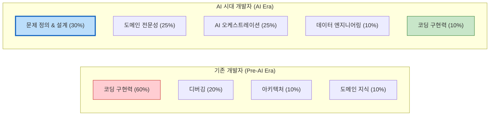

# 🚀 AI 시대에 개발자에게 진정으로 필요한 핵심 역량

AI가 코드를 대신 작성하고 디버깅까지 해주는 시대, 개발자의 가치는 **"코드를 얼마나 빨리 짜느냐"** 에서 **"어떤 문제를 정의하고, AI를 어떻게 orchestration(조율)하여 비즈니스 가치를 창출하느냐"** 로 이동하고 있습니다.

AI 시대에 개발자에게 진정으로 필요한 6가지 핵심 역량을 정리해 드립니다.

---

## 1.  AI 협업 및 오케스트레이션 역량 (AI Co-pilot Mastery)
AI를 단순한 코드 자동완성 도구가 아닌, **팀의 일원(Co-pilot/Agent)** 으로 활용하는 능력입니다.
* **프롬프트 엔지니어링**: AI에게 명확한 지시(Context, Role, Constraint)를 내려 고품질 결과를 끌어내는 능력
* **AI 에이전트 설계**: AI가 도구(Tools)를 사용하여 복잡한 워크플로우를 자율적으로 수행하도록 파이프라인을 설계하는 능력 (LangChain, LangGraph 등)
* **AI 결과 검증 및 디버깅**: AI가 생성한 코드나 답변의 환각(Hallucination)을 찾아내고, 보안/성능 이슈를 간파하는 안목

## 2.  도메인 전문성 (Domain Expertise)
앞서 논의했듯이, **"코드를 잘 짜는 개발자"** 에서 **"도메인을 이해하는 개발자"** 로의 진화가 필수적입니다.
* **비즈니스 로직 이해**: 의료, 금융, 물류 등 특정 산업의 프로세스, 규제, 용어를 깊이 있게 파악
* **현업 전문가와의 소통**: 도메인 전문가의 모호한 요구사항을 기술적 명세로 번역(Translation)하는 능력
* **가치 창출**: AI가 도메인 지식을 대체할 수 없으므로, 도메인 지식을 가진 개발자만이 진짜 문제를 해결할 수 있음

## 3. 🏗️ 시스템 아키처 및 설계 역량 (System Architecture)
AI는 개별 함수나 모듈은 잘 만들지만, **전체 시스템의 큰 그림(Big Picture)** 을 설계하는 것은 여전히 인간의 영역입니다.
* **분산 시스템 설계**: 마이크로서비스, 이벤트 기반 아키텍처, 데이터 파이프라인 설계
* **기술 택 선정**: 프로젝트의 규모와 목적에 맞는 최적의 DB, 클라우드, 프레임워크 택
* **확장성과 보안 고려**: 트래픽 폭증에 대비한 스케일링 전략과 데이터 보안/컴플라이언스 설계

## 4. 🎯 문제 정의 및 추상화 능력 (Problem Definition)
**"무엇을(What) 만들 것인가?"** 가 **"어떻게(How) 만들 것인가?"** 보다 훨씬 중요해졌습니다.
* **복잡한 문제의 분해**: 거대한 비즈니스 문제를 AI와 컴퓨터가 해결할 수 있는 작은 단위의 서브 문제로 개는 능력
* **추상화**: 구체적인 현상 속에서 핵심 패턴과 로직을 찾아내어 모델링하는 능력
* **가설 검증**: 기술적 구현 전에 비즈니스 가설을 빠르게 프로토이핑하고 검증하는 능력

## 5. 📊 데이터 리터러시 및 엔지니어링 (Data Literacy)
AI의 성능은 결국 데이터에 의해 결정됩니다. 데이터를 다루는 능력은 개발자의 핵심 무기입니다.
* **데이터 파이프라인 구축**: 정제되지 않은 원본 데이터를 AI가 학습/추론할 수 있는 고품질 데이터셋으로 가공
* **터 DB 및 RAG 설계**: 비정형 데이터를 효율적으로 저장하고 검색하는 지식 그래프/벡터 저장소 설계
* **데이터 거버넌스**: 데이터의 품질, 편향성(Bias), 프라이버시(PII)를 관리하는 능력

## 6. 🛡️ 윤리적 판단 및 책임 (Ethics & Responsibility)
AI가 만든 결과물에 대한 최종 책임은 인간 개발자에게 있습니다.
* **AI 윤리**: 알고리즘 편향성, 저작권, 개인정보 보호 등 윤리적 이슈를 사전에 차단하는 설계
* **Human-in-the-Loop**: AI의 자율성과 인간의 통제 사이에서 적절한 안전장치(Guardrails)를 설계
* **지속적 학습**: AI 기술은 매주 변합니다. 새로운 모델과 패러다임을 끊임없이 학습하는 적응력

---

## 📊 역량 변화 시각화 (Mermaid)

기존 개발자와 AI 시대 개발자의 역량 비중 변화를 시각화한 다이어그램입니다.

---

##  결론: 개발자의 새로운 정체성

AI 시대의 개발자는 **'코더(Coder)'** 에서 **'오케스트레이터(Orchestrator)'** 로 진화해야 합니다. 

> **"AI는 최고의 엔진이지만, 핸들을 잡고 목적지를 설정하는 사람은 여전히 당신이어야 합니다."**

단순 문법과 API를 외우는 데 시간을 쓰기보다, **비즈니스 문제를 정의하고, AI를 조율하며, 견고한 시스템을 설계하는 '엔지니어링 본질'** 에 집중할 때 대체 불가능한 개발자가 될 수 있습니다.
