# AI시대 개발자의 핵심 역량
> **기본 방향에는 상당히 동의합니다.** 다만 “개발자가 도메인 전문가가 되어야 한다”기보다는,
> **도메인 전문가와 협업할 수 있을 정도의 업무 이해 + 컴퓨터 시스템을 깊이 이해하는 기술 역량**이 앞으로 개발자의 핵심이 된다고 보는 편이 더 정확합니다.

핵심을 한 문장으로 정리하면:

> **도메인의 정답은 현업 전문가가 제공하고, 개발자는 그것을 컴퓨터가 안정적·효율적·안전하게 수행할 수 있는 시스템으로 변환하는 전문가가 되어야 합니다.**

### 1. 도메인은 현업 담당자가 개발자보다 잘 아는 것이 정상입니다

예를 들어 병원 시스템을 만든다고 하면 의사가 질병·진료 프로세스를 개발자보다 더 잘 알고, 금융 시스템에서는 은행원이 여신·결제·정산 업무를 더 잘 압니다.

따라서 개발자가 모든 것을 알 수는 없지만 전반적인 업무 프로세스는 알고 있어야 한다. 결국 업무의 이해와 이를 시스템으로 성공적으로 전환하는 능력이 필요하다.

## 의료 개발자

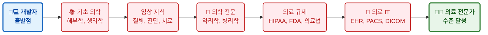
---  
## 금융 개발자

--- 
## 물류 개발자
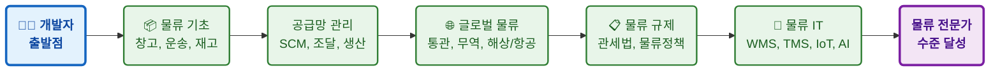


할 필요는 없습니다.

개발자가 필요한 정도는 오히려 이 수준입니다.

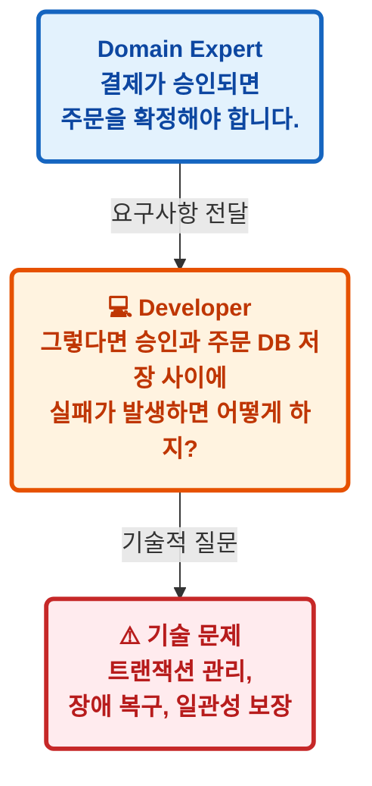

---


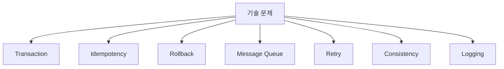


**여기부터가 개발자의 전문영역입니다.**

---

## 2. Agent 시대에는 오히려 시스템 기초의 가치가 커집니다

AI가 다음을 대신할수록

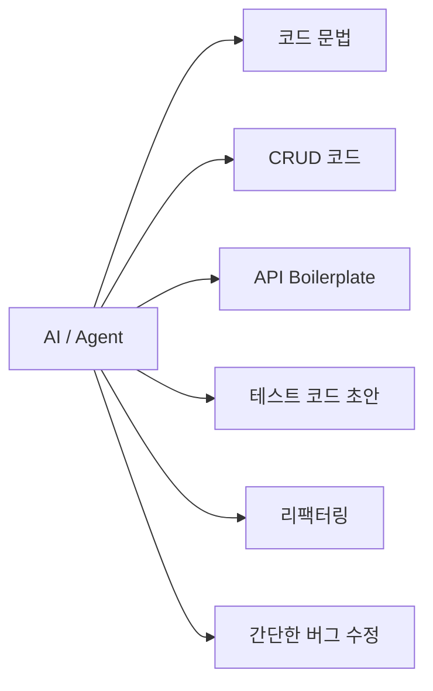

개발자에게 남는 문제는 상대적으로 다음과 같이 됩니다.

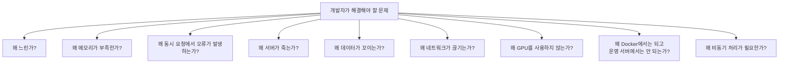

이 문제들은 Prompt Engineering만으로 이해하기 어렵습니다.

결국 밑으로 내려갑니다.

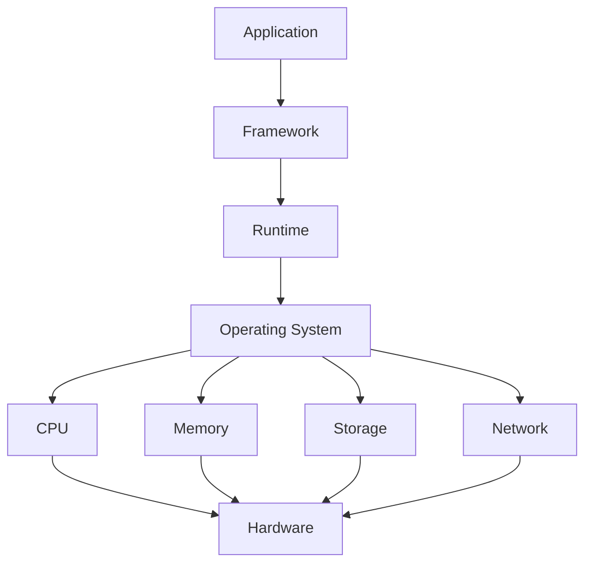

따라서 개발자가 **컴퓨터가 실제로 어떻게 프로그램을 실행하는지를 이해하는 능력**은 오히려 차별화될 가능성이 높다고 봅니다.

---

# 3. 다만 ‘컴퓨터 구조’만 강조하면 조금 부족합니다

여기서 한 가지 조정할 부분이 있습니다.

일반적인 웹·AI 애플리케이션 개발자가 CPU의 ALU 설계나 파이프라이닝을 아주 깊이 공부하는 것보다 실무적으로는 다음 계층이 훨씬 중요합니다.

### 우선순위 1 — 운영체제

반드시 이해하면 좋은 개념입니다.

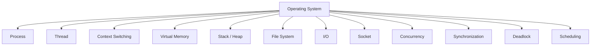

예를 들어 Python에서

```python
async def request():
    ...
```

를 사용하는 이유도 단순히 `async` 문법을 외우는 것이 아니라

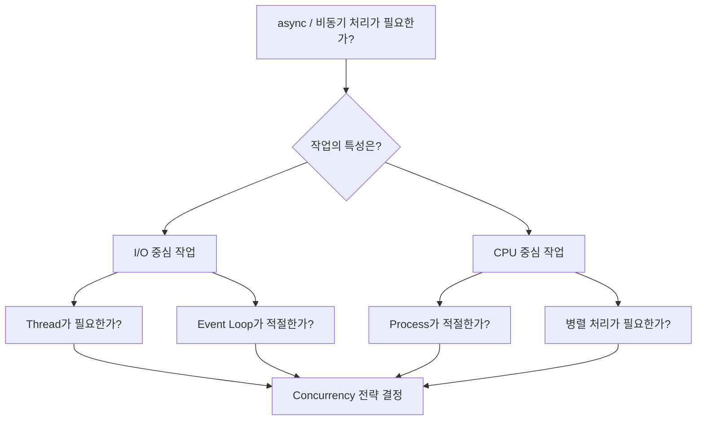

를 판단할 수 있어야 합니다.

---

## 우선순위 2 — 네트워크

현대 애플리케이션은 사실상 분산 시스템입니다.

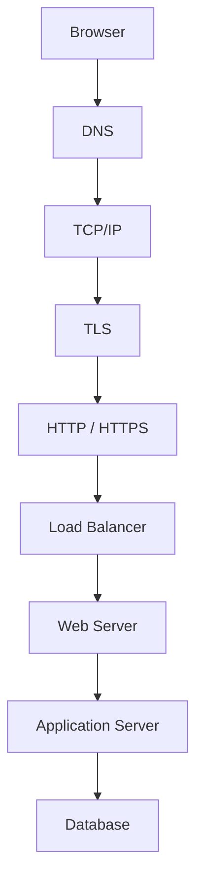

따라서 다음 정도는 개발자의 핵심 기초라고 봅니다.

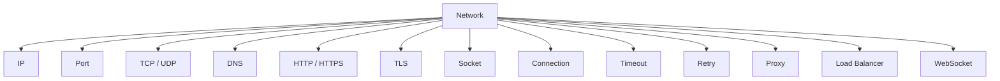

예를 들어

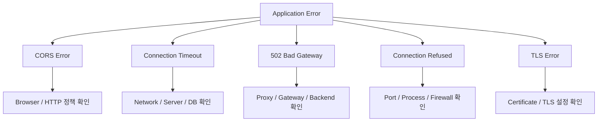

를 Agent에게 맡기더라도 **어느 계층에서 문제가 발생했는지 판단할 수 있어야 합니다.**

---

# 4. 데이터베이스는 거의 시스템 과목으로 봐야 합니다

Agent가 SQL을 아주 잘 만들어주는 시대에도 개발자는 다음을 알아야 합니다.

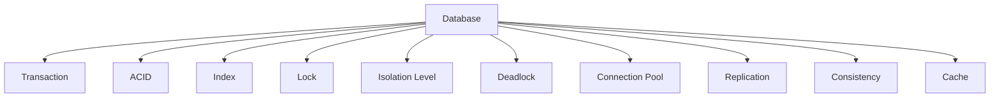

예를 들어 AI가 다음 SQL을 만들 수 있습니다.

```sql
SELECT *
FROM orders
WHERE customer_id = 100;
```

하지만 데이터가 10억 건이면 이야기가 완전히 달라집니다.

개발자가 생각해야 하는 것은

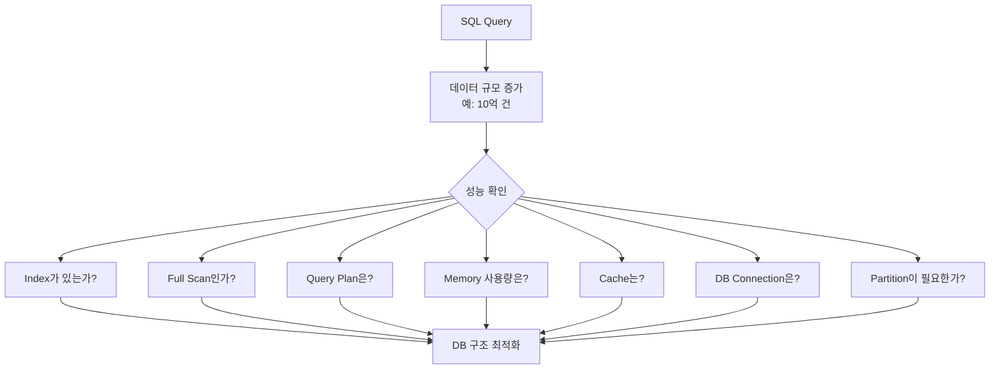

입니다.

즉 **코드를 생성하는 것과 시스템을 설계하는 것은 다른 문제**입니다.

---

# 5. 컴퓨터 구조도 AI 시대에 새로운 의미로 중요해집니다

특히 AI 개발자는 일반 웹 개발자보다 컴퓨터 구조를 조금 더 이해할 필요가 있습니다.

예를 들어 LLM을 사용하다 보면 곧바로 다음 문제가 등장합니다.

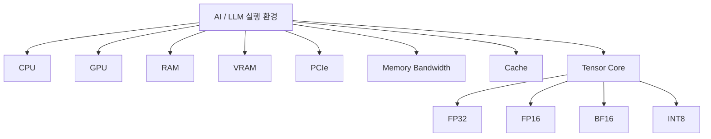

왜

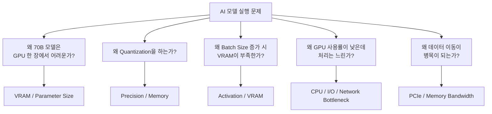

를 이해하려면 결국 하드웨어 구조로 내려갑니다.

그래서 AI 시대에는 오히려
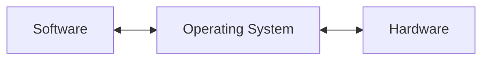

연결을 이해하는 사람이 강해질 가능성이 있습니다.

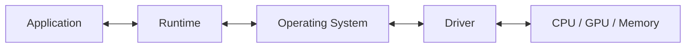

---

# 6. 그래서 저는 개발자의 역량을 이렇게 보는 것이 더 적절하다고 생각합니다

---


---

이 구조에서 개발자에게 필요한 Domain Knowledge는 **★★★ 정도**, 시스템 역량은 **★★★★★ 정도**라고 보는 것이 제 관점에 더 가깝습니다.

---

# 7. 개발자는 결국 ‘추상화 계층 아래를 이해하는 사람’이어야 합니다

이것이 상당히 중요합니다.

AI는 위쪽 계층을 점점 편하게 만들어줍니다.

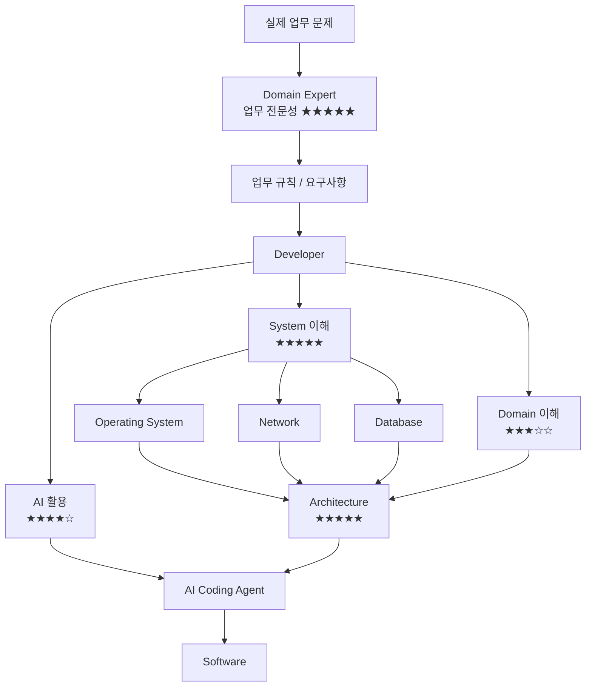

AI가 위쪽의 복잡성을 감춰줄수록 사람이 문제가 발생했을 때 **아래 계층을 이해하는 능력의 희소성이 오히려 증가할 수 있습니다.**

예전에 Java 개발자들이

```text
Spring이 알아서 해준다.
```

라고 생각하다가 문제가 생기면

```mermaid
flowchart TB
    A["Spring이 알아서 해준다"]

    A --> B["실제 장애 발생"]

    B --> C["JVM"]
    B --> D["GC"]
    B --> E["Thread Pool"]
    B --> F["Heap"]
    B --> G["Connection Pool"]
    B --> H["Transaction"]

    C --> I["하위 시스템 이해 필요"]
    D --> I
    E --> I
    F --> I
    G --> I
    H --> I
```

까지 내려가야 했던 것과 같습니다.

Agent 시대에는

> `"Agent가 알아서 해준다"`

라는 새로운 추상화 계층이 하나 더 생긴 것뿐입니다.

---

```mermaid
flowchart TB
    A["Developer"]
    B["AI Agent"]
    C["Framework"]
    D["Runtime"]
    E["Operating System"]
    F["Hardware"]

    A -->|"작업 지시"| B
    B -->|"코드 생성"| C
    C --> D
    D --> E
    E --> F

    F -. "문제 발생" .-> E
    E -. "원인 추적" .-> D
    D -. "원인 추적" .-> C
    C -. "원인 추적" .-> B
    B -. "최종 판단" .-> A
```

# 8. 따라서 개발자 교육에서도 방향을 조금 바꾸는 것이 좋습니다

저라면 앞으로 비전공자 개발자 교육에서 기술 기초를 다음 순서로 강화하겠습니다.

| 영역              |   중요도 | 핵심                                 |
| --------------- | ----: | ---------------------------------- |
| 컴퓨터 구조          | ★★★★☆ | CPU, Memory, Cache, I/O, GPU       |
| 운영체제            | ★★★★★ | Process, Thread, Memory, File, I/O |
| 네트워크            | ★★★★★ | TCP/IP, HTTP, DNS, TLS, Socket     |
| 데이터베이스          | ★★★★★ | Transaction, Index, Lock, DB 구조    |
| 자료구조·알고리즘       | ★★★★☆ | 데이터 처리 원리와 효율성                     |
| 프로그래밍           | ★★★★☆ | 프로그램 구조를 이해할 수준                    |
| Architecture    | ★★★★★ | 시스템 전체 구조                          |
| Security        | ★★★★☆ | 인증·권한·취약점                          |
| Cloud/Container | ★★★★☆ | 실제 실행 플랫폼                          |
| AI/Agent        | ★★★★☆ | 구현·테스트·분석 도구                       |
| Domain          | ★★★☆☆ | 업무 이해와 전문가와의 의사소통                  |

여기서 중요한 변화는 **프로그래밍 문법 비중을 줄이고 시스템 원리 비중을 늘리는 것**입니다.

---

## 9. 특히 비전공자에게는 ‘컴퓨터가 실제로 어떻게 움직이는지’를 한 번 연결해 주는 교육이 중요합니다

예를 들어 단순히 FastAPI 코드를 가르치는 것이 아니라

```python
@app.get("/users")
def users():
    return db.query(...)
```

이 코드 한 줄이 실제로 어떤 일을 발생시키는지 추적하게 합니다.

```mermaid
flowchart TB
    A["사용자 클릭"]
    B["Browser"]
    C["DNS"]
    D["TCP Connection"]
    E["HTTP Request"]
    F["Linux Socket"]
    G["Web Server"]
    H["Python Process"]
    I["Thread / Event Loop"]
    J["FastAPI"]
    K["DB Connection"]
    L["SQL"]
    M["Disk / Memory"]
    N["HTTP Response"]
    O["Browser 화면 표시"]

    A --> B
    B --> C
    C --> D
    D --> E
    E --> F
    F --> G
    G --> H
    H --> I
    I --> J
    J --> K
    K --> L
    L --> M

    M --> N
    N --> O
```

학생이 이것을 이해하면

**네트워크 + OS + Python + DB + 웹 + 서버를 하나의 시스템으로 이해하게 됩니다.**

이런 수업이 앞으로 굉장히 중요해질 것이라고 봅니다.

---

# 결론

사용자께서 제시한 방향을 저는 다음과 같이 조금 수정하면 가장 타당하다고 봅니다.

> **“개발자도 도메인을 깊이 알아야 한다.”**
>
> 보다는
>
> **“도메인 전문가는 업무를 정의하고, 개발자는 해당 업무를 이해할 수 있을 정도의 도메인 지식을 갖춘 뒤 컴퓨터 시스템에 대해서는 훨씬 깊은 전문성을 가져야 한다.”**

그리고 Agent 시대에는 개발자의 핵심 기술 기반을

```mermaid
graph TD
    A[AI Agent Layer<br>자율 의사결정/도구 사용] 
    B[Software Architecture Layer<br>마이크로서비스/이벤트 기반 아키텍처]
    C[Distributed System Layer<br>분산 처리/일관성/장애 허용]
    D[Database Layer<br>데이터 영속화/인덱싱/트랜잭션]
    E[Network Layer<br>통신 프로토콜/데이터 전송]
    F[Operating System Layer<br>프로세스/메모리/파일 시스템 관리]
    G[Computer Architecture Layer<br>CPU/메모리/명령어 집합 구조]

    G --> F --> E --> D --> C --> B --> A

    style A fill:#f9f,stroke:#333,stroke-width:2px
    style G fill:#bbf,stroke:#333,stroke-width:2px

graph LR
    subgraph Foundation [기반 기술]
        CA[Computer Architecture]
        OS[Operating System]
    end

    subgraph Infrastructure [인프라]
        Net[Network]
        DB[Database]
        DS[Distributed System]
    end

    subgraph Application [응용/지능]
        SA[Software Architecture]
        AI[AI Agent]
    end

    %% 의존성 연결
    CA --> OS
    OS --> Net
    OS --> DB
    Net --> DS
    DB --> DS
    DS --> SA
    SA --> AI

    %% 설명
    AI -.->|활용| DB
    AI -.->|호출| Net


flowchart TB
    HW[💻 Computer Architecture<br>성능/병렬 처리 기반] --> OS
    OS[⚙️ Operating System<br>리소스 관리/가상화] --> Net
    Net[🌐 Network<br>클러스터링/통신] --> DS
    DS[☁️ Distributed System<br>확장성/일관성] --> DB
    DB[🗄️ Database<br>데이터 저장/분산 트랜잭션] --> SA
    SA[🧩 Software Architecture<br>시스템 설계 패턴] --> AI
    AI[🤖 AI Agent<br>자율적 작업 수행/추론]

    AI -.->|피드백 및 최적화 요청| HW

```

로 보는 것이 좋습니다.

특히 교육적인 관점에서는 **Python, Java, Spring, FastAPI 같은 ‘도구’를 중심으로 가르치는 교육에서, “프로그램이 컴퓨터 위에서 실제로 어떻게 실행되고 서로 통신하는가”를 중심으로 한 교육으로 다시 이동할 필요가 있다**고 생각합니다.

아이러니하게도 **AI가 발전할수록 컴퓨터공학의 오래된 기초과목인 컴퓨터구조·운영체제·네트워크·DB가 다시 중요해지는 현상**이 나타날 가능성이 높습니다. AI가 코딩의 상위 계층을 자동화할수록, 문제가 발생했을 때 인간 개발자가 판단해야 하는 영역은 그 아래 계층에 더 많이 남기 때문입니다.
