# LLM과 RAG로 구현하는 AI 애플리케이션 강의자료

## 장 1: LLM과 RAG의 기초 이해

### 슬라이드 1-1: 강의 개요
**LLM과 RAG로 구현하는 AI 애플리케이션**
- 거대언어모델(LLM)의 한계와 해결책
- RAG(Retrieval-Augmented Generation)의 등장
- 실전 AI 애플리케이션 구축을 위한 여정

### 슬라이드 1-2: LLM의 현재와 한계
**거대언어모델의 현황**
- GPT-4, Claude, Gemini 등의 발전
- 지식의 정적 성격 (학습 시점의 데이터)
- 환각(Hallucination) 문제
- 최신 정보 부재
- 도메인 특화 지식 부족

### 슬라이드 1-3: RAG의 개념
**RAG란 무엇인가?**
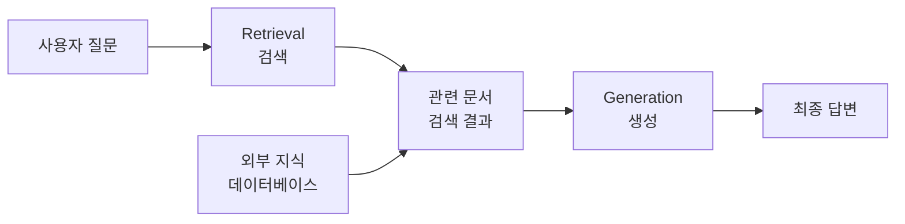

### 슬라이드 1-4: RAG의 필요성
**왜 RAG인가?**
- LLM의 지식 한계 극복
- 최신 정보 반영
- 도메인 특화 지식 활용
- 환각 현상 감소
- 비용 효율성 (파인튜닝 대비)

### 슬라이드 1-5: RAG의 작동 원리
**RAG 파이프라인**
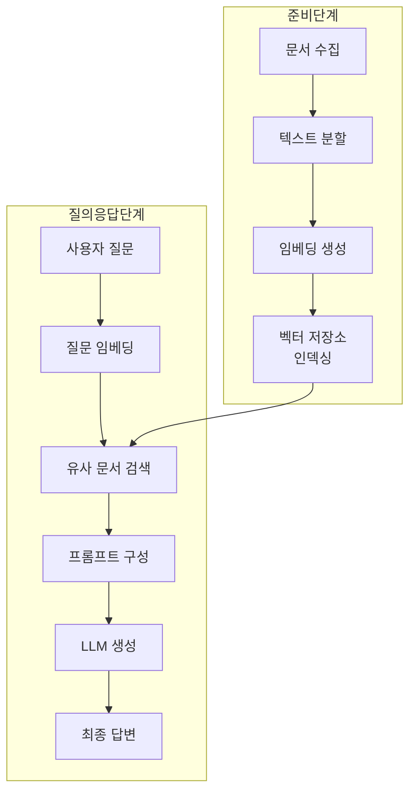

### 슬라이드 1-6: RAG의 구성 요소
**핵심 컴포넌트**
1. **Document Loader**: 다양한 형식의 문서 로드
2. **Text Splitter**: 텍스트를 적절한 크기로 분할
3. **Embedding Model**: 텍스트를 벡터로 변환
4. **Vector Store**: 벡터 데이터 저장 및 검색
5. **Retriever**: 관련 문서 검색
6. **LLM**: 최종 답변 생성

### 슬라이드 1-7: RAG의 장점
**RAG 도입 효과**
- ✅ 최신 정보 실시간 반영
- ✅ 도메인 특화 지식 통합
- ✅ 파인튜닝보다 저렴한 비용
- ✅ 지식 소스 추적 가능
- ✅ 지속적인 업데이트 용이
- ✅ 환각 현상 최소화

### 슬라이드 1-8: RAG의 적용 분야
**실제 사용 사례**
- 📚 기업 문서 기반 Q&A 시스템
- 🏥 의료 지식 기반 진단 지원
- ⚖️ 법률 문서 분석 및 조문 검색
- 🎓 교육용 튜터링 시스템
- 💼 고객 지원 챗봇
- 🔬 연구 논문 분석 및 요약

### 슬라이드 1-9: 라마인스 소개
**LlamaIndex란?**
- RAG 애플리케이션 구축을 위한 프레임워크
- 데이터 연결 → 인덱싱 → 쿼리 인터페이스 제공
- 단순 RAG부터 고급 에이전트까지 지원
- Python 및 TypeScript 지원
- 다양한 데이터 소스 통합

### 슬라이드 1-10: 학습 로드맵
**강의 진행 계획**
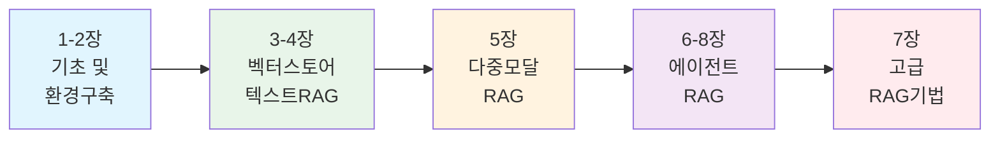

---

## 장 2: 라마인덱스 소개 및 환경 구축

### 슬라이드 2-1: 라마인덱스의 핵심 기능
**LlamaIndex가 지원하는 작업**
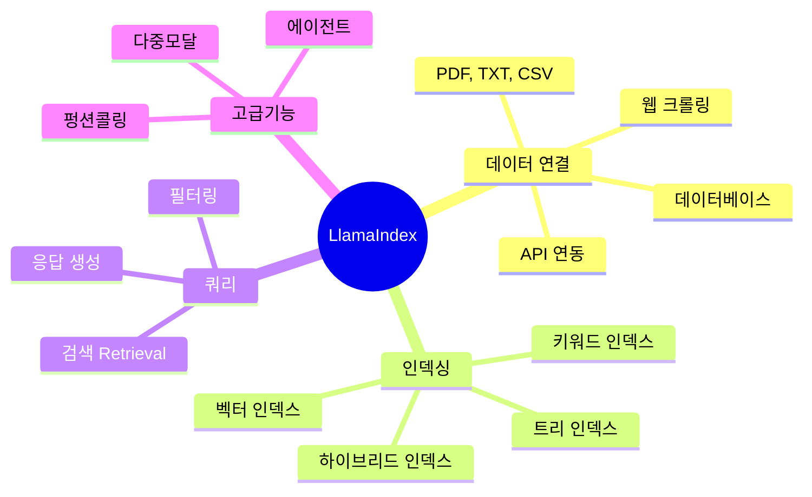

### 슬라이드 2-2: 개발 환경 구축
**환경 설정 단계**
1. **Python 설치** (3.10 이상 권장)
2. **가상 환경 구축**
   ```bash
   python -m venv venv
   source venv/bin/activate  # Linux/Mac
   venv\Scripts\activate     # Windows
   ```
3. **필수 패키지 설치**
   ```bash
   pip install llama-index
   pip install python-dotenv
   ```

### 슬라이드 2-3: API 키 설정
**API 키 관리**
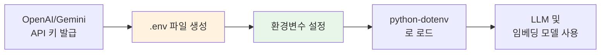

### 슬라이드 2-4: OpenAI API 키 발급
**OpenAI 설정**
1. https://platform.openai.com 접속
2. 계정 생성 및 로그인
3. API Keys 메뉴에서 키 생성
4. `.env` 파일에 저장:
   ```
   OPENAI_API_KEY=sk-...
   ```
5. 사용량 및 과금 설정 확인

### 슬라이드 2-5: Gemini API 키 발급
**Google Gemini 설정**
1. https://makersuite.google.com 접속
2. Get API Key 클릭
3. API 키 생성
4. `.env` 파일에 저장:
   ```
   GOOGLE_API_KEY=...
   ```
5. 무료 티어 확인 (분당 요청 제한)

### 슬라이드 2-6: Visual Studio Code 설정
**IDE 환경 구성**
- VS Code 설치
- Python 확장 설치
- Jupyter 확장 설치
- 코드 자동완성 설정
- 디버깅 도구 설정
- Git 연동

### 슬라이드 2-7: 가상 환경의 중요성
**가상 환경 활용**
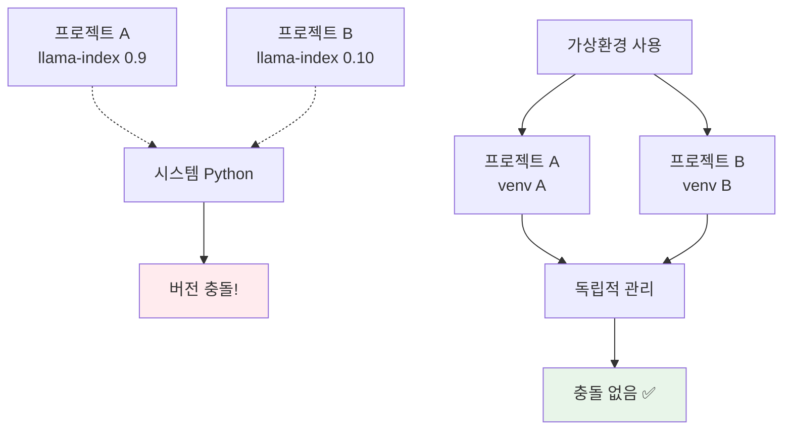

### 슬라이드 2-8: 첫 번째 라마인덱스 실행
**Hello LlamaIndex**
- 간단한 문서 로드
- 인덱스 생성
- 쿼리 실행
- 응답 확인
- 전체 파이프라인 이해

### 슬라이드 2-9: 디버깅 및 로깅
**문제 해결 도구**
- `llama-index` 디버그 모드 활성화
- 로그 레벨 설정 (INFO, DEBUG)
- 에러 메시지 분석
- Stack trace 확인
- 온라인 문서 활용

### 슬라이드 2-10: 환경 변수 관리
**보안 모범 사례**
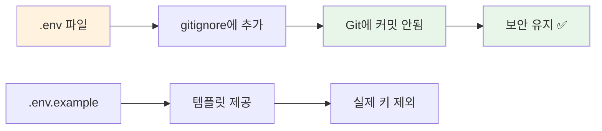

---

## 장 3: 데이터 로딩 및 텍스트 분할

### 슬라이드 3-1: 데이터 로딩 개요
**Document Loading**
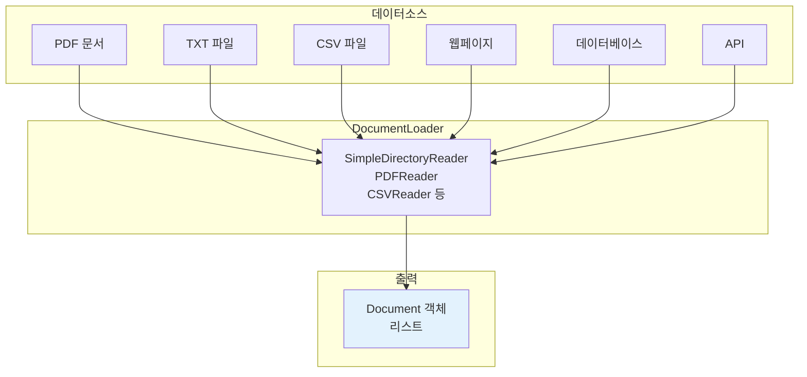

### 슬라이드 3-2: Document 객체 이해
**Document 구조**
```python
Document(
    text="문서의 전체 텍스트 내용...",
    metadata={
        "source": "file.pdf",
        "page": 1,
        "author": "John Doe"
    },
    id_="unique-document-id"
)
```

**핵심 속성:**
- `text`: 문서의 전체 텍스트
- `metadata`: 문서 정보 (소스, 페이지 등)
- `id_`: 고유 식별자

### 슬라이드 3-3: SimpleDirectoryReader
**디렉토리 전체 로드**
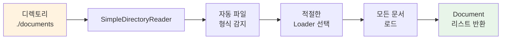

**지원 형식:**
- .txt, .pdf, .docx, .csv
- .json, .html, .md
- 이미지, 오디오 (추가 패키지)

### 슬라이드 3-4: 텍스트 분할의 필요성
**왜 텍스트를 나눌까?**
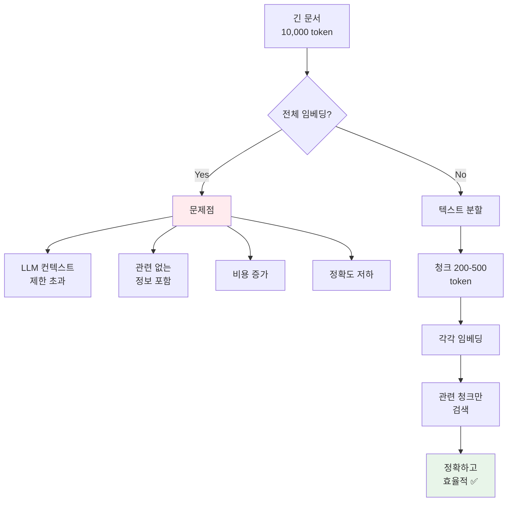

### 슬라이드 3-5: 분할 전략
**텍스트 분할 방법**
1. **토큰 단위 분할**: 고정된 토큰 수로 분할
2. **문장 단위 분할**: 문장 경계에서 분할
3. **문단 단위 분할**: 문단 경계에서 분할
4. **의미 단위 분할**: 의미적 완결성 고려
5. **재귀적 분할**: 여러 전략 조합

### 슬라이드 3-6: SentenceSplitter
**문장 기반 분할**
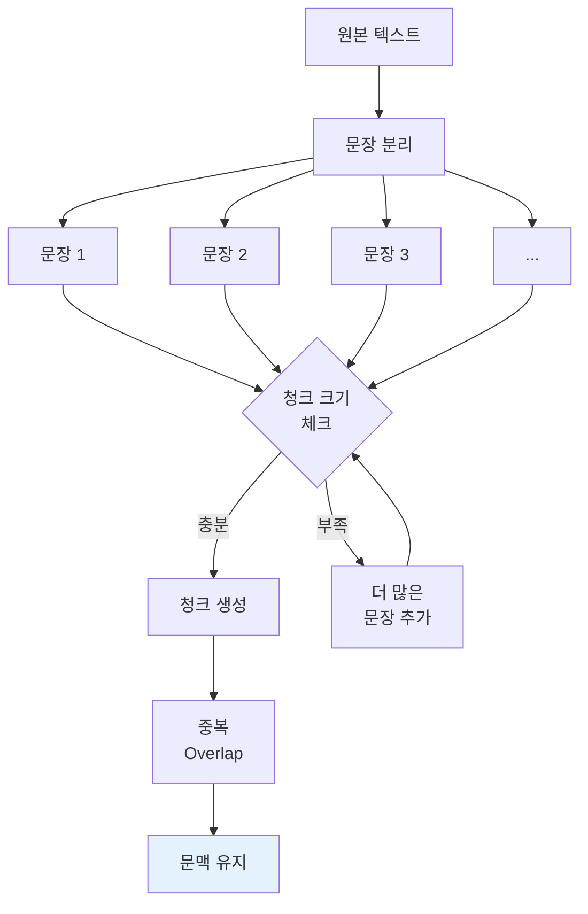

### 슬라이드 3-7: 분할 파라미터
**주요 설정값**
- `chunk_size`: 청크 크기 (기본 1024)
- `chunk_overlap`: 청크 간 중복 (기본 20)
- `separator`: 구분자 (기본 "\n\n")
- `paragraph_separator`: 문단 구분자
- `secondary_chunking_regex`: 보조 분할 규칙

### 슬라이드 3-8: 분할 비교
**전략별 특징**
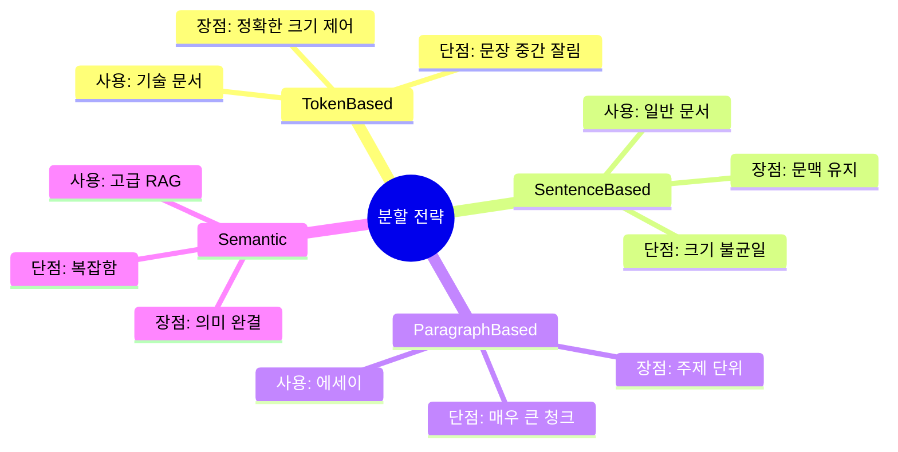

### 슬라이드 3-9: Node 객체
**Document vs Node**
```python
# Document: 전체 문서
Document(text="전체 내용...", metadata={})

# Node: 분할된 청크
Node(
    text="청크 내용...",
    metadata={"source": "file.pdf"},
    relationships={
        "SOURCE": DocumentNode(id="doc-123"),
        "NEXT": Node(id="node-457"),
        "PREVIOUS": Node(id="node-455")
    }
)
```

### 슬라이드 3-10: 분할 모범 사례
**Best Practices**
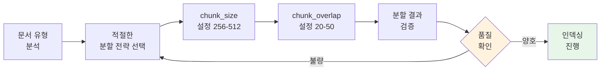

---

## 장 4: 인덱싱과 벡터 저장소

### 슬라이드 4-1: 인덱싱이란?
**Indexing의 개념**
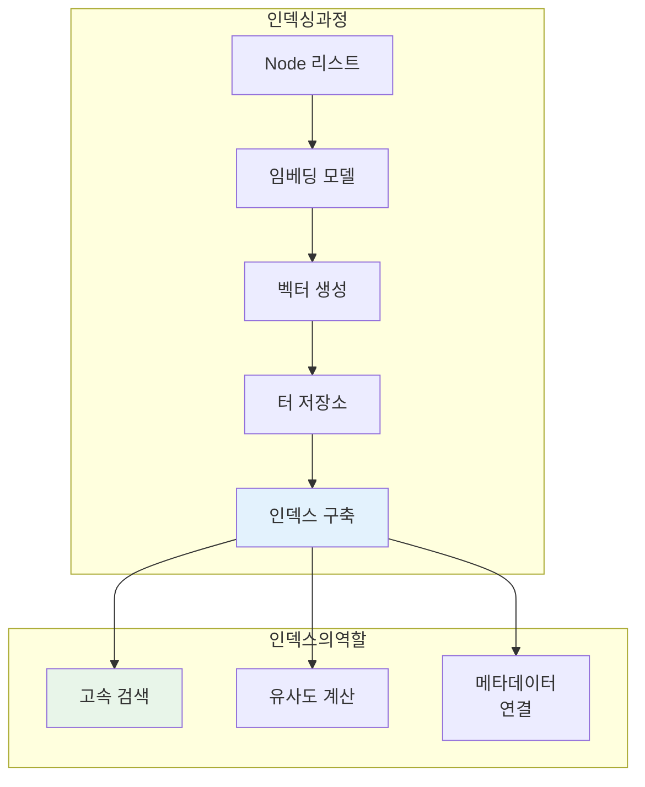

### 슬라이드 4-2: 임베딩 모델
**Text Embedding**
- **OpenAI**: text-embedding-3-small, ada-002
- **Google**: text-embedding-004
- **HuggingFace**: BERT, SentenceTransformers
- **Local**: BGE, KoSimCSE (한국어)

**특징:**
- 1536차원 (OpenAI ada-002)
- 의미적 유사성 → 벡터 공간에서 가까운 거리

### 슬라이드 4-3: 벡터 저장소 인덱스
**Vector Store Index**
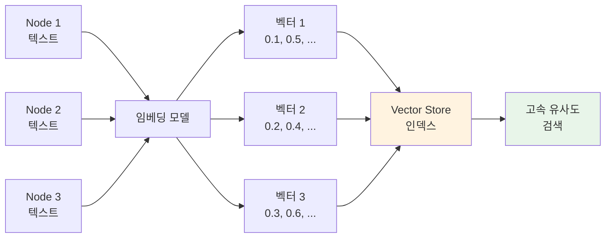

### 슬라이드 4-4: Top-K 검색
**K-Nearest Neighbors**
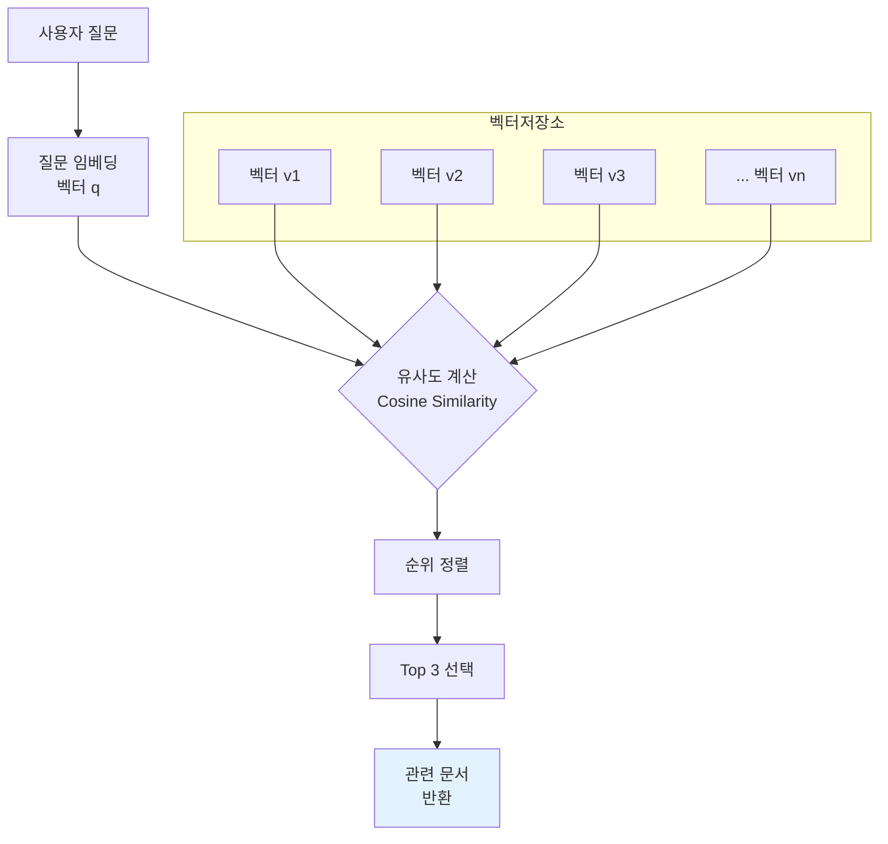

### 슬라이드 4-5: 코사인 유사도
**Similarity Measurement**
```
cosine_similarity(A, B) = (A · B) / (||A|| × ||B||)

결과 범위: -1 ~ 1
- 1: 완전히 동일
- 0: 무관계
- -1: 완전히 반대
```

**예시:**
- 질문 벡터 vs 문서 벡터
- 0.85 → 매우 유사
- 0.45 → 다소 유사
- 0.12 → 거의 무관계

### 슬라이드 4-6: 인메모리 벡터 저장소
**SimpleVectorStore**
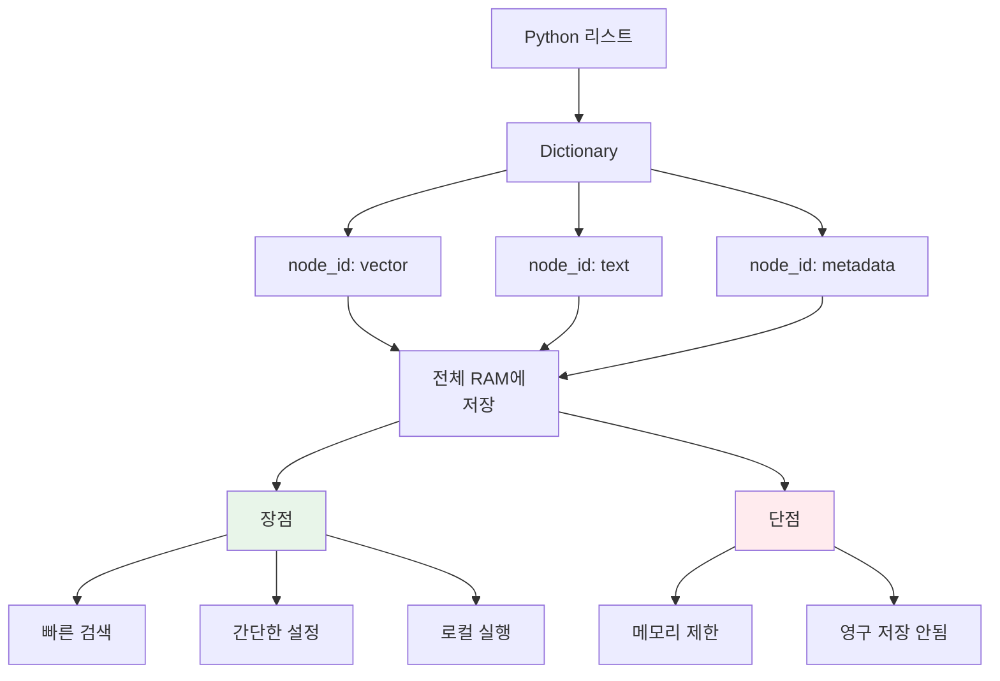

### 슬라이드 4-7: 크로마 (Chroma)
**ChromaDB 소개**
- 경량 오픈소스 벡터 DB
- 로컬 및 클라우드 지원
- 메타데이터 필터링
- 지속적 저장 (persist)
- Python & JavaScript

**사용 사례:**
- 소규모 프로젝트
- 프로토타이핑
- 로컬 개발 환경

### 슬라이드 4-8: 파인콘 (Pinecone)
**Pinecone 특징**
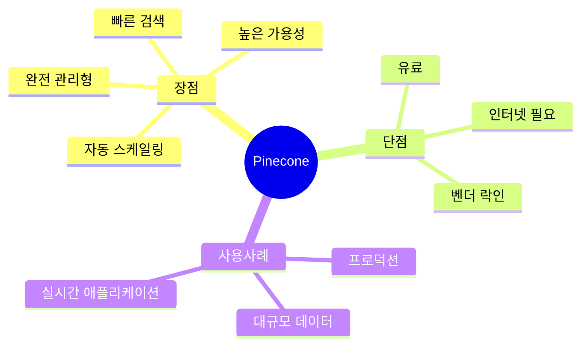

### 슬라이드 4-9: 드런트 (Qdrant)
**Qdrant 소개**
- Rust 기반 고성능 벡터 DB
- 오픈소스 (Apache 2.0)
- Docker로 로컬 실행 가능
- 클라우드 서비스 제공
- 고급 필터링 지원
- gRPC 및 REST API

### 슬라이드 4-10: 저장 및 로드
**Persist & Load**
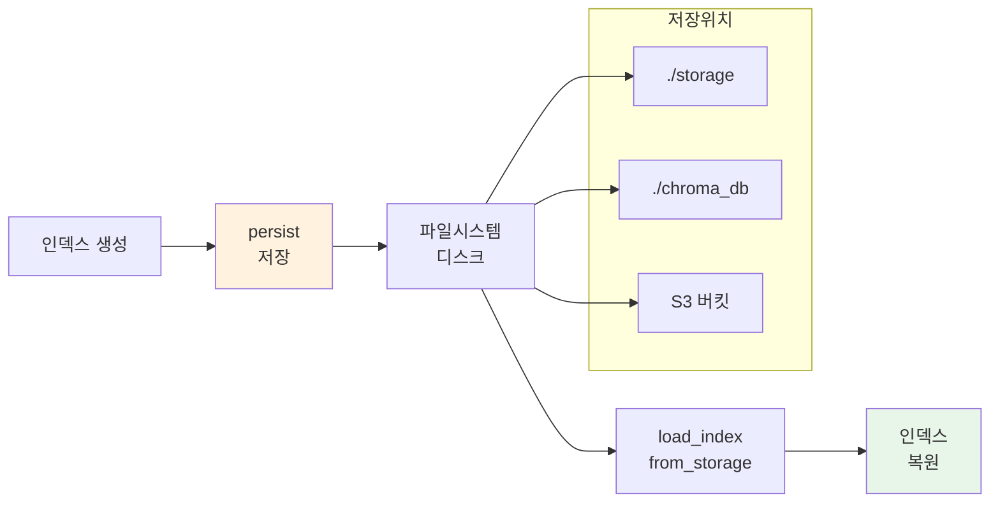

---

## 장 5: 쿼리 엔진과 검색

### 슬라이드 5-1: 쿼리 엔진(QueryEngine)
**QueryEngine의 역할**
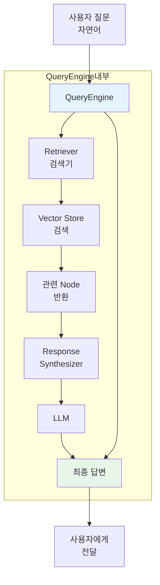

### 슬라이드 5-2: 검색(Retrieval) 과정
**Retrieval 단계**
1. **질문 임베딩**: 사용자 질문 → 벡터
2. **유사도 계산**: 질문 벡터 vs 문서 벡터
3. **순위화**: 유사도 기준 정렬
4. **Top-K 선택**: 상위 K개 문서 선택
5. **메타데이터 필터링**: 조건부 필터 적용 (선택)

### 슬라이드 5-3: 후처리(Postprocessing)
**Node Postprocessing**
```mermaid
flowchart LR
    A[검색된<br>Node 리스트] --> B[Similarity<br>Threshold]
    B --> C{유사도<br>체크}
    C -->|0.7 이상| D[유지]
    C -->|0.7 미만| E[제거]
    
    D --> F[재순위화<br>Re-ranking]
    E --> G[결과 제외]
    
    F --> H[최종 Node<br>리스트]
    
    style H fill:#e8f5e9
    style E fill:#ffebee
```

### 슬라이드 5-4: 응답 합성(Response Synthesis)
**답변 생성 전략**
```mermaid
mindmap
  root((Response Synthesis))
    Default
      검색된 텍스트<br>프롬프트에 포함
      LLM이 한 번에 생성
    Refine
      초기 답변 생성
      추가 문서로 개선
      반복적 개선
    Tree Summarize
      각 문서 요약
      요약들 통합
      계층적 처리
    Compact
      텍스트 압축
      토큰 제한 내로
      효율적 사용
```

### 슬라이드 5-5: 커스터마이징
**QueryEngine 설정**
- `similarity_top_k`: 검색할 문서 수
- `response_mode`: 응답 합성 방식
- `llm`: 사용할 LLM 모델
- `embed_model`: 임베딩 모델
- `node_postprocessors`: 후처리 모듈

### 슬라이드 5-6: 스트리밍 응답
**Streaming Response**
```mermaid
sequenceDiagram
    participant U as 사용자
    participant QE as QueryEngine
    participant LLM as LLM API
    
    U->>QE: 질문 전송
    QE->>QE: 문서 검색
    QE->>LLM: 프롬프트 전송
    
    loop 스트리밍
        LLM-->>QE: 토큰 조각 전송
        QE-->>U: 실시간 출력
    end
    
    LLM-->>QE: 완료
    QE-->>U: 최종 답변 완료
    
    Note over U,LLM: 즉시 피드백 제공
```

### 슬라이드 5-7: 메타데이터 필터링
**필터링 활용**
```python
# 예시: 특정 날짜 이후 문서만 검색
from llama_index.core.query_engine import VectorStoreQueryEngine
from llama_index.core.vector_stores import MetadataFilters, MetadataFilter

filters = MetadataFilters(
    filters=[
        MetadataFilter(key="date", value="2024-01-01", operator=">"),
        MetadataFilter(key="category", value="technical", operator="==")
    ]
)

query_engine = index.as_query_engine(filters=filters)
```

### 슬라이드 5-8: 하이브리드 검색
**Hybrid Search**
```mermaid
flowchart TB
    Q[질문] --> B1[벡터 검색<br>Semantic]
    Q --> B2[키워드 검색<br>BM25]
    
    B1 --> R1[터<br>결과]
    B2 --> R2[키워드<br>결과]
    
    R1 & R2 --> M[결과 병합<br>Merging]
    M --> RRR[재순위화<br>Re-ranking]
    RRR --> F[최종 결과]
    
    style F fill:#e3f2fd
```

### 슬라이드 5-9: 쿼리 변환
**Query Transformation**
- **Query Rewriting**: 질문 재작성
- **HyDE**: Hypothetical Document Embeddings
- **Step-back Prompting**: 상위 개념 질문
- **Sub-question Query**: 하위 질문 분해

### 슬라이드 5-10: 디버깅 및 로깅
**쿼리 디버깅**
```mermaid
flowchart LR
    A[질문 입력] --> B[쿼리 실행]
    B --> C[로그 활성화]
    C --> D1[검색된<br>Node 출력]
    C --> D2[유사도<br>점수 확인]
    C --> D3[프롬프트<br>확인]
    C --> D4[LLM<br>응답 확인]
    
    D1 & D2 & D3 & D4 --> E[문제 진단]
    E --> F[파라미터<br>조정]
    F --> B
    
    style E fill:#fff3e0
    style F fill:#e8f5e9
```

---

## 장 6: 벡터 데이터베이스 심화

### 슬라이드 6-1: 크로마 클라이언트 생성
**ChromaDB 설정**
```mermaid
flowchart TB
    A[chromadb<br>설치] --> B[Client 생성]
    B --> C{저장 방식}
    C -->|Persistent| D[디스크 저장<br>./chroma_db]
    C -->|In-Memory| E[RAM 저장<br>임시]
    
    D --> F[Client]
    E --> F
    
    F --> G[Collection<br>생성/가져오기]
    
    style F fill:#e3f2fd
    style G fill:#e8f5e9
```

### 슬라이드 6-2: 컬렉션 생성
**Collection 개념**
- 데이터베이스의 "테이블"에 해당
- 특정 도메인/프로젝트별 분리
- 독립적인 인덱스 관리
- 메타데이터 스키마 정의

**예시:**
```python
collection = client.create_collection(
    name="documents",
    metadata={"description": "Company documents"}
)
```

### 슬라이드 6-3: 벡터 데이터 추가
**Add Operations**
```mermaid
sequenceDiagram
    participant App as 애플리케이션
    participant Chroma as ChromaDB
    
    App->>App: 문서 임베딩<br>생성
    App->>Chroma: collection.add
    Note over App,Chroma: documents, embeddings,<br>metadatas, ids
    
    Chroma->>Chroma: 인덱스 업데이트
    Chroma-->>App: 성공 응답
    
    Note over Chroma: 디스크에<br>자동 저장
```

### 슬라이드 6-4: 벡터 검색
**Query 실행**
```python
results = collection.query(
    query_embeddings=[[0.1, 0.2, ...]],  # 질문 벡터
    n_results=5,                          # 반환할 결과 수
    where={"category": "technical"},     # 메타데이터 필터
    include=["documents", "metadatas", "distances"]
)
```

**반환 데이터:**
- `documents`: 관련 텍스트
- `metadatas`: 문서 정보
- `distances`: 유사도 거리
- `ids`: 문서 식별자

### 슬라이드 6-5: 메타데이터 필터링
**Advanced Filtering**
```mermaid
mindmap
  root((Metadata Filter))
    연산자
      == (equal)
      != (not equal)
      > (greater)
      < (less)
      >= (gte)
      <= (lte)
      in (리스트 포함)
      nin (리스트 미포함)
    사용예
      날짜 범위
      문서 유형
      작성자
      부서
      태그
```

### 슬라이드 6-6: 임베딩 데이터 추가
**임베딩 통합**
```mermaid
flowchart LR
    A[원본 문서] --> B[임베딩 모델<br>OpenAI/HF]
    B --> C[터 생성<br>1536차원]
    C --> D[ChromaDB<br>add/update]
    
    E[메타데이터<br>source, date] --> D
    
    D --> F[인스<br>자동 업데이트]
    F --> G[검색 가능<br>상태]
    
    style G fill:#e8f5e9
```

### 슬라이드 6-7: 임베딩 데이터 검색
**검색 최적화**
- **효율적 인덱싱**: HNSW (Hierarchical Navigable Small World)
- **근사 최근접 검색**: ANN (Approximate Nearest Neighbor)
- **성능 vs 정확도**: trade-off 조정
- `ef_construction`: 인덱스 품질
- `ef_search`: 검색 속도

### 슬라이드 6-8: 크로마의 저장 방식
**Persistence**
```mermaid
graph TB
    subgraph 메모리
        A[Chroma Client]
        B[Collection]
        C[Vectors]
    end
    
    subgraph 디스크
        D[./chroma_db]
        E[chroma.sqlite3]
        F[binaries/]
        G[metadata/]
    end
    
    A --> B --> C
    C -.persist.-> D
    D --> E & F & G
    
    style D fill:#fff3e0
    style C fill:#e3f2fd
```

### 슬라이드 6-9: 임베딩 기반 라마인덱스
**LlamaIndex + Chroma**
```python
from llama_index.vector_stores.chroma import ChromaVectorStore
from llama_index.core import VectorStoreIndex

# Chroma 연결
chroma_client = chromadb.PersistentClient(path="./chroma_db")
chroma_collection = chroma_client.get_or_create_collection("docs")

vector_store = ChromaVectorStore(chroma_collection=chroma_collection)
storage_context = StorageContext.from_defaults(vector_store=vector_store)

index = VectorStoreIndex.from_documents(
    documents,
    storage_context=storage_context
)
```

### 슬라이드 6-10: 라마인덱스 기반 답변 생성
**End-to-End Flow**
```mermaid
flowchart TB
    A[사용자 질문] --> B[QueryEngine]
    B --> C[ChromaDB<br>검색]
    C --> D[Top-K<br>Node 반환]
    D --> E[프롬프트<br>구성]
    E --> F[LLM<br>생성]
    F --> G[응답<br>합성]
    G --> H[최종 답변]
    
    subgraph ChromaDB
        C1[터 인덱스]
        C2[메타데이터]
    end
    
    C -.-> C1 & C2
    
    style H fill:#e8f5e9
    style C fill:#fff3e0
```

---

## 장 7: 텍스트 기반 RAG 실습

### 슬라이드 7-1: 개발 환경 구축
**실습 준비**
```mermaid
mindmap
  root((환경설정))
    필수패키지
      llama-index
      chromadb
      python-dotenv
      openai
    선택패키지
      llama-hub
      pypdf
      nltk
    데이터
      샘플 PDF
      TXT 파일
      웹페이지
```

### 슬라이드 7-2: PDF 파일 다루기
**PDF 처리 파이프라인**
```mermaid
flowchart TB
    A[PDF 파일] --> B[PDFReader]
    B --> C[텍스트 추출]
    C --> D{품질 확인}
    D -->|좋음| E[Text Splitter]
    D -->|나쁨| F[전처리]
    F --> C
    
    E --> G[Node 리스트]
    G --> H[임베딩]
    H --> I[Vector Store]
    
    style I fill:#e8f5e9
```

### 슬라이드 7-3: 텍스트 분할 전략
**PDF 최적 분할**
- **페이지 단위**: 문서 구조 유지
- **섹션 단위**: 주제별 분리
- **문단 단위**: 의미적 완결성
- **중복 설정**: 50-100 token overlap
- **크기 설정**: 512-1024 token

### 슬라이드 7-4: 인덱싱
**Vector Index 생성**
```mermaid
sequenceDiagram
    participant D as Documents
    participant E as Embedding Model
    participant V as VectorStore
    participant I as Index
    
    D->>E: 텍스트 전송
    E->>E: 임베딩 생성
    E->>V: 벡터 저장
    V->>I: 인덱스 구축 완료
    I->>I: 메타데이터 연결
    
    Note over I: 검색 준비 완료
```

### 슬라이드 7-5: 쿼리 실행
**질문하기**
```python
query_engine = index.as_query_engine(
    similarity_top_k=3,
    response_mode="compact"
)

response = query_engine.query(
    "이 문서의 주요 주제는 무엇인가요?"
)

print(response)
```

### 슬라이드 7-6: 텍스트 파일 다루기
**TXT 처리**
- SimpleDirectoryReader로 대량 로드
- UTF-8 인코딩 확인
- 메타데이터 자동 추출 (파일명, 경로)
- 대용량 파일 분할 로드

### 슬라이드 7-7: 기본 RAG 실습
**End-to-End 예제**
```mermaid
flowchart LR
    A[1. 문서 로드] --> B[2. 분할]
    B --> C[3. 임베딩]
    C --> D[4. 인덱싱]
    D --> E[5. 쿼리엔진]
    E --> F[6. 질문]
    F --> G[7. 답변]
    
    style G fill:#e8f5e9
```

### 슬라이드 7-8: CSV 파일 다루기
**구조화된 데이터**
```python
from llama_index.readers.file import CSVReader

reader = CSVReader()
documents = reader.load_data(
    Path("./data.csv"),
    extra_info_keys=["row_number"]
)

# 각 행을 독립적인 문서로 처리
```

**활용:**
- FAQ 데이터베이스
- 제품 카탈로그
- 고객 정보

### 슬라이드 7-9: HWP 파일 다루기
**한글 문서 처리**
- `HWPRreader` 사용
- `SimpleDirectoryReader` 통합
- 인코딩 주의 (CP949, UTF-8)
- 표/이미지 추출 제한

### 슬라이드 7-10: 실습 체크리스트
**검증 항목**
- ✅ 문서 로드 성공
- ✅ 텍스트 분할 적절
- ✅ 임베딩 생성 완료
- ✅ 인덱스 저장/로드
- ✅ 쿼리 응답 정상
- ✅ 유사도 점수 확인
- ✅ 메타데이터 유지
- ✅ 에러 처리 완료

---

## 장 8: 다중모달 RAG 실습

### 슬라이드 8-1: 다중모달의 개념
**Multimodal RAG**
```mermaid
mindmap
  root((Multimodal))
    텍스트
      문서
      기사
      논문
    이미지
      사진
      다이어그램
      차트
    오디오
      음성
      팟캐스트
    비디오
      강의
      프레젠테이션
```

### 슬라이드 8-2: OpenAI API로 다중모달 인덱싱
**GPT-4 Vision**
- 이미지 이해 및 설명 생성
- 텍스트 + 이미지 결합 검색
- CLIP 임베딩 활용
- 다중모달 벡터 저장

### 슬라이드 8-3: 쿼드런트를 활용한 다중모달 RAG
**Qdrant + Multimodal**
```mermaid
flowchart TB
    subgraph 텍스트스트림
        T1[텍스트 문서] --> T2[텍스트<br>임베딩]
    end
    
    subgraph 이미지스트림
        I1[이미지 파일] --> I2[CLIP<br>임베딩]
    end
    
    T2 & I2 --> Q[Qdrant<br>Vector DB]
    Q --> M[통합 검색]
    M --> R[다중모달<br>응답]
    
    style R fill:#e8f5e9
```

### 슬라이드 8-4: 텍스트 및 이미지 벡터 스토어
**이중 저장소**
- 텍스트 벡터: 1536차원 (OpenAI)
- 이미지 벡터: 512차원 (CLIP)
- 별도 컬렉션 또는 통합 인덱스
- 크로스 모달 검색 지원

### 슬라이드 8-5: 다중모달 벡터 인덱스 생성
**Index Construction**
```mermaid
sequenceDiagram
    participant T as Text Data
    participant I as Image Data
    participant TE as Text Embedding
    participant IE as Image Embedding
    participant VS as VectorStore
    
    T->>TE: 임베딩
    I->>IE: CLIP 임베딩
    TE->>VS: 저장
    IE->>VS: 저장
    
    VS->>VS: 공통<br>벡터공간 정렬
    Note over VS: 다중모달<br>검색 가능
```

### 슬라이드 8-6: 검색
**Cross-Modal Retrieval**
- **Text → Image**: 텍스트로 이미지 검색
- **Image → Text**: 이미지로 텍스트 검색
- **Text+Image → Text**: 복합 검색
- 유사도 기반 랭킹

### 슬라이드 8-7: 질의응답 기반 RAG 시스템
**기본 질의 실행**
```python
response = query_engine.query(
    "이 이미지에 대해 설명해주세요"
)
print(response)
```

**개선된 프롬프트 활용:**
- 구체적인 질문 형식
- 컨텍스트 명시
- 출력 형식 지정

### 슬라이드 8-8: 이미지 기반 RAG 시스템
**Image-Centric RAG**
```mermaid
flowchart TB
    A[이미지 업로드] --> B[CLIP 임베딩]
    B --> C[유사 이미지<br>검색]
    C --> D[관련 텍스트<br>문서 검색]
    D --> E[LLM 통합]
    E --> F[이미지 기반<br>답변 생성]
    
    style F fill:#e8f5e9
```

### 슬라이드 8-9: 새로운 이미지 처리
**이미지 다운로드 및 저장**
- URL에서 이미지 로드
- 로컬 저장소 관리
- 메타데이터 연결 (캡션, 태그)
- 배치 처리 최적화

### 슬라이드 8-10: 비슷한 화풍을 가진 이미지 분석
**유사성 분석**
- 스타일 기반 검색
- 색상 분포 비교
- 구성 요소 분석
- 아티스트/장르 분류

---

## 장 9: 에이전트 RAG

### 슬라이드 9-1: 에이전트의 개념
**Agent vs Standard RAG**
```mermaid
mindmap
  root((Agent RAG))
    표준RAG
      단일 검색
      고정 파이프라인
      수동 리
    에이전트RAG
      다단계 추론
      도구 활용
      자율적 실행
      피드백 루프
```

### 슬라이드 9-2: 허깅페이스 임베딩
**HuggingFace Models**
- 오픈소스 임베딩 모델
- 로컬 행 가능
- 비용 절감
- 다양한 언어 지원
- `sentence-transformers`

### 슬라이드 9-3: 에이전트 만들기
**Agent 구성 요소**
```mermaid
flowchart TB
    subgraph 에이전트코어
        A[LLM<br>두뇌]
        B[Tools<br>도구]
        C[Memory<br>기억]
    end
    
    A --> D[Action<br>실행]
    B --> D
    D --> E[Observation<br>관찰]
    E --> F{목표<br>달성?}
    F -->|No| A
    F -->|Yes| G[Final Answer]
    
    style G fill:#e8f5e9
```

### 슬라이드 9-4: 펑션 콜링
**Function Calling**
- LLM이 함수 택
- 파라미터 자동 추출
- 외부 API 호출
- 결과 통합

**예시 도구:**
- 웹 검색
- 계산기
- 데이터베이스 쿼리
- 날씨 API

### 슬라이드 9-5: 에이전트 행 흐름
**ReAct Pattern**
```mermaid
sequenceDiagram
    participant U as User
    participant A as Agent
    participant T as Tool
    participant L as LLM
    
    U->>A: 질문
    A->>L: Thought 생성
    L->>A: Action 결정
    A->>T: 도구 실행
    T->>A: Observation
    A->>L: 새로운 Thought
    L->>A: Final Answer
    A->>U: 응답
    
    Note over A,L: ReAct<br>Reason+Act
```

### 슬라이드 9-6: ReAct 에이전트
**Reason + Act**
1. **Thought**: 현재 상황 분석
2. **Action**: 도구 선택 및 실행
3. **Observation**: 결과 확인
4. **Repeat**: 목표 달성 시까지 반복

### 슬라이드 9-7: OpenAI Agent
**GPT 기반 에이전트**
- Function Calling API 활용
- 자동 도구 선택
- 멀티툴 지원
- 스트리밍 응답

### 슬라이드 9-8: 에이전트 디버깅
**문제 해결**
- Thought-Action-Observation 로그
- 도구 실패 처리
- 무한 루프 방지
- 타임아웃 설정

### 슬라이드 9-9: 메모리 관리
**Memory Types**
```mermaid
mindmap
  root((Memory))
    ShortTerm
      대화 히스토리
      최근 컨텍스트
    LongTerm
      벡터 저장소
      지식 그래프
    Working
      현재 작업 상태
      변수
```

### 슬라이드 9-10: 에이전트 최적화
**Performance Tips**
- 도구 수 최소화
- 명확한 도구 설명
- 적절한 토큰 제한
- 캐싱 활용
- 병렬 실행

---

## 장 10: 고급 RAG 기법

### 슬라이드 10-1: 고급 RAG 개요
**Advanced Techniques**
```mermaid
flowchart LR
    A[Basic RAG] --> B[Advanced RAG]
    B --> C1[ReRanking]
    B --> C2[HyDE]
    B --> C3[Query Expansion]
    B --> C4[Self-Query]
    B --> C5[Adaptive Retrieval]
    
    style B fill:#fff3e0
    style C1 fill:#e8f5e9
    style C2 fill:#e3f2fd
```

### 슬라이드 10-2: 리랭킹(ReRanking)
**검색 결과 재순위화**
```mermaid
flowchart TB
    A[1차 검색<br>Top 50] --> B[LLM 기반<br>ReRanking]
    B --> C[정밀 유사도<br>계산]
    C --> D[순위 재조정]
    D --> E[Top 5 선택]
    E --> F[응답 생성]
    
    style F fill:#e8f5e9
```

### 슬라이드 10-3: LLM 기반 리랭킹
**Cross-Encoder**
- Bi-Encoder (1차 검색): 빠름, 정확도 낮음
- Cross-Encoder (리랭킹): 느림, 정확도 높음
- 조합으로 최적화

### 슬라이드 10-4: 크로스 인코더
**Cross-Encoder 작동**
```mermaid
sequenceDiagram
    participant Q as Question
    participant D as Document
    participant CE as CrossEncoder
    
    Q->>CE: 질문 입력
    D->>CE: 문서 입력
    CE->>CE: 함께 임베딩<br>[CLS] Q [SEP] D [SEP]
    CE->>CE: 상호작용<br>Attention
    CE->>CE: 유사도 점수
    CE->>CE: 0.92 (매우 유사)
```

### 슬라이드 10-5: HyDE (Hypothetical Document Embeddings)
**가상 문서 생성**
```mermaid
flowchart TB
    A[사용자 질문] --> B[LLM]
    B --> C[가상 문서 생성<br>Hypothetical Answer]
    C --> D[임베딩]
    D --> E[실제 문서<br>검색]
    E --> F[실제 문서로<br>응답 생성]
    
    style F fill:#e8f5e9
```

### 슬라이드 10-6: HyDE 구현
**단계별 실행**
1. 질문으로 가상 답변 생성
2. 가상 답변 임베딩
3. 실제 문서 검색
4. 실제 문서로 최종 답변

**장점:**
- 질문-문서 간 semantic gap 해소
- 더 정확한 검색

### 슬라이드 10-7: 리 확장
**Query Expansion**
```mermaid
mindmap
  root((Query Expansion))
    방법
      동의어 추가
      관련 개념
      하위 질문
      HyDE
    목적
      검색 범위 확대
      누락 방지
      recall 향상
```

### 슬라이드 10-8: 퓨샷 프롬프트
**Few-Shot Prompting**
```python
prompt = """
예시 1:
질문: 파이썬의 장점은?
답변: 파이썬은 배우기 쉽고...

예시 2:
질문: 자바스크립트 특징은?
답변: 자바스크립트는 브라우저에서...

질문: {query}
답변:
"""
```

### 슬라이드 10-9: 평가 및 모니터링
**RAG 평가 지표**
- **Retrieval Precision**: 검색 정확도
- **Answer Relevance**: 답변 관련성
- **Faithfulness**: 사실 일치도
- **Response Time**: 응답 시간

### 슬라이드 10-10: 프로덕션 배포
**배포 체크리스트**
```mermaid
flowchart LR
    A[로컬 개발] --> B[테스트]
    B --> C[성능 최적화]
    C --> D[클라우드 배포]
    D --> E[모니터링]
    E --> F[지속적 개선]
    
    subgraph 모니터링
        E1[사용자 피드백]
        E2[성능 메트릭]
        E3[에러 로그]
    end
    
    E -.-> E1 & E2 & E3
    
    style F fill:#e8f5e9
```

---

이 자료는 총 10개 장으로 구성되었으며, 각 장마다 10개의 슬라이드를 포함하고 있습니다. 이론적 이해를 돕기 위해 Mermaid 다이어그램을 활용하여 시각화하였으며, 코드보다는 개념과 구조에 중점을 두었습니다.
