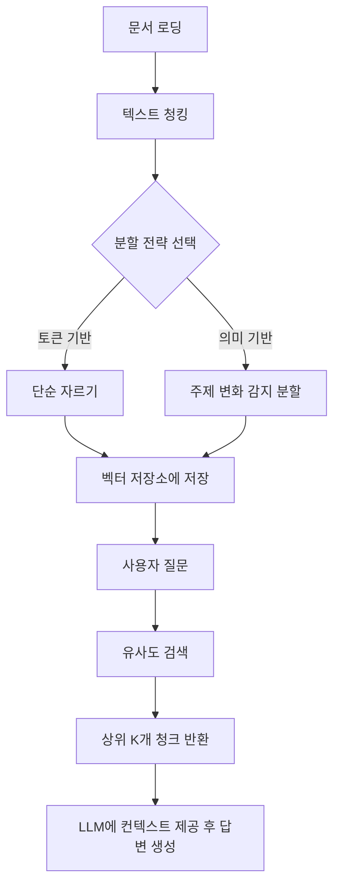
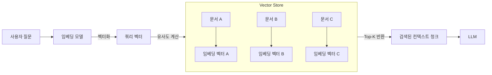
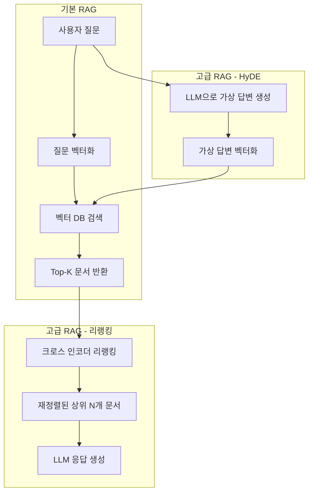
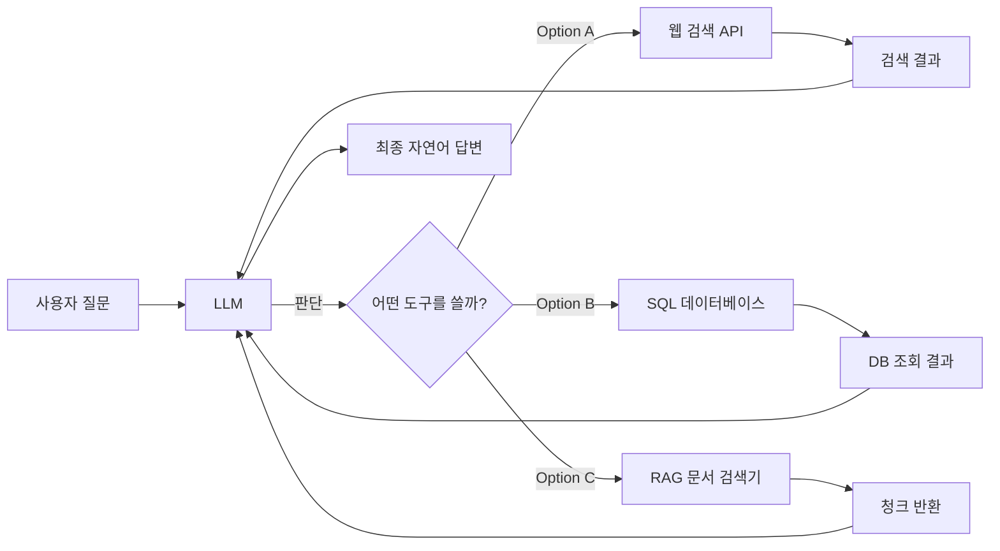

제공해주신 6장의 목차 이미지를 바탕으로 **"LLM과 RAG로 구현하는 AI 애플리케이션"**이라는 주제의 PPT 강의자료(슬라이드 텍스트)를 구성했습니다. 

총 10개의 장(섹션)으로 나누었으며, 각 슬라이드마다 **발표자가 설명할 핵심 텍스트**와 **이론 구조를 시각화한 Mermaid 다이어그램**을 포함했습니다. 소스코드는 제외하고 이론과 구조에 집중했습니다.

---

# 📊 PPT 강의자료: LLM과 RAG로 구현하는 AI 애플리케이션

---

## [서문] 강의 개요
*   **주제**: Retrieval-Augmented Generation (RAG)을 활용한 AI 애플리케이션 설계 및 구현
*   **핵심 도구**: LlamaIndex, Vector Store, Multi-modal, Agent, MCP
*   **학습 목표**: RAG의 기본 원리부터 고급 기법(멀티모달, 에이전트, MCP)까지의 전체 파이프라인을 이해한다.

---

### 01장. 라마인덱스(LlamaIndex)의 이해와 환경 구축
**1-1. 라마인덱스란 무엇인가?**
*   **개념**: LLM 애플리케이션 개발을 위한 데이터 프레임워크.
*   **지원하는 작업**: 데이터 수집(로딩) -> 인덱싱(구조화) -> 검색(Querying) -> 에이전트 기반 상호작용.
*   **핵심 가치**: 개인 데이터나 기업 데이터를 LLM에 연결하여 맥락(Context)을 제공하는 '브릿지' 역할.

**1-2. 개발 환경 구축 (이론)**
*   **파이썬 가상 환경**: 프로젝트별 의존성 충돌 방지를 위한 가상 환경(venv/conda) 설정의 중요성.
*   **API Key 관리**: OpenAI API, Gemini API 등의 키를 환경 변수(.env)에 안전하게 저장하고 불러오는 방법.
*   **라이브러리 설치**: `llama-index` 및 관련 통합 패키지 설치.

**1-3. 라마인덱스의 기본 구성 요소 (개발 전 개념)**
*   **데이터 로딩(Data Loading)**: 다양한 문서(PDF, 웹, DB)를 읽어오는 Reader.
*   **인덱싱(Indexing)**: 문서를 벡터로 변환하고 구조화하는 과정.
*   **쿼리 엔진(Query Engine)**: 사용자 질문을 받아 데이터를 검색하고 답변을 합성하는 엔진.

---

### 02장. RAG 파이프라인의 이해 (LlamaIndex 구조)
**2-1. RAG 워크플로우**
*   **데이터 로딩** -> **텍스트 분할(Chunking)** -> **벡터화(Embedding)** -> **인덱싱** -> **검색(Retrieval)** -> **LLM 응답 생성**.

**2-2. 텍스트 분할(Chunking) 전략의 이론적 이해**
*   왜 문서를 쪼개야 하는가? (LLM의 컨텍스트 윈도우 한계 극복 및 검색 정확도 향상)
*   분할 단위 비교:
    *   **토큰(Token) 단위**: 가장 기본적이지만 의미 단위가 깨질 수 있음.
    *   **문장(Sentence) 단위**: 의미가 비교적 잘 보존됨.
    *   **의미(Semantic) 단위**: 문맥의 변화(주제 변경)를 감지하여 분할하는 고급 기법.
*   **중첩(Overlap)의 중요성**: 분할된 텍스트 간의 연결성을 유지하여 정보 손실 방지.



---

### 03장. 벡터 스토어(Vector Store)의 이해
**3-1. 벡터 스토어의 핵심 개념**
*   **임베딩(Embedding)이란?**: 텍스트/이미지를 수치 벡터로 변환하여 의미적 유사성을 계산할 수 있게 하는 기술.
*   **인덱싱(Indexing)**: 수천/수만 개의 벡터를 빠르게 검색하기 위한 자료 구조(예: HNSW, IVF) 생성.
*   **Top-K 검색**: 가장 유사한 K개의 문서 조각만을 추출하여 LLM에 전달하는 과정.

**3-2. 대표적인 벡터 스토어 소개 (이론)**
*   **크로마(Chroma)**: 로컬 환경에서 가장 쉽게 사용할 수 있는 경량화된 오픈소스 벡터 DB.
*   **파인콘(Pinecone)**: 클라우드 기반의 매니지드 벡터 DB. 대규모 트래픽과 확장성에 강점.
*   **핵심 동작 원리**:
    *   컬렉션(Collection) 생성 -> 벡터 및 메타데이터 업로드 -> 메타데이터 필터링 검색 -> 결과 반환.



---

### 04장. 텍스트 문서를 활용한 RAG 실습 구조
**4-1. 다양한 문서 포맷 처리 이론**
*   RAG의 첫 단계인 '데이터 준비(Data Loading)'의 중요성.
*   **PDF 처리**: 텍스트 추출, 표/이미지 레이아웃 분석의 어려움.
*   **CSV 처리**: 테이블 형식의 데이터를 어떻게 청킹하고 벡터화할 것인가? (행(Row) 단위 분할 vs 셀 단위).
*   **HWP(한글) 처리**: 국내 환경에서 필수적인 HWPReader 개념 및 텍스트 추출 방법.

**4-2. RAG 인덱스 및 쿼리 동작 구조**
*   **인덱싱 프로세스**: 문서 로딩 -> 청킹 -> 벡터화 -> 로컬 벡터DB(크로마)에 저장.
*   **쿼리 실행 프로세스**: 사용자 질문 -> 질문을 벡터화 -> DB에서 유사 청크 검색 -> LLM에 검색 결과를 프롬프트에 넣어 응답 생성.

---

### 05장. 다중모달(Multi-modal) RAG와 고급 검색
**5-1. 텍스트를 넘어선 RAG: 멀티모달**
*   **개념**: 텍스트뿐만 아니라 **이미지**도 함께 저장하고 검색할 수 있는 시스템.
*   **멀티모달 임베딩**: OpenAI CLIP, GPT-4V 등 이미지와 텍스트를 동일한 벡터 공간에 투영하는 모델.

**5-2. 이미지 기반 RAG 시스템 아키텍처**
*   이미지 데이터를 벡터화하여 저장 (이미지 자체의 검색).
*   이미지 내 텍스트(OCR) 및 이미지의 시각적 특징을 활용한 하이브리드 검색.
*   **응용 분야**: 비슷한 화풍의 이미지 검색, 제품 이미지 기반 카탈로그 검색, 시각적 결함 분석.

**5-3. RAG 성능 고도화 (프롬프트 엔지니어링)**
*   기본 질의응답 구조에서 **개선된 프롬프트(Prompt) 템플릿**을 활용하여 응답의 정확성과 논리성을 높이는 방법.

```mermaid
flowchart TD
    subgraph Data_Prep [데이터 준비]
        A[텍스트 문서] --> Embed1[텍스트 임베딩]
        B[이미지 파일] --> Embed2[멀티모달 임베딩]
    end
    
    subgraph Storage [벡터 저장소]
        Vec1[텍스트 벡터]
        Vec2[이미지 벡터]
    end
    
    Embed1 --> Vec1
    Embed2 --> Vec2
    
    UserQuery[사용자 질문] --> QueryEmbed[질문 임베딩]
    QueryEmbed -->|텍스트 검색| Vec1
    QueryEmbed -->|이미지 검색| Vec2
    
    Vec1 --> Result1[텍스트 Top-K]
    Vec2 --> Result2[이미지 Top-K]
    
    Result1 & Result2 --> LLM[LLM (Gpt-4V 등)]
    LLM --> FinalAnswer[텍스트 응답 + 이미지 분석 결과]
```

---

### 06장. 에이전트(Agent) RAG의 이해
**6-1. 기존 RAG와 에이전트 RAG의 차이**
*   **기존 RAG**: 한 번의 질문에 한 번의 검색으로 답변 (수동적).
*   **에이전트 RAG**: 스스로 생각하고(Reasoning), 도구를 선택하고(Tool Calling), 반복 실행하며 문제를 해결 (자율적).

**6-2. 에이전트의 핵심 구성 요소**
*   **LLM (두뇌)**: 추론을 담당 (ex. GPT-4).
*   **도구 (Tools)**: 외부 API, 내부 DB, 웹 검색 등 호출 가능한 기능.
*   **메모리 (Memory)**: 이전 대화 기록을 저장하여 맥락 유지.
*   **허깅페이스(HuggingFace) 임베딩과의 결합**: 다양한 오픈소스 모델을 결합한 에이전트 구성 방법.

---

### 07장. 고급 RAG (Advanced RAG) 기법
**7-1. 단순 검색의 한계와 극복 방안**
*   **문제점**: 단순 Top-K 검색은 노이즈가 많고, 순위가 부정확할 수 있음.

**7-2. 리랭킹(ReRanking)이란?**
*   **개념**: 1차로 벡터 검색으로 뽑아낸 많은 문서(예: 10~20개) 중에서, **LLM이나 교차 인코더(Cross-Encoder)를 사용하여 재정렬**하는 과정.
*   **효과**: 정확도가 크게 향상되지만, 처리 시간과 비용이 추가됨.

**7-3. 리랭킹의 두 가지 접근법 비교**
*   **LLM 기반 리랭킹**: GPT-4 등에 질문과 후보 문서를 던져 '이게 가장 적절합니까?'라고 묻는 방식. 비용 비쌈.
*   **크로스 인코더 기반 리랭킹**: 특화된 작은 모델(예: BGE-Reranker)을 사용하여 점수를 매기는 방식. 비용 대비 효율이 좋음.

**7-4. 하이드(HyDE) 기법 소개**
*   **개념**: *Hypothetical Document Embeddings*.
*   **작동 방식**: 사용자 질문을 그대로 검색하는 대신, **"이 질문에 대한 완벽한 답변은 이렇게 생겼을 것이다"라는 가상의 문서를 LLM으로 생성**하고, 그 가상 문서의 벡터로 검색을 수행하는 기법.
*   **장점**: 질문과 실제 문서의 어휘 차이(Semantic Gap)를 줄여 검색 성능을 비약적으로 높임.



---

### 08장. 평션 콜링(Function Calling) 에이전트 실습 구조
**8-1. 함수 호출(Function Calling)의 핵심 원리**
*   **개념**: LLM이 단순히 텍스트를 생성하는 것을 넘어, **외부 함수(API, 계산기, DB 쿼리 등)를 호출할 수 있도록** 하는 기능.
*   **작동 방식**:
    1. 개발자가 사용 가능한 함수 목록과 설명을 LLM에 전달.
    2. LLM이 사용자 질문에 따라 어떤 함수를 호출할지 결정 (JSON 형태로 반환).
    3. 애플리케이션에서 해당 함수를 실제 실행하고, 결과를 다시 LLM에 전달하여 최종 답변 생성.

**8-2. 외부 API를 활용한 평션 콜링**
*   **구현 구조**: 증시 정보 호출 에이전트, 날씨 정보 호출 에이전트 등.
*   **에이전트 만들기**: 평션 콜링용 특화된 프롬프트와 도구 정의(Tool Definition) 방법.

**8-3. RAG와 평션 콜링의 결합**
*   RAG가 단순한 '문서 검색 도구'로 사용되는 것이 아니라, **에이전트가 선택할 수 있는 여러 '도구(Tool)' 중 하나**로 동작하는 구조.



---

### 09장. Text-to-SQL 상담사 에이전트 구현 구조
**9-1. Text-to-SQL의 도전 과제**
*   **개념**: 자연어 질문을 SQL 쿼리문으로 자동 변환하는 기술.
*   **어려운 점**: 데이터베이스 스키마(테이블 구조, 컬럼명, 관계)에 대한 사전 지식이 없으면 LLM이 정확한 SQL을 생성하기 어려움.

**9-2. RAG를 활용한 Text-to-SQL 접근법**
*   **스키마 인덱싱**: 데이터베이스의 테이블 및 컬럼 설명, 샘플 데이터를 벡터화하여 저장.
*   **질문 분석**: 사용자 질문이 들어오면, 관련 있는 테이블/컬럼만을 RAG로 검색해냄.
*   **프롬프트 주입**: 검색된 스키마 정보와 함께 "이 구조를 바탕으로 SQL을 작성해줘"라고 LLM에 지시.
*   **멀티턴 대화 처리**: 이전 질문과 답변을 고려하여 맥락을 유지하는 SQL 생성 기법.
*   **그라디오(Gradio) 인터페이스**: 백엔드 시스템을 웹 UI로 감싸서 데모 및 테스트 가능하도록 구성.

---

### 10장. MCP (Model Context Protocol)와 AI 에이전트의 미래
**10-1. MCP란 무엇인가? (핵심 이론)**
*   **정의**: Anthropic이 제안한 오픈소스 프로토콜. **LLM과 외부 데이터 소스/도구 간의 표준화된 연결 방식**.
*   **필요성**: 현재 각각의 LLM과 API는 연결 방식이 제각각(MCP가 없으면 직접 코딩해야 함). MCP는 이 모든 연결을 **표준 규격**으로 통일하여, 어떤 LLM이든 표준 MCP 서버에 연결될 수 있게 함.

**10-2. MCP의 구조 (Server vs Client)**
*   **MCP 서버 (Server)**: 외부 데이터(파일, DB, API)와 연결되어 실제 기능을 수행하는 주체.
*   **MCP 클라이언트 (Client)**: LLM 애플리케이션. (예: Claude Desktop, Cursor IDE, 또는 우리가 만든 커스텀 앱).
*   **연결 방식**: 표준 메시지 형식을 통해 통신. 어댑터(Adapter) 패턴을 활용하여 다양한 도구를 통합.

**10-3. MCP 실습 구조 (날씨 에이전트 예시)**
*   **날씨 API 연동**: OpenWeatherMap 등의 외부 API를 MCP 서버로 래핑(Wrapping)하기.
*   **도시명 추출**: 사용자의 질문(예: "서울 날씨 알려줘")에서 '서울'을 추출하는 로직.
*   **MCP 도구 등록**: 날씨 조회 기능을 'Tool'로 등록하고, MCP 서버 실행.
*   **클라이언트 실행**: MCP 클라이언트가 서버에 요청을 보내고, 결과를 받아 LLM이 자연어로 답변하는 전체 플로우.

```mermaid
flowchart TB
    subgraph MCP_Client [MCP 클라이언트 (AI 앱)]
        A[사용자 프롬프트 입력] --> LLM[LLM (추론 엔진)]
        LLM -->|표준 프로토콜 요청| Transport[메시지 송수신]
    end
    
    subgraph MCP_Server [MCP 서버 (외부 도구 관리)]
        Transport -->|표준 프로토콜 응답| Adapter[어댑터 / 라우터]
        Adapter --> Tool1[날씨 API 도구]
        Adapter --> Tool2[문서 검색 도구]
        Adapter --> Tool3[내부 DB 도구]
        
        Tool1 --> OpenWeather[OpenWeatherMap API]
        Tool2 --> VectorDB[벡터 DB]
        Tool3 --> SQLDB[SQL DB]
    end
    
    OpenWeather -->|데이터 반환| Tool1
    VectorDB -->|문서 반환| Tool2
    SQLDB -->|데이터 반환| Tool3
    
    Tool1 & Tool2 & Tool3 --> Adapter
    Adapter --> Transport
    Transport --> LLM
    LLM --> FinalResponse[최종 LLM 응답 출력]
```

---
**강의 자료 활용 팁:**
*   각 장의 Mermaid 코드를 `mermaid.live` 같은 사이트에 복사해서 넣으시면 예쁜 다이어그램 이미지로 변환되어 PPT에 붙여넣기 좋습니다.
*   각 장의 '텍스트' 부분은 발표자의 대본으로, 'Mermaid' 부분은 슬라이드의 시각 자료로 배치하시면 완벽한 강의 자료가 됩니다.
