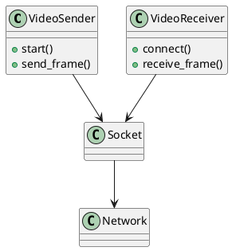

# ✅ 5️⃣ GitHub 프로젝트 구조화 버전 (파일 분리)

## 📁 video_stream_project/

```
video_stream_project/
 ├─ sender.py
 ├─ receiver.py
 ├─ config.py
 └─ README.md
```

## 📄 config.py

```python
HOST = "127.0.0.1"
PORT = 5000
```

## 📄 sender.py

```python
import socket, cv2, pickle, struct
from config import PORT

cap = cv2.VideoCapture(0)

server = socket.socket()
server.bind(("", PORT))
server.listen(1)
conn, addr = server.accept()

while True:
    ret, frame = cap.read()
    if not ret:
        break
    data = pickle.dumps(frame)
    conn.sendall(struct.pack("Q", len(data)) + data)

cap.release()
conn.close()
```

## 📄 receiver.py

```python
import socket, struct, pickle, cv2
from config import HOST, PORT

sock = socket.socket()
sock.connect((HOST, PORT))

buf = b""
size = struct.calcsize("Q")

while True:
    while len(buf) < size:
        buf += sock.recv(4096)

    frame_size = struct.unpack("Q", buf[:size])[0]
    buf = buf[size:]

    while len(buf) < frame_size:
        buf += sock.recv(4096)

    frame = pickle.loads(buf[:frame_size])
    buf = buf[frame_size:]

    cv2.imshow("Receiver", frame)
    if cv2.waitKey(1) == 27:
        break
```

## 📄 README.md

```markdown
# Video Stream Project

## Run Order
1. python sender.py
2. python receiver.py
```

---

# ✅ 6️⃣ UML 다이어그램 파일 (PlantUML)

## 📄 video_stream_uml.puml



👉 PlantUML 사이트에서 열면 UML 다이어그램 자동 생성됨

---

# ✅ 7️⃣ TCP vs UDP 비교 실습 버전

## 📤 tcp_sender.py

```python
import socket, cv2, pickle, struct

cap = cv2.VideoCapture(0)
s = socket.socket()
s.bind(("", 5001))
s.listen(1)
c,_ = s.accept()

while True:
    ret, frame = cap.read()
    if not ret: break
    data = pickle.dumps(frame)
    c.sendall(struct.pack("Q", len(data)) + data)
```

## 📥 tcp_receiver.py

```python
import socket, struct, pickle, cv2

s = socket.socket()
s.connect(("127.0.0.1",5001))

buf=b""; size=struct.calcsize("Q")

while True:
    while len(buf)<size: buf+=s.recv(4096)
    frame_size=struct.unpack("Q",buf[:size])[0]
    buf=buf[size:]

    while len(buf)<frame_size: buf+=s.recv(4096)
    frame=pickle.loads(buf[:frame_size])
    buf=buf[frame_size:]

    cv2.imshow("TCP",frame)
    if cv2.waitKey(1)==27: break
```

---

## 📤 udp_sender.py

```python
import socket, cv2, pickle

cap = cv2.VideoCapture(0)
sock = socket.socket(socket.AF_INET, socket.SOCK_DGRAM)

while True:
    ret, frame = cap.read()
    data = pickle.dumps(frame)
    sock.sendto(data, ("127.0.0.1", 5002))
```

## 📥 udp_receiver.py

```python
import socket, pickle, cv2

sock = socket.socket(socket.AF_INET, socket.SOCK_DGRAM)
sock.bind(("",5002))

while True:
    data,_ = sock.recvfrom(65536)
    frame = pickle.loads(data)
    cv2.imshow("UDP", frame)
    if cv2.waitKey(1)==27: break
```

---

# ✅ 8️⃣ exe 자동 빌드 스크립트 (PyInstaller)

## 📄 build_sender.bat

```bat
pyinstaller --onefile sender.py
pause
```

## 📄 build_receiver.bat

```bat
pyinstaller --onefile receiver.py
pause
```

---

# 📦 최종 파일 구성 요약

## 5번 (GitHub 구조)

* sender.py
* receiver.py
* config.py
* README.md

## 6번 (UML)

* video_stream_uml.puml

## 7번 (TCP/UDP 비교)

* tcp_sender.py
* tcp_receiver.py
* udp_sender.py
* udp_receiver.py

## 8번 (exe 빌드)

* build_sender.bat
* build_receiver.bat

---

# 🎯 실행 순서 예시 (TCP)

```bash
python tcp_sender.py
python tcp_receiver.py
```

# 🎯 exe 생성

```bash
build_sender.bat
build_receiver.bat
```

---

원하시면 다음 단계도 바로 만들어 드릴 수 있습니다:

✅ **9번: 모든 버전 통합 GUI 런처 프로그램**
✅ **10번: 송수신 트래픽 그래프 시각화(PyQt + matplotlib)**
✅ **11번: UDP 패킷 손실률 측정 버전**
✅ **12번: 전체 프로젝트 ZIP 구조 정리**

원하시면 다음 번호를 선택하세요:
👉 **9 / 10 / 11 / 12 중 원하는 번호**
