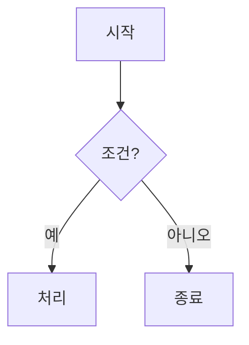

마크다운 문서에 다양한 요소를 적용하기 위한 주요 문법(태그)을 정리해 드립니다. 특히 이전 대화에서 자주 사용한 **코드 블록, Mermaid 다이어그램, 표** 등을 중심으로 설명합니다.

---

### 1. 📦 코드 블록 (Code Block)
파이썬, 자바스크립트 등 프로그래밍 코드를 넣을 때 사용합니다.

```markdown
```python
print("Hello, World!")
```
```

**지원되는 언어명 예시:** `python`, `javascript`, `java`, `bash`, `sql`, `json`, `html`, `css` 등

---

### 2.  Mermaid 다이어그램
흐름도, 순서도, 클래스 다이어그램 등을 그릴 때 사용합니다. **Notion, Obsidian, GitHub, VS Code** 등에서 지원합니다.

```markdown

```

**지원하는 다이어그램 종류:**
- `graph` / `flowchart`: 흐름도
- `sequenceDiagram`: 시퀀스 다이어그램
- `classDiagram`: 클래스 다이어그램
- `pie`: 파이 차트
- `gantt`: 간트 차트
- `mindmap`: 마인드맵

---

### 3. 📋 표 (Table)
데이터를 표 형태로 정리할 때 사용합니다.

```markdown
| 이름 | 나이 | 직업 |
| --- | --- | --- |
| 홍길동 | 30 | 개발자 |
| 김철수 | 25 | 디자이너 |
```

**정렬 옵션:**
- `:---` (왼쪽 정렬)
- `:---:` (가운데 정렬)
- `---:` (오른쪽 정렬)

---

### 4.  텍스트 강조
- **굵게:** `**텍스트**` 또는 `__텍스트__`
- *기울임:* `*텍스트*` 또는 `_텍스트_`
- ~~취소선~~: `~~텍스트~~`
- `인라인 코드`: `` `텍스트` ``

---

### 5. 📌 제목 (Heading)
```markdown
# 1단계 제목 (가장 큼)
## 2단계 제목
### 3단계 제목
#### 4단계 제목
```

---

### 6. 🔗 링크 & 이미지
- **링크:** `[텍스트](URL)` → [구글](https://google.com)
- **이미지:** ``

---

### 7. 📝 리스트
- **순서 없는 리스트:** `- 항목` 또는 `* 항목`
- **순서 있는 리스트:** `1. 항목`, `2. 항목`
- **체크박스:** `- [ ] 할 일`, `- [x] 완료된 일`

---

### 8. 💬 인용 & 구분선
- **인용:** `> 인용 텍스트`
- **수평 구분선:** `---` 또는 `***` 또는 `___`

---

### 9. 📌 참고: 플랫폼별 Mermaid 지원 여부

| 플랫폼 | Mermaid 지원 | 비고 |
| --- | --- | --- |
| **GitHub** | ✅ 지원 | README.md에서 자동 렌더링 |
| **Notion** | ✅ 지원 | `/mermaid` 블록으로 삽입 |
| **Obsidian** | ✅ 지원 | 기본 지원 |
| **VS Code** | ✅ 지원 | 확장 프로그램 설치 권장 |
| **Jupyter Notebook** | ✅ 지원 | `%%mermaid` 매직 명령어 |
| **일반 마크다운 뷰어** | ❌ 미지원 | HTML로 변환 필요 |

---

### 💡 실전 예시 (복사해서 사용해 보세요)

```markdown
# 📊 시스템 아키텍처

## 1. 데이터 흐름도


## 2. 주요 기술 스택

| 구분 | 기술 | 비고 |
| --- | --- | --- |
| 모델 | Qwen2.5-1.5B | 경량 한국어 모델 |
| 프레임워크 | Hugging Face | transformers 라이브러리 |
| 배포 | Ollama | 로컬 행 |

## 3. 코드 예시

```python
from transformers import pipeline
pipe = pipeline("text-generation", model="Qwen/Qwen2.5-1.5B-Instruct")
print(pipe("안녕하세요!"))
```
```

---

### ️ 주의사항
1. **Mermaid 렌더링이 안 될 때:** 사용하는 마크다운 에디터가 Mermaid를 지원하는지 확인하세요. 미지원 환경이라면 [Mermaid Live Editor](https://mermaid.live)에서 이미지로 변환 후 삽입하세요.
2. **코드 블록 안의 백틱:** 코드 블록 안에 백틱(```)을 포함시키려면 백틱을 4개로 늘리세요: ```` ````
3. **표 안의 파이프(|):** 표 내용 안에 `|` 문자를 넣으려면 `\|`로 이스케이프하세요.

특정 플랫폼(Notion, GitHub, Obsidian 등)에서 사용하시는 경우 말씀해 주시면, 해당 플랫폼에 최적화된 문법을 추가로 안내해 드리겠습니다!
