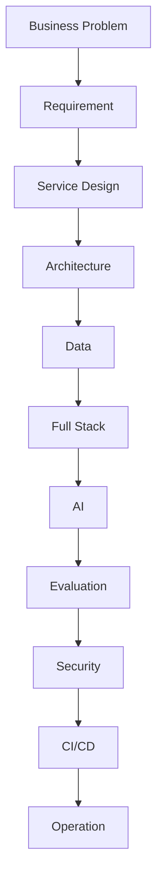

아래 코드는 `process.txt` 파일에서 단계형 텍스트를 읽고 Mermaid 스크립트가 포함된 `process_mermaid.md` 파일을 생성합니다.

### 1. 입력 파일: `process.txt`

```text
Business Problem
        ↓
Requirement
        ↓
Service Design
        ↓
Architecture
        ↓
Data
        ↓
Full Stack
        ↓
AI
        ↓
Evaluation
        ↓
Security
        ↓
CI/CD
        ↓
Operation
```

### 2. 파이썬 코드: `text_to_mermaid.py`

````python
from pathlib import Path


def read_process_steps(input_file: str) -> list[str]:
    """
    텍스트 파일을 읽어 단계 이름을 리스트로 반환한다.

    지원 구분자:
    - ↓
    - ->
    - →
    """

    text = Path(input_file).read_text(encoding="utf-8")

    # 화살표 표현을 줄바꿈으로 통일
    for arrow in ["↓", "→", "->"]:
        text = text.replace(arrow, "\n")

    # 빈 줄과 공백 제거
    steps = [
        line.strip()
        for line in text.splitlines()
        if line.strip()
    ]

    return steps


def escape_mermaid_text(text: str) -> str:
    """
    Mermaid 노드 안에서 문제가 될 수 있는 문자를 처리한다.
    """

    return (
        text.replace("\\", "\\\\")
        .replace('"', '\\"')
        .replace("\n", " ")
    )


def create_mermaid(
    steps: list[str],
    direction: str = "TD"
) -> str:
    """
    단계 목록을 Mermaid flowchart 코드로 변환한다.

    direction:
    - TD: 위에서 아래
    - LR: 왼쪽에서 오른쪽
    """

    if not steps:
        raise ValueError("변환할 단계가 없습니다.")

    lines = [
        "```mermaid",
        f"flowchart {direction}"
    ]

    # 노드 생성
    for index, step in enumerate(steps, start=1):
        node_id = f"N{index}"
        label = escape_mermaid_text(step)

        lines.append(f'    {node_id}["{label}"]')

    lines.append("")

    # 노드 연결
    for index in range(1, len(steps)):
        lines.append(f"    N{index} --> N{index + 1}")

    # 노드 스타일
    lines.extend([
        "",
        "    classDef processNode fill:#EEF5E9,"
        "stroke:#7BA36A,"
        "stroke-width:1.5px,"
        "color:#1F2937,"
        "font-size:16px;",
        "",
        f"    class {','.join(f'N{i}' for i in range(1, len(steps) + 1))} processNode;",
        "```"
    ])

    return "\n".join(lines)


def save_mermaid(
    mermaid_script: str,
    output_file: str
) -> None:
    """
    Mermaid 스크립트를 마크다운 파일로 저장한다.
    """

    Path(output_file).write_text(
        mermaid_script,
        encoding="utf-8"
    )


def main():
    input_file = "process.txt"
    output_file = "process_mermaid.md"

    try:
        steps = read_process_steps(input_file)

        # TD: 위에서 아래, LR: 왼쪽에서 오른쪽
        mermaid_script = create_mermaid(
            steps,
            direction="TD"
        )

        save_mermaid(
            mermaid_script,
            output_file
        )

        print("Mermaid 스크립트 생성 완료")
        print(f"입력 파일: {input_file}")
        print(f"출력 파일: {output_file}")
        print(f"단계 개수: {len(steps)}")

        print("\n생성된 Mermaid 코드")
        print("-" * 50)
        print(mermaid_script)

    except FileNotFoundError:
        print(f"오류: '{input_file}' 파일을 찾을 수 없습니다.")

    except ValueError as error:
        print(f"오류: {error}")

    except Exception as error:
        print(f"예상하지 못한 오류: {error}")


if __name__ == "__main__":
    main()
````

### 3. 실행

```bash
python text_to_mermaid.py
```

생성된 `process_mermaid.md`의 Mermaid 결과는 다음 구조입니다.



가로 방향으로 만들려면 다음 부분을 `LR`로 변경하면 됩니다.

```python
mermaid_script = create_mermaid(
    steps,
    direction="LR"
)
```
