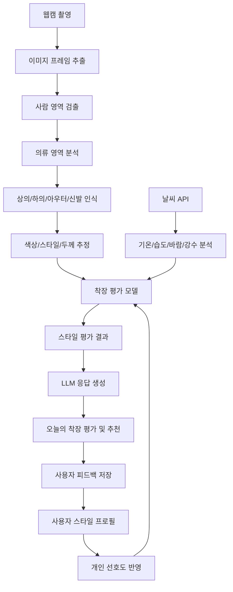
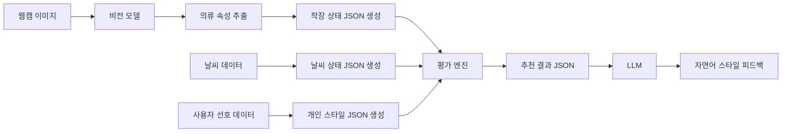
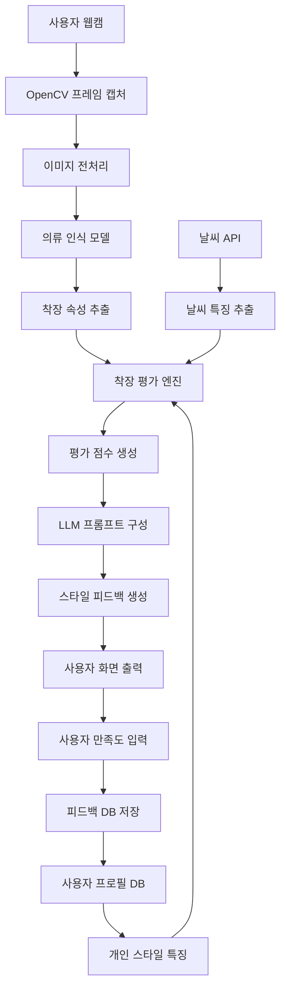

가능합니다. 기존 시스템에 웹캠을 추가하면 구조가 다음처럼 확장됩니다.

> **오늘 날씨 분석 → 사용자의 현재 옷차림 인식 → 날씨 적합도 평가 → 개인 스타일 반영 → 개선 코디 추천**

즉, 단순히 “오늘 뭐 입을까?”가 아니라 **“지금 입은 옷이 오늘 날씨와 상황에 적절한가?”**를 판단하는 AI 스타일 코치 시스템으로 발전시킬 수 있습니다.

---

## 1. 추가되는 핵심 기능

웹캠을 추가하면 다음 기능이 필요합니다.

| 기능        | 설명                             |
| --------- | ------------------------------ |
| 웹캠 촬영     | 사용자의 현재 착장 이미지 입력              |
| 사람 영역 검출  | 배경에서 사람만 분리                    |
| 의류 인식     | 상의, 하의, 아우터, 신발 등 인식           |
| 색상/스타일 분석 | 무채색, 밝은색, 캐주얼, 포멀, 스포티 등 분류    |
| 날씨 적합도 평가 | 기온, 습도, 바람, 강수 여부와 현재 옷 비교     |
| 개인 스타일 반영 | 사용자가 선호하는 스타일 기준으로 평가          |
| 개선 추천     | “겉옷 추가”, “소재 변경”, “신발 변경” 등 제안 |

웹캠 입력은 Python 기준으로 OpenCV의 `VideoCapture`를 사용해 카메라 장치에서 프레임을 읽는 방식이 기본입니다. OpenCV 튜토리얼에서도 카메라 장치 번호를 지정해 프레임 단위로 영상을 캡처하는 방식을 설명합니다. ([OpenCV-Python Tutorials][1])

---

## 2. 전체 시스템 구조



---

## 3. 기능을 나누면 5개 모듈입니다

## 모듈 1: 웹캠 입력 모듈

웹캠에서 이미지를 받아옵니다.

역할은 간단합니다.

```text
웹캠 실행 → 프레임 캡처 → 이미지 저장 또는 실시간 분석
```

초기 MVP에서는 실시간 분석보다 **버튼을 눌러 한 장 촬영한 뒤 분석**하는 방식이 좋습니다.

예:

```text
[웹캠 켜기]
[사진 촬영]
[오늘 옷차림 평가하기]
```

처음부터 실시간으로 매 프레임을 분석하면 속도, 조명, 자세, 배경 문제 때문에 구현 난도가 올라갑니다.

---

## 모듈 2: 사람 및 의류 영역 검출

웹캠 이미지에서 사용자의 옷을 분석하려면 먼저 사람과 의류 영역을 찾아야 합니다.

사용 가능한 방법은 세 가지입니다.

| 방법                        | 설명                  | 난이도 |    추천도 |
| ------------------------- | ------------------- | --: | -----: |
| YOLO 객체 탐지                | 사람, 옷, 신발 등 객체 검출   |  중간 |     높음 |
| MediaPipe Object Detector | 이미지/비디오에서 객체 위치 검출  |  중간 |     중간 |
| Segmentation 모델           | 사람과 옷 영역을 픽셀 단위로 분리 |  높음 | 고도화 단계 |

Ultralytics YOLO는 Python에서 객체 탐지, 인스턴스 세그멘테이션, 이미지 분류 등을 통합적으로 사용할 수 있도록 문서화되어 있어 교육용 구현에 적합합니다. ([Ultralytics Docs][2]) MediaPipe Object Detector도 이미지나 연속 비디오 스트림에서 여러 객체의 위치를 검출하는 태스크를 제공합니다. ([Google for Developers][3])

초기에는 다음 정도만 검출해도 충분합니다.

```text
사람 있음/없음
상의 영역
하의 영역
아우터 여부
신발 여부
```

---

## 모듈 3: 옷차림 속성 분석

단순히 “셔츠다, 바지다”만 아는 것으로는 부족합니다. 스타일 평가를 하려면 다음 속성이 필요합니다.

| 분석 항목    | 예시                         |
| -------- | -------------------------- |
| 의류 종류    | 반팔, 긴팔, 셔츠, 니트, 재킷, 코트, 패딩 |
| 하의 종류    | 반바지, 슬랙스, 청바지, 면바지         |
| 신발 종류    | 운동화, 구두, 샌들, 부츠            |
| 색상       | 검정, 흰색, 회색, 네이비, 베이지       |
| 스타일      | 캐주얼, 포멀, 스포티, 미니멀          |
| 계절감      | 여름형, 봄가을형, 겨울형             |
| 두께 추정    | 얇음, 보통, 두꺼움                |
| 노출/보온 정도 | 반팔/긴팔, 반바지/긴바지, 외투 유무      |

이 단계에서는 반드시 완벽한 의류 인식 모델을 만들 필요는 없습니다.
초기에는 다음처럼 단순화하는 것이 좋습니다.

```text
상의: 반팔 / 긴팔 / 셔츠 / 후드 / 니트
하의: 반바지 / 긴바지 / 청바지 / 슬랙스
아우터: 없음 / 가디건 / 재킷 / 코트 / 패딩
신발: 운동화 / 구두 / 샌들 / 부츠
색상: 밝음 / 어두움 / 무채색 / 컬러감 있음
스타일: 캐주얼 / 단정함 / 스포티 / 포멀
```

의류 전용 데이터셋을 활용하려면 DeepFashion, DeepFashion2, Fashionpedia가 후보입니다. DeepFashion은 의류 속성 예측, 의류 검색, 랜드마크 검출 등 벤치마크를 제공하고, DeepFashion2는 의류 검출·포즈 추정·세그멘테이션·재식별 태스크를 위한 의류 아이템 주석을 포함합니다. ([다매체 연구소][4]) Fashionpedia는 의류 카테고리, 의류 파트, 세부 속성, 세그멘테이션 마스크를 포함한 패션 이미지 데이터셋입니다. ([arXiv][5])

---

## 4. 평가 기준을 먼저 정의해야 합니다

웹캠 기능의 핵심은 “옷을 인식하는 것”보다 **어떤 기준으로 평가할 것인가**입니다.

추천 평가 기준은 다음 4가지입니다.

| 평가 기준      | 설명                  | 예시                      |
| ---------- | ------------------- | ----------------------- |
| 날씨 적합도     | 기온, 습도, 바람, 비에 맞는지  | “습도 높은 날 청바지는 불편할 수 있음” |
| 계절감        | 현재 계절과 어울리는지        | “여름철 두꺼운 니트는 부적합”       |
| 상황 적합도     | 출근, 강의, 운동, 외출에 맞는지 | “강의 일정이면 단정한 셔츠가 좋음”    |
| 개인 스타일 적합도 | 사용자의 선호와 맞는지        | “사용자는 무채색 캐주얼을 선호함”     |

여기서 중요한 것은 **사람의 외모나 체형을 평가하지 않는 것**입니다.
이 시스템은 다음만 평가해야 합니다.

```text
옷의 종류
옷의 색상
옷의 계절감
옷의 날씨 적합성
옷의 상황 적합성
사용자 선호와의 일치도
```

피해야 할 평가는 다음입니다.

```text
체형 평가
외모 평가
얼굴 평가
나이/성별 추정
매력도 평가
민감한 개인 특성 추정
```

---

## 5. 착장 평가 로직 예시

예를 들어 오늘 날씨가 다음과 같다고 가정합니다.

```text
기온: 31도
습도: 78%
풍속: 약함
강수확률: 20%
상황: 강의
```

웹캠 분석 결과:

```text
상의: 긴팔 셔츠
하의: 청바지
아우터: 없음
신발: 운동화
색상: 네이비 + 블루
스타일: 캐주얼
```

평가 결과:

```text
날씨 적합도: 65점
스타일 적합도: 80점
개인 선호 적합도: 75점
개선 추천: 청바지 대신 얇은 슬랙스 또는 린넨 팬츠 추천
```

LLM 응답:

```text
현재 착장은 전체적으로 단정한 캐주얼 스타일이라 강의 상황에는 잘 어울립니다. 
다만 오늘은 기온과 습도가 높은 편이라 청바지는 다소 덥고 답답하게 느껴질 수 있습니다. 
상의는 괜찮지만, 하의는 얇은 슬랙스나 린넨 소재 바지로 바꾸면 더 쾌적할 것 같습니다.
```

---

## 6. 모델 구성 방식

추천 구조는 다음처럼 나누는 것이 좋습니다.



핵심은 LLM에게 이미지를 바로 맡기는 것이 아니라, 먼저 비전 모델이 구조화된 정보를 뽑아내는 것입니다.

예:

```json
{
  "top": "long_sleeve_shirt",
  "bottom": "jeans",
  "outer": "none",
  "shoes": "sneakers",
  "main_colors": ["navy", "blue"],
  "style": "casual",
  "warmth_level": 3,
  "formality_level": 3
}
```

그 다음 LLM이 이 정보를 바탕으로 설명합니다.

---

## 7. 추천 점수 계산 방식

초기에는 머신러닝보다 점수 기반 규칙이 좋습니다.

```text
최종 점수 = 날씨 적합도 40점
          + 상황 적합도 25점
          + 개인 선호 적합도 25점
          + 색상/스타일 조화 10점
```

예시:

| 평가 항목     |       점수 |
| --------- | -------: |
| 날씨 적합도    |  30 / 40 |
| 상황 적합도    |  22 / 25 |
| 개인 선호 적합도 |  20 / 25 |
| 스타일 조화    |   8 / 10 |
| 총점        | 80 / 100 |

출력:

```text
오늘 착장 점수: 80점
평가: 전체적으로 무난하지만, 습도가 높아 하의 소재를 바꾸면 더 좋음
```

---

## 8. 개인화 튜닝 방식

웹캠이 추가되면 사용자 데이터가 훨씬 풍부해집니다.

기존에는 사용자가 직접 “오늘 반팔을 입었다”고 입력해야 했지만, 이제는 웹캠이 자동으로 추정할 수 있습니다.

저장 데이터 예시:

| 날짜    | 날씨          | 웹캠 분석       | 사용자 만족도 |
| ----- | ----------- | ----------- | ------- |
| 7월 7일 | 31도, 습도 78% | 긴팔 셔츠 + 청바지 | 2점      |
| 7월 8일 | 29도, 습도 70% | 반팔 셔츠 + 슬랙스 | 5점      |
| 7월 9일 | 24도, 바람 강함  | 셔츠 + 가디건    | 5점      |

이 데이터가 쌓이면 다음을 학습할 수 있습니다.

```text
사용자는 습도 높은 날 청바지를 싫어한다.
사용자는 강의 일정에서는 셔츠 스타일을 선호한다.
사용자는 24도 이하에서 얇은 겉옷을 선호한다.
사용자는 무채색 계열을 선호한다.
```

튜닝은 다음 순서가 좋습니다.

| 단계  | 방식               |
| --- | ---------------- |
| 1단계 | 규칙 기반 점수 조정      |
| 2단계 | 사용자 선호 프로필 업데이트  |
| 3단계 | 유사 날씨 + 유사 착장 검색 |
| 4단계 | 추천 모델 학습         |
| 5단계 | LLM 응답 스타일 튜닝    |

---

## 9. 비전 모델 선택 전략

초기 구현은 세 가지 방식 중 하나를 선택하면 됩니다.

### A안: YOLO 기반

가장 실용적인 방식입니다.

```text
웹캠 이미지 → YOLO → 사람/옷/신발 검출 → 착장 정보 생성
```

장점:

| 장점            |
| ------------- |
| 빠름            |
| Python 예제가 많음 |
| 실시간 웹캠 분석 가능  |
| 교육용으로 설명하기 좋음 |

단점:

| 단점                           |
| ---------------------------- |
| 일반 YOLO 모델은 의류 세부 분류가 약함     |
| 별도 의류 데이터셋으로 추가 학습이 필요할 수 있음 |

---

### B안: CLIP 기반

CLIP은 이미지와 텍스트를 같은 임베딩 공간에서 비교하는 방식으로, 별도 학습 없이 “이 이미지는 캐주얼 스타일인가?”, “여름 옷인가?” 같은 zero-shot 분류에 사용할 수 있습니다. OpenAI의 CLIP 설명에서도 CLIP이 zero-shot 방식 사용을 목표로 설계되었다고 설명합니다. ([OpenAI][6])

예:

```text
이미지와 다음 문장들을 비교
- "a person wearing casual summer clothes"
- "a person wearing formal office clothes"
- "a person wearing winter outerwear"
- "a person wearing sporty clothes"
```

장점:

| 장점                            |
| ----------------------------- |
| 별도 학습 없이 스타일 분류 가능            |
| “캐주얼/포멀/스포티” 같은 추상 스타일 판단에 유리 |
| MVP에 적합                       |

단점:

| 단점                  |
| ------------------- |
| 정확한 의류 부위 검출은 약함    |
| 세부 옷 종류 분류에는 한계가 있음 |

---

### C안: Segmentation 기반

고도화 단계에서는 의류 영역을 픽셀 단위로 나누는 세그멘테이션이 필요합니다.

```text
상의 영역
하의 영역
아우터 영역
신발 영역
```

SAM 계열 모델은 이미지와 비디오에서 객체를 선택하고 분할하는 방향으로 발전했고, SAM 2는 비디오 프레임을 순차적으로 처리하면서 대상 객체를 추적할 수 있는 구조를 설명합니다. ([Meta AI][7])

장점:

| 장점               |
| ---------------- |
| 옷 영역을 정밀하게 분리 가능 |
| 색상 분석 정확도 향상     |
| 의류별 영역 기반 분석 가능  |

단점:

| 단점                   |
| -------------------- |
| 구현 난도 높음             |
| 연산량이 큼               |
| 초보자 교육용 MVP에는 다소 무거움 |

---

## 10. 현실적인 개발 순서

가장 추천하는 개발 순서는 다음입니다.

## 1단계: 웹캠 촬영 기능 구현

목표:

```text
웹캠 켜기
사진 촬영
이미지 저장
화면에 표시
```

기술:

```text
OpenCV
Streamlit 또는 Gradio
```

---

## 2단계: 기본 이미지 분석

목표:

```text
사람이 있는지 확인
전체 착장 이미지 저장
밝은색/어두운색 정도 분석
```

처음부터 옷 종류를 완벽하게 맞추려고 하지 말고, 먼저 색상과 전체 스타일만 분석합니다.

---

## 3단계: 의류 분류 모델 연결

목표:

```text
상의, 하의, 외투, 신발을 대략적으로 분류
```

가능한 출력:

```json
{
  "top": "short_sleeve",
  "bottom": "long_pants",
  "outer": "none",
  "shoes": "sneakers",
  "style": "casual"
}
```

---

## 4단계: 날씨 데이터와 비교

목표:

```text
현재 옷차림이 오늘 날씨에 맞는지 평가
```

예시 규칙:

| 날씨 조건               | 착장 평가     |
| ------------------- | --------- |
| 30도 이상 + 긴팔 + 청바지   | 더울 가능성 높음 |
| 25도 이하 + 반팔 + 바람 강함 | 얇은 외투 추천  |
| 습도 75% 이상 + 두꺼운 하의  | 통기성 낮음    |
| 비 예보 + 흰색 신발        | 오염 가능성 안내 |
| 일교차 큼 + 외투 없음       | 가벼운 겉옷 추천 |

---

## 5단계: 스타일 평가 응답 생성

LLM에게 다음 정보를 전달합니다.

```json
{
  "weather": {
    "temperature": 31,
    "humidity": 78,
    "wind": "weak",
    "rain_probability": 20
  },
  "outfit": {
    "top": "long_sleeve_shirt",
    "bottom": "jeans",
    "outer": "none",
    "shoes": "sneakers",
    "style": "casual"
  },
  "user_profile": {
    "preferred_style": "neat casual",
    "heat_sensitive": true,
    "dislikes": ["humid day jeans"]
  },
  "situation": "lecture"
}
```

LLM 응답:

```text
오늘 착장은 강의 상황에는 잘 어울리는 단정한 캐주얼 스타일입니다. 
다만 기온과 습도가 높기 때문에 긴팔 셔츠와 청바지 조합은 다소 덥게 느껴질 수 있습니다. 
상의는 소매를 걷을 수 있는 얇은 셔츠라면 괜찮고, 하의는 얇은 슬랙스나 린넨 팬츠로 바꾸면 더 쾌적합니다.
```

---

## 6단계: 사용자 피드백 저장

평가 후 사용자에게 물어봅니다.

```text
오늘 추천이 도움이 되었나요?
1점: 전혀 아님
2점: 조금 아쉬움
3점: 보통
4점: 좋음
5점: 매우 좋음
```

또는:

```text
실제로 입어보니 어땠나요?
- 더웠다
- 추웠다
- 습해서 불편했다
- 바람 때문에 추웠다
- 스타일은 마음에 들었다
- 상황에 잘 맞았다
```

이 피드백이 개인 스타일 튜닝 데이터가 됩니다.

---

## 11. 최종 시스템 아키텍처



---

## 12. 추천 기술 스택

| 영역         | 추천 기술                               |
| ---------- | ----------------------------------- |
| 웹캠 입력      | OpenCV                              |
| 웹 UI       | Streamlit 또는 Gradio                 |
| 백엔드        | FastAPI                             |
| 의류 검출      | YOLO                                |
| 스타일 분류     | CLIP                                |
| 세그멘테이션 고도화 | SAM / SAM 2                         |
| 데이터 저장     | SQLite → PostgreSQL                 |
| 추천 모델      | 규칙 기반 → KNN → RandomForest/LightGBM |
| LLM 응답     | OpenAI API, Ollama, Qwen, Llama     |
| 배포         | Docker, AWS, RunPod, 로컬 PC          |

교육용 MVP라면 이 조합이 가장 현실적입니다.

```text
Streamlit + OpenCV + CLIP + 날씨 API + SQLite + LLM API
```

조금 더 본격적으로 만들 경우:

```text
FastAPI + React/Streamlit + YOLO + CLIP + PostgreSQL + LLM
```

---

## 13. MVP 기준 기능 정의

처음 만드는 버전은 이 정도면 충분합니다.

| 기능            | 구현 여부 |
| ------------- | ----- |
| 지역 입력         | 필수    |
| 날씨 API 연동     | 필수    |
| 웹캠 사진 촬영      | 필수    |
| 전체 착장 이미지 분석  | 필수    |
| 밝은색/어두운색 분석   | 필수    |
| 캐주얼/포멀/스포티 분류 | 필수    |
| 날씨 적합도 점수     | 필수    |
| LLM 추천 문장 생성  | 필수    |
| 사용자 만족도 저장    | 필수    |
| 상의/하의 정밀 분류   | 2차    |
| 의류 세그멘테이션     | 3차    |
| 개인별 추천 모델 학습  | 3차    |

---

## 14. 프로젝트 개발 로드맵

| 단계  | 개발 내용      | 목표                    |
| --- | ---------- | --------------------- |
| 1단계 | 웹캠 촬영 기능   | 사용자의 현재 착장 이미지 확보     |
| 2단계 | 날씨 API 연동  | 오늘의 기온, 습도, 바람, 강수 확보 |
| 3단계 | 이미지 기본 분석  | 색상, 밝기, 전체 스타일 분석     |
| 4단계 | 의류 분류      | 상의, 하의, 아우터, 신발 추정    |
| 5단계 | 평가 규칙 설계   | 날씨 적합도와 상황 적합도 계산     |
| 6단계 | LLM 응답 생성  | 자연어 스타일 피드백 제공        |
| 7단계 | 사용자 피드백 저장 | 개인화 데이터 축적            |
| 8단계 | 추천 모델 튜닝   | 개인별 스타일 추천 고도화        |

---

## 15. 최종 출력 예시

사용자가 웹캠으로 현재 착장을 촬영합니다.

시스템 분석:

```json
{
  "detected_outfit": {
    "top": "long_sleeve_shirt",
    "bottom": "jeans",
    "outer": "none",
    "shoes": "sneakers",
    "color_tone": "dark casual",
    "style": "neat casual"
  },
  "weather": {
    "temperature": 31,
    "humidity": 78,
    "wind": "weak",
    "rain_probability": 20
  },
  "score": {
    "weather_fit": 65,
    "occasion_fit": 85,
    "personal_style_fit": 80,
    "total": 76
  }
}
```

사용자에게 보여주는 응답:

```text
현재 착장은 단정한 캐주얼 스타일로 강의나 외출 상황에는 잘 어울립니다.

다만 오늘은 기온이 높고 습도도 높은 편이라 긴팔 셔츠와 청바지 조합은 다소 덥고 답답하게 느껴질 수 있습니다. 상의가 얇은 소재라면 괜찮지만, 하의는 청바지보다 얇은 슬랙스나 린넨 팬츠가 더 적합합니다.

오늘의 추천은 “얇은 셔츠 + 통기성 좋은 바지 + 편한 운동화”입니다. 실내 냉방이 강한 장소에 오래 있을 예정이라면 아주 얇은 가디건을 가방에 챙기는 것도 좋습니다.
```

---

## 16. 가장 중요한 설계 원칙

이 시스템은 다음 방향으로 설계하는 것이 좋습니다.

```text
이미지에서 사람을 평가하지 않는다.
이미지에서 옷의 속성만 분석한다.
날씨와 상황에 맞는 실용적 피드백을 제공한다.
사용자의 선호를 계속 학습한다.
얼굴 이미지는 저장하지 않거나 자동 블러 처리한다.
민감한 신체 정보는 추론하지 않는다.
```

특히 웹캠을 사용하는 서비스는 개인정보 문제가 있으므로, 가능하면 다음 방식을 추천합니다.

| 항목     | 권장 방식         |
| ------ | ------------- |
| 얼굴     | 자동 블러 처리      |
| 이미지 저장 | 기본 저장 안 함     |
| 분석 결과  | 옷 속성만 저장      |
| 사용자 동의 | 촬영 전 명확히 고지   |
| 데이터 삭제 | 사용자가 직접 삭제 가능 |
| 모델 학습  | 개인별 로컬 데이터 우선 |

---

## 핵심 정리

웹캠 기능을 추가하면 프로젝트는 다음과 같이 발전합니다.

> **날씨 기반 추천 AI → 웹캠 기반 착장 평가 AI → 개인화 스타일 코치 AI**

가장 현실적인 구현 순서는 다음입니다.

```text
1. 웹캠으로 착장 이미지 촬영
2. 이미지에서 사람/옷 영역 분석
3. 상의, 하의, 외투, 신발, 색상, 스타일 추출
4. 오늘 날씨와 비교
5. 개인 선호도와 비교
6. 착장 점수 계산
7. LLM으로 자연어 스타일 피드백 생성
8. 사용자 만족도 저장
9. 다음 추천에 반영
```

처음부터 완벽한 의류 인식 모델을 만들려고 하기보다, **웹캠 촬영 + CLIP 스타일 분류 + 규칙 기반 날씨 평가 + LLM 응답 생성**으로 MVP를 만든 뒤, 이후 YOLO나 의류 데이터셋 기반 파인튜닝으로 고도화하는 방향이 가장 안정적입니다.

[1]: https://opencv24-python-tutorials.readthedocs.io/en/latest/py_tutorials/py_gui/py_video_display/py_video_display.html?utm_source=chatgpt.com "Getting Started with Videos — OpenCV-Python Tutorials beta ..."
[2]: https://docs.ultralytics.com/usage/python?utm_source=chatgpt.com "Python Usage"
[3]: https://developers.google.com/edge/mediapipe/solutions/vision/object_detector?utm_source=chatgpt.com "Object detection task guide | Google AI Edge"
[4]: https://mmlab.ie.cuhk.edu.hk/projects/DeepFashion.html?utm_source=chatgpt.com "Large-scale Fashion (DeepFashion) Database"
[5]: https://arxiv.org/abs/2004.12276?utm_source=chatgpt.com "Fashionpedia: Ontology, Segmentation, and an Attribute Localization Dataset"
[6]: https://openai.com/index/clip/?utm_source=chatgpt.com "CLIP: Connecting text and images"
[7]: https://ai.meta.com/research/sam2/?utm_source=chatgpt.com "Introducing Meta Segment Anything Model 2 (SAM 2)"
