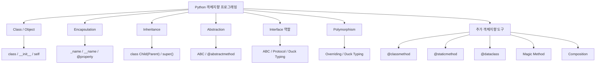
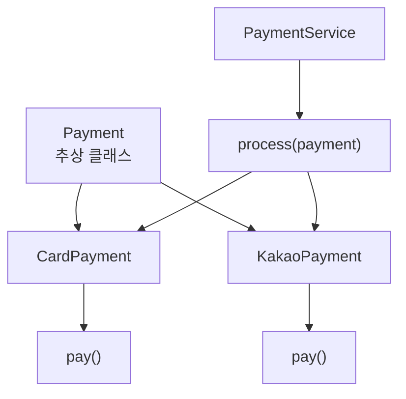

네. Java의 객체지향을 배운 학생에게 Python 객체지향을 설명할 때는 **“개념은 거의 동일하지만, Python은 문법적 제약이 훨씬 적고 동적 타이핑과 Duck Typing을 적극적으로 활용한다”**는 점을 먼저 잡아주는 것이 좋습니다.

전체 관계를 먼저 보면 다음과 같습니다.



---

# 1. Java와 Python 객체지향 비교

먼저 전체적인 대응 관계부터 보여주면 학생들이 이해하기 쉽습니다.

| 객체지향 개념       | Java                       | Python                         |
| ------------- | -------------------------- | ------------------------------ |
| 클래스           | `class Student`            | `class Student:`               |
| 객체 생성         | `new Student()`            | `Student()`                    |
| 생성자           | `Student()`                | `__init__()`                   |
| 현재 객체         | `this`                     | `self`                         |
| 상속            | `extends`                  | `class B(A)`                   |
| 부모 호출         | `super()`                  | `super()`                      |
| 추상 클래스        | `abstract class`           | `ABC`                          |
| 추상 메서드        | `abstract`                 | `@abstractmethod`              |
| 인터페이스         | `interface`                | `ABC`, `Protocol`, Duck Typing |
| 구현            | `implements`               | 별도 키워드 없음                      |
| 오버라이딩         | `@Override`                | 같은 이름의 메서드 재정의                 |
| 오버로딩          | 지원                         | 전통적인 방식은 미지원                   |
| 접근제어          | `private/protected/public` | 관례 중심                          |
| Getter/Setter | 메서드                        | `@property`                    |
| 정적 메서드        | `static`                   | `@staticmethod`                |
| 클래스 메서드       | 없음에 가까움                    | `@classmethod`                 |
| 다중 상속         | 클래스는 불가                    | 가능                             |
| 다형성           | 타입 중심                      | Duck Typing 중심                 |

---

# 2. 클래스와 객체

## Java

```java
class Student {

    String name;
    int age;

    Student(String name, int age) {
        this.name = name;
        this.age = age;
    }

    void study() {
        System.out.println(name + " 학생이 공부합니다.");
    }
}
```

객체 생성:

```java
Student s1 = new Student("홍길동", 20);

s1.study();
```

---

## Python

```python
class Student:

    def __init__(self, name, age):
        self.name = name
        self.age = age

    def study(self):
        print(f"{self.name} 학생이 공부합니다.")


s1 = Student("홍길동", 20)

s1.study()
```

결과:

```text
홍길동 학생이 공부합니다.
```

### 가장 중요한 대응

```text
Java                Python

this.name      ↔     self.name
new Student()  ↔     Student()
생성자          ↔     __init__()
```

---

# 3. `self`란 무엇인가?

Python 객체지향에서 학생들이 가장 먼저 혼란스러워하는 것이 `self`입니다.

```python
class Student:

    def __init__(self, name):
        self.name = name

    def hello(self):
        print(self.name)
```

객체를 생성하면:

```python
s1 = Student("홍길동")
s2 = Student("김철수")
```

각 객체는 자신의 데이터를 가지고 있습니다.

```text
s1
┌─────────────┐
│ name 홍길동 │
└─────────────┘

s2
┌─────────────┐
│ name 김철수 │
└─────────────┘
```

따라서:

```python
s1.hello()
s2.hello()
```

결과:

```text
홍길동
김철수
```

Java의 `this`와 거의 같은 역할입니다.

```text
Java this
   ≈
Python self
```

---

# 4. 인스턴스 변수와 클래스 변수

Python에서는 둘을 확실하게 구분해야 합니다.

## 인스턴스 변수

```python
class Student:

    def __init__(self, name):
        self.name = name
```

`self.name`은 객체마다 별도로 존재합니다.

```python
s1 = Student("홍길동")
s2 = Student("김철수")

print(s1.name)
print(s2.name)
```

---

## 클래스 변수

Java의 `static` 필드와 유사합니다.

```python
class Student:

    school = "파이썬대학교"

    def __init__(self, name):
        self.name = name


s1 = Student("홍길동")
s2 = Student("김철수")

print(s1.school)
print(s2.school)
```

결과:

```text
파이썬대학교
파이썬대학교
```

구조적으로 보면:

```text
Student 클래스
│
├─ school = "파이썬대학교"    ← 공유
│
├─ s1
│   └─ name = "홍길동"
│
└─ s2
    └─ name = "김철수"
```

---

# 5. 캡슐화 Encapsulation

Java에서는 접근 제한자가 명확합니다.

```java
private String name;
protected int age;
public void hello() {}
```

Python은 이 부분이 상당히 다릅니다.

Python에는 Java처럼 강제적인 `private`, `protected`, `public` 키워드가 없습니다.

---

## 5-1. Public

```python
class Student:

    def __init__(self):
        self.name = "홍길동"
```

외부에서 접근 가능합니다.

```python
student = Student()

print(student.name)
```

---

# 6. `_변수` : protected처럼 사용하는 관례

```python
class Student:

    def __init__(self):
        self._age = 20
```

```python
student = Student()

print(student._age)
```

실제로 접근은 가능합니다.

하지만 `_age`는 프로그래머끼리:

> "외부에서 직접 접근하지 않는 것이 좋습니다."

라는 의미의 **관례**입니다.

즉:

```text
_age

→ protected 성격
→ 하지만 접근을 강제로 막지는 않음
```

---

# 7. `__변수` : Name Mangling

```python
class Student:

    def __init__(self):
        self.__age = 20
```

다음은 오류가 발생합니다.

```python
student = Student()

print(student.__age)
```

하지만 이것도 Java의 `private`와 완전히 같지는 않습니다.

내부적으로 이름을 다음처럼 변경합니다.

```text
__age

↓

_Student__age
```

따라서 기술적으로는:

```python
print(student._Student__age)
```

처럼 접근할 수 있습니다.

따라서 학생들에게:

> `__변수`는 완전한 보안 기능이라기보다 **이름 충돌 및 직접 접근 방지를 위한 Name Mangling 기능**

이라고 설명하는 것이 정확합니다.

---

# 8. `@property`를 이용한 캡슐화

Java:

```java
private int age;

public int getAge() {
    return age;
}

public void setAge(int age) {
    this.age = age;
}
```

Python에서는 `@property`를 많이 사용합니다.

```python
class Student:

    def __init__(self, age):
        self._age = age

    @property
    def age(self):
        return self._age

    @age.setter
    def age(self, value):

        if value < 0:
            raise ValueError("나이는 0 이상이어야 합니다.")

        self._age = value
```

사용:

```python
student = Student(20)

print(student.age)

student.age = 25

print(student.age)
```

중요한 것은 호출이:

```python
student.get_age()
```

가 아니라

```python
student.age
```

라는 것입니다.

따라서 Python에서는:

```text
Java Getter / Setter
        ↓
Python @property
```

로 연결해서 가르치면 좋습니다.

---

# 9. 상속 Inheritance

Java:

```java
class Animal {
}

class Dog extends Animal {
}
```

Python:

```python
class Animal:
    pass


class Dog(Animal):
    pass
```

`extends`가 필요 없습니다.

---

# 10. 기본 상속 예제

```python
class Animal:

    def eat(self):
        print("먹습니다.")


class Dog(Animal):

    def bark(self):
        print("멍멍")


dog = Dog()

dog.eat()
dog.bark()
```

결과:

```text
먹습니다.
멍멍
```

구조:

```text
Animal
  │
  │ 상속
  ▼
 Dog
  │
  ├─ eat()
  └─ bark()
```

---

# 11. `super()` 부모 생성자 호출

Java:

```java
class Student extends Person {

    Student(String name, int studentId) {

        super(name);

        this.studentId = studentId;
    }
}
```

Python:

```python
class Person:

    def __init__(self, name):
        self.name = name


class Student(Person):

    def __init__(self, name, student_id):

        super().__init__(name)

        self.student_id = student_id
```

사용:

```python
student = Student("홍길동", 1001)

print(student.name)
print(student.student_id)
```

---

# 12. 메서드 오버라이딩 Overriding

Java:

```java
class Animal {

    void sound() {
        System.out.println("동물 소리");
    }
}


class Dog extends Animal {

    @Override
    void sound() {
        System.out.println("멍멍");
    }
}
```

Python:

```python
class Animal:

    def sound(self):
        print("동물 소리")


class Dog(Animal):

    def sound(self):
        print("멍멍")
```

사용:

```python
dog = Dog()

dog.sound()
```

결과:

```text
멍멍
```

Python에서는 `@Override`를 반드시 작성할 필요가 없습니다.

---

# 13. 다형성 Polymorphism

객체지향에서 매우 중요한 부분입니다.

먼저 Java식 접근을 Python으로 표현할 수 있습니다.

```python
class Animal:

    def sound(self):
        pass


class Dog(Animal):

    def sound(self):
        print("멍멍")


class Cat(Animal):

    def sound(self):
        print("야옹")
```

함수:

```python
def make_sound(animal):

    animal.sound()
```

실행:

```python
dog = Dog()
cat = Cat()

make_sound(dog)
make_sound(cat)
```

결과:

```text
멍멍
야옹
```

같은:

```python
animal.sound()
```

코드가 실제 객체에 따라 서로 다른 동작을 합니다.

이것이 **다형성**입니다.

---

# 14. Python 다형성의 핵심 — Duck Typing

Python 객체지향에서 Java와 가장 큰 차이 중 하나입니다.

다음 클래스를 보겠습니다.

```python
class Dog:

    def sound(self):
        print("멍멍")


class Cat:

    def sound(self):
        print("야옹")
```

둘 사이에는 상속 관계가 없습니다.

그런데:

```python
def make_sound(animal):
    animal.sound()
```

둘 다 전달할 수 있습니다.

```python
make_sound(Dog())
make_sound(Cat())
```

Python은 먼저:

> 이 객체가 Animal의 자식인가?

를 엄격하게 확인하기보다는:

> `sound()` 메서드를 가지고 있는가?

를 중요하게 생각하는 경우가 많습니다.

이것이 **Duck Typing**입니다.

유명한 표현은:

> 오리처럼 걷고 오리처럼 소리 내면 오리처럼 취급한다.

즉:

```text
Java

"너는 어떤 타입인가?"
        ↓
타입 중심


Python

"필요한 동작을 할 수 있는가?"
        ↓
행동 중심
```

---

# 15. 추상화 Abstraction

Java:

```java
abstract class Animal {

    abstract void sound();
}
```

Python에서는 `abc` 모듈을 사용합니다.

```python
from abc import ABC, abstractmethod


class Animal(ABC):

    @abstractmethod
    def sound(self):
        pass
```

자식 클래스:

```python
class Dog(Animal):

    def sound(self):
        print("멍멍")


class Cat(Animal):

    def sound(self):
        print("야옹")
```

사용:

```python
dog = Dog()

dog.sound()
```

---

# 16. 추상 메서드를 구현하지 않으면?

```python
from abc import ABC, abstractmethod


class Animal(ABC):

    @abstractmethod
    def sound(self):
        pass


class Dog(Animal):
    pass
```

다음 객체 생성은 실패합니다.

```python
dog = Dog()
```

대략 다음 형태의 오류가 발생합니다.

```text
TypeError:
Can't instantiate abstract class Dog
with abstract method sound
```

따라서 Java의:

```java
abstract class
abstract method
```

와 매우 비슷합니다.

```text
Java                          Python

abstract class Animal    ↔    class Animal(ABC)

abstract void sound()    ↔    @abstractmethod
                              def sound(self):
```

---

# 17. Python에는 Java의 `interface`가 있는가?

여기가 매우 중요합니다.

Java에는:

```java
interface Payment {

    void pay();
}
```

그리고:

```java
class CardPayment implements Payment {

    public void pay() {
    }
}
```

처럼 명확한 `interface`와 `implements`가 있습니다.

Python에는 별도의:

```text
interface
implements
```

키워드가 없습니다.

대신 크게 세 가지 방식을 사용합니다.

```text
Python Interface 표현

① ABC
② Protocol
③ Duck Typing
```

---

# 18. 방법 1 — ABC를 인터페이스처럼 사용

```python
from abc import ABC, abstractmethod


class Payment(ABC):

    @abstractmethod
    def pay(self, amount):
        pass
```

구현:

```python
class CardPayment(Payment):

    def pay(self, amount):
        print(f"카드로 {amount}원 결제")


class CashPayment(Payment):

    def pay(self, amount):
        print(f"현금으로 {amount}원 결제")
```

사용:

```python
def payment_service(payment, amount):

    payment.pay(amount)


payment_service(CardPayment(), 10000)
payment_service(CashPayment(), 10000)
```

결과:

```text
카드로 10000원 결제
현금으로 10000원 결제
```

Java 경험이 있는 학생에게 가장 먼저 보여주기 좋은 방법입니다.

---

# 19. 방법 2 — `Protocol`

현대 Python에서는 `typing.Protocol`도 중요합니다.

```python
from typing import Protocol


class Payment(Protocol):

    def pay(self, amount: int) -> None:
        ...
```

구현:

```python
class CardPayment:

    def pay(self, amount: int) -> None:
        print(f"카드 결제: {amount}원")
```

주목할 점은:

```python
class CardPayment(Payment):
```

라고 상속하지 않았습니다.

그런데 `pay()`가 있으므로 Payment 규약을 만족합니다.

```python
def process(payment: Payment):

    payment.pay(10000)
```

```python
card = CardPayment()

process(card)
```

이를 **구조적 타이핑 Structural Typing**이라고 합니다.

---

# 20. Java Interface와 Python Protocol 비교

Java:

```java
interface Payment {
    void pay(int amount);
}


class CardPayment implements Payment {

    public void pay(int amount) {
        ...
    }
}
```

Python:

```python
from typing import Protocol


class Payment(Protocol):

    def pay(self, amount: int) -> None:
        ...


class CardPayment:

    def pay(self, amount: int) -> None:
        print(amount)
```

가장 중요한 차이:

```text
Java

"Payment를 implements 했는가?"

Python Protocol

"Payment가 요구하는 구조를 가지고 있는가?"
```

---

# 21. Duck Typing과 Protocol의 차이

학생들이 혼동할 수 있습니다.

### Duck Typing

아예 타입 선언을 하지 않아도 됩니다.

```python
def process(payment):

    payment.pay()
```

실행할 때 `pay()`만 있으면 됩니다.

---

### Protocol

```python
def process(payment: Payment):

    payment.pay()
```

타입 힌트를 사용하여 IDE, Pyright, mypy 같은 정적 분석 도구가 검사를 도와줍니다.

따라서:

```text
Duck Typing
    ↓
런타임 중심 / 자유로움

Protocol
    ↓
Duck Typing + 타입 검사 도움
```

이라고 생각하면 됩니다.

---

# 22. Python의 다중 상속

Java에서는 클래스의 다중 상속을 허용하지 않습니다.

```java
class C extends A, B   // 불가능
```

Python은 가능합니다.

```python
class Father:

    def skill1(self):
        print("요리")


class Mother:

    def skill2(self):
        print("그림")


class Child(Father, Mother):
    pass
```

사용:

```python
child = Child()

child.skill1()
child.skill2()
```

결과:

```text
요리
그림
```

---

# 23. MRO — Method Resolution Order

다중 상속을 사용하면:

> 같은 이름의 메서드가 여러 부모에 있으면 어느 것을 호출하는가?

라는 문제가 생깁니다.

```python
class A:

    def hello(self):
        print("A")


class B:

    def hello(self):
        print("B")


class C(A, B):
    pass
```

```python
c = C()

c.hello()
```

결과:

```text
A
```

Python은 **MRO(Method Resolution Order)**에 따라 메서드를 찾습니다.

확인은:

```python
print(C.mro())
```

대략:

```text
[C, A, B, object]
```

입니다.

---

# 24. Python의 모든 클래스는 결국 `object`

다음 두 클래스는 사실상 같은 의미입니다.

```python
class Student:
    pass
```

```python
class Student(object):
    pass
```

Python 3에서는 모든 클래스가 기본적으로 `object`를 상속합니다.

```text
object
   ↑
Student
```

Java에서 모든 클래스가 기본적으로 `Object`의 영향을 받는 것과 비슷하게 연결해서 설명할 수 있습니다.

---

# 25. 메서드 오버로딩은 Java와 다르다

Java에서는:

```java
void print(int a) {}

void print(String a) {}

void print(int a, int b) {}
```

같은 이름을 여러 번 사용할 수 있습니다.

Python에서:

```python
def add(a):
    return a


def add(a, b):
    return a + b
```

라고 하면 첫 번째 `add()`가 유지되는 것이 아니라 두 번째 정의가 덮어씁니다.

따라서 전통적인 Java식 오버로딩을 지원하지 않습니다.

---

# 26. Python에서는 기본값으로 오버로딩 효과

```python
def add(a, b=0, c=0):

    return a + b + c
```

사용:

```python
print(add(10))

print(add(10, 20))

print(add(10, 20, 30))
```

결과:

```text
10
30
60
```

또는:

```python
def add(*args):

    return sum(args)
```

```python
print(add(10))
print(add(10, 20))
print(add(10, 20, 30))
```

처럼 처리할 수 있습니다.

---

# 27. `@classmethod`

Python에는 Java와 조금 다른 독특한 객체지향 도구가 있습니다.

```python
class Student:

    school = "AI대학교"

    @classmethod
    def show_school(cls):

        print(cls.school)
```

호출:

```python
Student.show_school()
```

결과:

```text
AI대학교
```

여기서:

```text
self → 객체

cls → 클래스
```

입니다.

---

# 28. `@classmethod`를 대체 생성자로 활용

Python에서는 자주 사용하는 패턴입니다.

```python
class Student:

    def __init__(self, name, age):

        self.name = name
        self.age = age

    @classmethod
    def from_string(cls, text):

        name, age = text.split(",")

        return cls(name, int(age))
```

사용:

```python
student = Student.from_string("홍길동,20")

print(student.name)
print(student.age)
```

결과:

```text
홍길동
20
```

Java의 Factory Method와 연결해서 설명할 수 있습니다.

---

# 29. `@staticmethod`

객체나 클래스 상태가 필요 없는 함수입니다.

```python
class Calculator:

    @staticmethod
    def add(a, b):

        return a + b
```

사용:

```python
print(Calculator.add(10, 20))
```

결과:

```text
30
```

Java의:

```java
static int add(int a, int b)
```

와 매우 비슷합니다.

---

# 30. 인스턴스 메서드 / 클래스 메서드 / 정적 메서드

이 세 가지는 학생들에게 반드시 비교해서 보여주는 것이 좋습니다.

```python
class Student:

    school = "AI대학교"

    def __init__(self, name):
        self.name = name


    # 객체 메서드
    def show_name(self):
        print(self.name)


    # 클래스 메서드
    @classmethod
    def show_school(cls):
        print(cls.school)


    # 정적 메서드
    @staticmethod
    def hello():
        print("Hello")
```

구조:

| 종류              | 첫 번째 인자 | 접근 대상 |
| --------------- | ------- | ----- |
| Instance Method | `self`  | 객체    |
| Class Method    | `cls`   | 클래스   |
| Static Method   | 없음      | 독립 기능 |

---

# 31. Magic Method / Dunder Method

Python 객체지향의 매우 중요한 특징입니다.

```text
__init__
__str__
__len__
__eq__
__add__
```

처럼 앞뒤에 `__`가 붙는 특별한 메서드입니다.

---

# 32. `__str__`

Java의 `toString()`과 매우 비슷합니다.

Java:

```java
@Override
public String toString() {
    return name;
}
```

Python:

```python
class Student:

    def __init__(self, name):

        self.name = name

    def __str__(self):

        return f"학생: {self.name}"
```

사용:

```python
student = Student("홍길동")

print(student)
```

결과:

```text
학생: 홍길동
```

즉:

```text
Java toString()

≈

Python __str__()
```

---

# 33. 연산자 오버로딩

Python에서는 객체에 `+`, `<`, `==` 등의 동작을 정의할 수 있습니다.

```python
class Money:

    def __init__(self, amount):
        self.amount = amount

    def __add__(self, other):

        return Money(self.amount + other.amount)

    def __str__(self):

        return f"{self.amount}원"
```

사용:

```python
m1 = Money(1000)
m2 = Money(2000)

m3 = m1 + m2

print(m3)
```

결과:

```text
3000원
```

실제로:

```python
m1 + m2
```

는 내부적으로:

```python
m1.__add__(m2)
```

와 연결됩니다.

---

# 34. `@dataclass`

Java 학생에게 보여주면 특히 흥미로운 기능입니다.

일반 클래스:

```python
class Student:

    def __init__(self, name, age):
        self.name = name
        self.age = age
```

Python에서는:

```python
from dataclasses import dataclass


@dataclass
class Student:

    name: str
    age: int
```

이렇게 간단하게 만들 수 있습니다.

```python
student = Student("홍길동", 20)

print(student)
```

결과:

```text
Student(name='홍길동', age=20)
```

`@dataclass`가 자동으로 여러 기능을 생성합니다.

```text
__init__()
__repr__()
__eq__()
...
```

Java의 `record` 또는 Lombok의 `@Data`와 어느 정도 비교해서 설명할 수 있습니다.

---

# 35. 상속보다 Composition

객체지향에서는 상속만 중요한 것이 아닙니다.

실무에서는 **Composition(구성)**도 매우 중요합니다.

상속:

```text
Car is-a Vehicle
```

구성:

```text
Car has-a Engine
```

Python:

```python
class Engine:

    def start(self):
        print("엔진 시작")


class Car:

    def __init__(self):

        self.engine = Engine()

    def start(self):

        self.engine.start()

        print("자동차 출발")
```

사용:

```python
car = Car()

car.start()
```

결과:

```text
엔진 시작
자동차 출발
```

---

# 36. Java와 Python의 객체지향 철학 차이

이 부분을 학생들에게 설명하는 것이 매우 중요합니다.

## Java

상대적으로:

```text
명시적 타입
+
엄격한 구조
+
Interface
+
접근제한자
+
컴파일 시점 검사
```

예:

```java
Payment payment = new CardPayment();
```

---

## Python

상대적으로:

```text
동적 타입
+
Duck Typing
+
간결한 문법
+
관례 중심
+
런타임 유연성
```

예:

```python
payment = CardPayment()

payment.pay()
```

---

# 37. 하나의 종합 예제로 정리

온라인 결제 시스템을 만든다고 해보겠습니다.

## ① 추상화

```python
from abc import ABC, abstractmethod


class Payment(ABC):

    @abstractmethod
    def pay(self, amount):
        pass
```

---

## ② 상속과 구현

```python
class CardPayment(Payment):

    def pay(self, amount):

        print(f"카드 결제: {amount:,}원")
```

```python
class KakaoPayment(Payment):

    def pay(self, amount):

        print(f"카카오페이 결제: {amount:,}원")
```

---

## ③ 다형성

```python
class PaymentService:

    def process(self, payment, amount):

        payment.pay(amount)
```

---

## ④ 객체 생성

```python
service = PaymentService()

card = CardPayment()
kakao = KakaoPayment()
```

---

## ⑤ 같은 코드로 서로 다른 객체 처리

```python
service.process(card, 10000)

service.process(kakao, 20000)
```

결과:

```text
카드 결제: 10,000원
카카오페이 결제: 20,000원
```

여기에 객체지향 핵심 개념이 대부분 들어 있습니다.



---

# 38. Java 코드와 직접 비교

Java라면:

```java
interface Payment {

    void pay(int amount);
}
```

```java
class CardPayment implements Payment {

    @Override
    public void pay(int amount) {

        System.out.println("카드 결제");
    }
}
```

```java
class KakaoPayment implements Payment {

    @Override
    public void pay(int amount) {

        System.out.println("카카오페이 결제");
    }
}
```

```java
class PaymentService {

    void process(Payment payment, int amount) {

        payment.pay(amount);
    }
}
```

Python에서는:

```python
from abc import ABC, abstractmethod


class Payment(ABC):

    @abstractmethod
    def pay(self, amount):
        pass


class CardPayment(Payment):

    def pay(self, amount):
        print("카드 결제")


class KakaoPayment(Payment):

    def pay(self, amount):
        print("카카오페이 결제")


class PaymentService:

    def process(self, payment, amount):
        payment.pay(amount)
```

핵심 설계 자체는 거의 같습니다.

Python 쪽의 문법이 훨씬 간결합니다.

---

# 39. Java 개발자가 Python에서 특히 주의할 점

### ① `this`가 아니라 `self`

```python
self.name
```

---

### ② `new`가 없다

```python
student = Student()
```

---

### ③ `extends`가 없다

```python
class Dog(Animal):
```

---

### ④ `implements`가 없다

```python
class CardPayment(Payment):
```

또는 아예 Duck Typing으로 상속하지 않을 수도 있습니다.

---

### ⑤ 접근 제한자가 엄격하지 않다

```python
_name
__name
```

관례와 Name Mangling을 이용합니다.

---

### ⑥ Java식 메서드 오버로딩이 없다

대신:

```python
*args
**kwargs
기본 매개변수
```

등을 사용합니다.

---

### ⑦ 다중 상속이 가능하다

```python
class C(A, B):
```

그래서 MRO 개념도 중요합니다.

---

# 40. 강의에서 학생들이 최종적으로 알아야 할 개념

객체지향 강의라면 최소한 다음 순서로 가르치는 것을 권합니다.

| 순서 | 주제             | Python 핵심 문법           |
| -- | -------------- | ---------------------- |
| 1  | Class / Object | `class`                |
| 2  | 생성자            | `__init__`             |
| 3  | 객체 자기참조        | `self`                 |
| 4  | 인스턴스 변수        | `self.name`            |
| 5  | 클래스 변수         | `Class.name`           |
| 6  | 캡슐화            | `_`, `__`, `@property` |
| 7  | 상속             | `class B(A)`           |
| 8  | 부모 호출          | `super()`              |
| 9  | 오버라이딩          | 메서드 재정의                |
| 10 | 다형성            | Duck Typing            |
| 11 | 추상 클래스         | `ABC`                  |
| 12 | 추상 메서드         | `@abstractmethod`      |
| 13 | Interface      | `ABC`, `Protocol`      |
| 14 | 다중 상속          | `class C(A, B)`        |
| 15 | MRO            | `Class.mro()`          |
| 16 | Class Method   | `@classmethod`         |
| 17 | Static Method  | `@staticmethod`        |
| 18 | Property       | `@property`            |
| 19 | Magic Method   | `__str__`, `__eq__` 등  |
| 20 | Data Class     | `@dataclass`           |
| 21 | Composition    | 객체 포함 관계               |

---

# 41. 가장 중요한 Java ↔ Python 대응표

학생들에게 마지막 정리 자료로 이 표를 주면 좋습니다.

| Java                     | Python                  |
| ------------------------ | ----------------------- |
| `class Student`          | `class Student:`        |
| `new Student()`          | `Student()`             |
| `this`                   | `self`                  |
| 생성자                      | `__init__()`            |
| `extends`                | `class Child(Parent)`   |
| `super()`                | `super()`               |
| `private`                | `__name`에 가까움           |
| `protected`              | `_name` 관례              |
| Getter/Setter            | `@property`             |
| `abstract class`         | `ABC`                   |
| `abstract method`        | `@abstractmethod`       |
| `interface`              | `ABC`, `Protocol`       |
| `implements`             | 별도 키워드 없음               |
| `@Override`              | 메서드 재정의                 |
| `static`                 | `@staticmethod`         |
| 클래스 단위 메서드               | `@classmethod`          |
| `toString()`             | `__str__()`             |
| `equals()`               | `__eq__()`              |
| Method Overloading       | 기본 인자, `*args` 등        |
| Single Class Inheritance | Multiple Inheritance 가능 |
| 타입 기반 다형성                | Duck Typing 중심          |
| DTO / record             | `@dataclass`            |

---

## 강의의 핵심 메시지

Java를 배운 학생에게 Python 객체지향을 한 문장으로 설명하면 다음이 가장 적절합니다.

> **Java와 Python은 클래스·객체·상속·캡슐화·추상화·다형성이라는 객체지향 원리는 동일하지만, Java가 타입과 인터페이스를 명시적으로 강제하는 언어라면 Python은 `self`, Duck Typing, ABC, Protocol 등의 도구를 사용하여 같은 개념을 훨씬 유연하게 표현한다.**

그리고 학생들이 반드시 구분해야 하는 가장 중요한 차이는 이것입니다.

```text
Java 객체지향
─────────────────
타입을 먼저 확인
"어떤 클래스인가?"
"어떤 인터페이스를 구현했는가?"

             ↕


Python 객체지향
─────────────────
행동을 중요하게 판단
"필요한 메서드를 가지고 있는가?"
"실제로 필요한 일을 할 수 있는가?"

      → Duck Typing
```

Python 객체지향 수업에서는 **Class → `self` → 캡슐화 → 상속 → Overriding → 다형성 → ABC → Protocol → Duck Typing** 순으로 진행하면, Java 경험이 있는 학생뿐 아니라 비전공자도 객체지향 전체 구조를 비교적 자연스럽게 이해할 수 있습니다.
