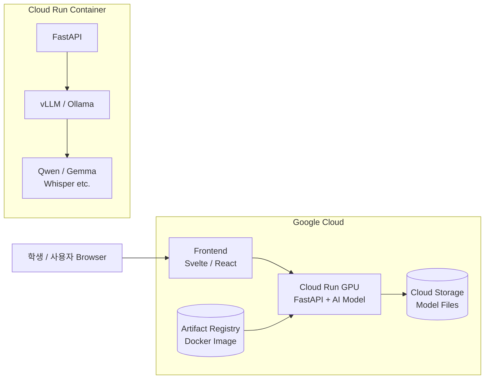
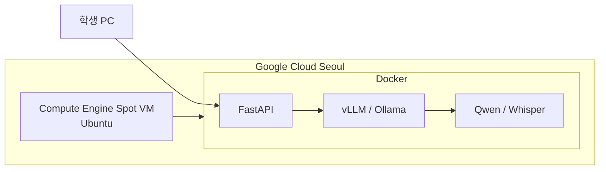

# Google Cloud에서 GPU 배포

> **비용을 최우선**으로 놓으면 Google Cloud에서 GPU 배포는 아래 두 가지를 구분해야 합니다.
> **결론부터 말하면**, 프로젝트 시연·학생 실습처럼 GPU를 하루 종일 계속 사용하지 않는 환경에서는 **Cloud Run + NVIDIA L4 GPU**를 1순위로 추천합니다.
> 이유는 요청이 없을 때 **GPU 인스턴스를 0개까지 내려 비용을 0에 가깝게 만들 수 있기 때문**입니다. 반대로 하루 4~8시간 이상 계속 모델을 사용하는
> 수업·개발 환경이라면 **Compute Engine Spot VM + NVIDIA T4**가 실제 GPU 사용시간당 비용은 더 저렴합니다. ([Google Cloud Documentation][1])

## 1. 가장 추천하는 저비용 구조

교육용 AI 서비스라면 우선 다음 구조를 권합니다.



핵심은 **FastAPI 서버와 AI 모델 서버를 한 GPU 컨테이너에 넣는 것**입니다.

처음부터

```text
Frontend
Backend
LLM Server
STT Server
TTS Server
Database
```

를 모두 별도 서버로 나누면 교육용 프로젝트에서는 관리비용과 클라우드 비용이 불필요하게 증가합니다.

초기에는 다음 정도면 충분합니다.

```text
Cloud Run GPU Container
 ├─ FastAPI
 ├─ vLLM 또는 Ollama
 └─ AI Model

Cloud Storage
 └─ model files

Artifact Registry
 └─ Docker images
```

---

# 2. Cloud Run GPU를 추천하는 가장 큰 이유

Cloud Run GPU는 현재 NVIDIA **L4 24GB VRAM**과 RTX PRO 6000을 지원합니다. L4의 최소 구성은 **4 vCPU + 16 GiB RAM + GPU 1개**입니다. ([Google Cloud Documentation][1])

가장 중요한 것은 이것입니다.

```text
사용자 요청 있음
        ↓
GPU Container 실행
        ↓
AI 추론
        ↓
일정 시간 요청 없음
        ↓
Instance = 0
        ↓
GPU 비용 = 0
```

Cloud Run GPU는 요청이 없을 경우 인스턴스를 **0까지 scale-down**할 수 있습니다. ([Google Cloud Documentation][1])

따라서 프로젝트 발표를 하루에 30분~2시간 정도 하거나 학생들이 필요할 때만 접속하는 환경에는 매우 유리합니다.

---

# 3. Cloud Run L4 비용

현재 Cloud Run의 NVIDIA L4 GPU 비용은 zonal redundancy를 끈 경우 GPU 자체가

```text
$0.0001867 / second
```

입니다. ([Google Cloud][2])

시간당으로 계산하면 약:

```text
GPU
$0.0001867 × 3600
≈ $0.672 / hour
```

최소 CPU와 RAM까지 포함하면 대략:

```text
L4 GPU    ≈ $0.672 / h
4 vCPU    ≈ $0.259 / h
16 GiB    ≈ $0.115 / h
────────────────────
합계       ≈ $1.05 / h
```

정도입니다. 이는 네트워크, 저장공간 등의 부수 비용을 제외한 대략적인 활성 인스턴스 비용입니다. Cloud Run의 CPU·메모리·GPU 단가는 공식 가격표에 명시돼 있습니다. ([Google Cloud][2])

예를 들어 GPU가 실제로 하루 2시간씩, 월 20일만 실행된다면 대략:

```text
$1.05 × 2 × 20

≈ $42 / month
```

입니다.

4시간이면 약:

```text
$84 / month
```

8시간이면 약:

```text
$167 / month
```

수준입니다.

하지만 중요한 것은 **브라우저 사용 시간이 아니라 실제 GPU 인스턴스가 살아 있는 시간**입니다.

---

# 4. 비용 절약 설정

Cloud Run GPU를 다음과 같이 구성하는 것을 권합니다.

```text
GPU
NVIDIA L4 × 1

CPU
4 vCPU

Memory
16 GB

min-instances
0

max-instances
1

GPU zonal redundancy
OFF
```

특히

```text
min-instances = 0
max-instances = 1
```

이 두 가지가 중요합니다.

학생들이 동시에 접속한다고 Cloud Run이

```text
GPU 1
GPU 2
GPU 3
GPU 4
...
```

식으로 자동 확장되어 버리면 비용이 크게 증가할 수 있기 때문입니다.

---

# 5. 단점: Cloud Run GPU는 현재 서울 리전이 없음

이 부분은 현재 한국에서 사용할 때 중요합니다.

Cloud Run의 **L4 GPU 지원 리전에는 현재 서울 `asia-northeast3`가 포함되어 있지 않습니다.** 아시아에서는 Singapore `asia-southeast1`이 지원됩니다. ([Google Cloud Documentation][1])

따라서 추천 리전은:

```text
asia-southeast1
Singapore
```

입니다.

구조는:

```text
한국 사용자
    │
    ↓
Singapore
Cloud Run GPU
    │
    └─ NVIDIA L4
```

가 됩니다.

교육용 AI 챗봇이나 프로젝트 시연 정도라면 사용할 수 있지만, 극도로 낮은 실시간 latency가 필요한 음성 인터랙션이라면 다음의 Compute Engine 방식도 고려할 가치가 있습니다.

---

# 6. 두 번째 추천: Compute Engine Spot + T4

**실제 GPU 시간당 비용을 가장 싸게 만들려면 이 방법이 더 유리할 가능성이 높습니다.**

Google Cloud에서는 N1 VM에 NVIDIA T4 GPU를 붙일 수 있습니다. T4는 **16GB VRAM**이며 소규모 AI 및 inference용으로 여전히 비용 효율적인 GPU입니다. ([Google Cloud Documentation][3])

일반 T4 GPU attachment 가격은 기본 가격 기준 약:

```text
$0.35 / hour
```

입니다. 물론 여기에 CPU와 RAM VM 비용이 추가됩니다. ([Google Cloud][4])

그런데 **Spot VM**을 사용하면 더 내려갑니다.

Google은 Spot VM의 CPU와 GPU 등에 대해 온디맨드 대비 **최대 91% 할인**을 제공할 수 있다고 명시하고 있습니다. 가격은 변동하며 Compute Engine에 의해 언제든 중단될 수 있습니다. ([Google Cloud Documentation][5])

---

# 7. 한국에서는 Spot T4의 장점이 하나 더 있습니다

Compute Engine은 **서울 리전에서 T4를 사용할 수 있습니다.**

현재:

```text
asia-northeast3-b
Seoul
 ├─ G2
 └─ N1 + T4

asia-northeast3-c
Seoul
 └─ N1 + T4
```

가 지원됩니다. ([Google Cloud Documentation][6])

따라서:



구성이 가능합니다.

---

# 8. Spot VM 구성 예

최저비용 쪽으로 시작하면:

```text
Region
asia-northeast3

Zone
asia-northeast3-b

Machine
N1

vCPU
2~4

RAM
7.5~15GB

GPU
NVIDIA T4 × 1

VRAM
16GB

Provisioning
Spot

OS
Ubuntu 22.04/24.04

Disk
50~100GB
```

정도로 구성할 수 있습니다.

Google의 공식 예제에서도 T4 1개에 `n1-standard-2`를 사용할 수 있습니다. ([Google Cloud Documentation][7])

예를 들어 Spot VM을 만들 때:

```bash
gcloud compute instances create ai-gpu-server \
    --machine-type=n1-standard-2 \
    --zone=asia-northeast3-b \
    --boot-disk-size=50GB \
    --accelerator=type=nvidia-tesla-t4,count=1 \
    --image-family=ubuntu-2204-lts \
    --image-project=ubuntu-os-cloud \
    --maintenance-policy=TERMINATE \
    --provisioning-model=SPOT
```

와 같은 형태로 만들 수 있습니다. `SPOT` provisioning model과 GPU attachment는 Compute Engine 공식 방식입니다. ([Google Cloud Documentation][7])

---

# 9. 여기에는 Docker Compose를 올립니다

VM 안에서는 앞에서 이야기했던 로컬 환경을 그대로 가져가면 됩니다.

```text
Ubuntu
│
└── Docker
     │
     └── docker-compose.yml
          │
          ├── FastAPI
          ├── Ollama / vLLM
          ├── Whisper
          └── PostgreSQL
```

즉 학생 입장에서 아주 중요한 장점이 생깁니다.

```text
학생 PC
Windows + Docker
      │
      │ 같은 Docker image
      ↓
Google Cloud
Ubuntu + Docker
```

로 갈 수 있습니다.

이것이 실제 DevOps 교육에서도 좋은 구조입니다.

---

# 10. AI 모델은 어떤 것을 올릴 수 있나

### T4 16GB

적당한 모델:

```text
Qwen 0.6B
Qwen 1.7B
Qwen 4B
Qwen 8B Quantized
Gemma 소형 모델
faster-whisper
Embedding Model
YOLO
```

등입니다.

7~8B급 LLM은 보통 **4bit 양자화**를 활용하는 것을 권합니다.

Google 역시 Cloud Run GPU 운영 가이드에서 비용과 동시성을 위해 **4-bit quantized model**을 고려할 것을 권고합니다. ([Google Cloud Documentation][8])

---

# 11. Cloud Run L4에서는 조금 더 여유가 있습니다

L4는:

```text
VRAM = 24GB
```

이므로 T4보다 훨씬 여유롭습니다. ([Google Cloud Documentation][1])

예를 들어:

```text
Qwen 4B
Qwen 8B
Whisper
Embedding Model
```

등을 운용하기가 좋습니다.

물론 여러 모델을 동시에 VRAM에 올릴 경우 메모리 계산이 필요합니다.

---

# 12. 모델 파일 저장 위치도 중요합니다

모델을 매번 Hugging Face에서 다운로드하는 구조는 권장하지 않습니다.

```text
Cloud Run 시작
      ↓
Hugging Face
      ↓
10GB 다운로드
      ↓
모델 로딩
```

이렇게 하면 cold start가 너무 오래 걸립니다.

Google도 큰 ML 모델은 **Cloud Storage에 저장하고 시작 시 가져오는 방식을 권장**하고 있습니다. 컨테이너 이미지 안에 넣는 방식은 대략 10GB 미만의 작은 모델에 더 적합하다고 설명합니다. ([Google Cloud Documentation][8])

그래서:

```text
Cloud Storage

gs://my-ai-models/
     │
     ├── qwen/
     ├── whisper/
     └── tts/
```

와 같이 만들어 놓는 것이 좋습니다.

---

# 13. 가장 저렴한 최종 구성

제가 비용을 최우선으로 **프로젝트용 GCP 환경을 하나 선택한다면** 다음입니다.

### 시연/개발 서버

```text
Google Cloud
│
├── Cloud Run GPU
│     ├── Singapore
│     ├── NVIDIA L4 24GB
│     ├── 4 vCPU
│     ├── 16 GB RAM
│     ├── min-instance = 0
│     └── max-instance = 1
│
├── Cloud Storage
│     └── AI Model
│
├── Artifact Registry
│     └── Docker Image
│
└── FastAPI
      ├── vLLM / Ollama
      └── Qwen
```

**“필요할 때만 AI 서버를 쓰는 방식”에서는 이 구성을 가장 먼저 추천합니다.**

---

# 14. 수업 중 하루 종일 사용할 경우는 선택이 바뀝니다

예를 들어 강의 프로젝트에서 학생들이

```text
09:00
  ↓
18:00
```

계속 서버에 접속한다면 Cloud Run GPU의 장점인 scale-to-zero가 크게 줄어듭니다.

이때는:

```text
Google Cloud Seoul
        │
Compute Engine
        │
Spot VM
        │
N1 + T4 16GB
        │
Docker
        │
FastAPI + vLLM
```

을 추천합니다.

Spot VM은 언제든 중단될 수 있다는 조건 때문에 **최종 상용 서비스보다는 교육·개발·실험 환경**에 특히 잘 맞습니다. ([Google Cloud Documentation][5])

---

# 15. 목적별로 보면 이렇게 선택하면 됩니다

| 사용 목적         | 추천                      | GPU          | 특징         | 추천도   |
| ------------- | ----------------------- | ------------ | ---------- | ----- |
| 가끔 프로젝트 시연    | **Cloud Run GPU**       | L4 24GB      | Scale to 0 | ★★★★★ |
| 하루 1~2시간      | **Cloud Run GPU**       | L4           | 총비용 저렴     | ★★★★★ |
| 하루 4~8시간 수업   | **Compute Engine Spot** | T4 16GB      | 시간당 저렴     | ★★★★★ |
| 한국 실시간 음성 서비스 | Compute Engine          | T4/L4        | Seoul 가능   | ★★★★  |
| 24시간 서비스      | Compute Engine/G2       | L4           | 안정성        | ★★★   |
| 모델 학습         | Compute Engine          | L4/A100/H100 | 학습 성능      | ★★★   |
| 단순 추론         | Cloud Run               | L4           | 관리 편리      | ★★★★★ |

따라서 **비전공 학생의 AI 프로젝트를 교육하고 결과물을 클라우드에 실제 배포해 보는 목적**이라면 저는 두 단계로 진행하는 것이 가장 좋다고 봅니다.

```text
[1단계]

Local Windows
     ↓
Docker
     ↓
FastAPI + AI Model

        │
        │ 동일 Docker image
        ▼

[2단계]

Google Cloud
     ↓
Artifact Registry
     ↓
Cloud Run GPU
     ↓
L4
```

그리고 마지막 인프라 실습에서만:

```text
Cloud Run
   ↓ 비교

Compute Engine Spot
   ↓
N1 + T4
   ↓
Docker Compose
```

를 경험시키면 됩니다.

이 구조가 특히 좋은 이유는 학생들이 **코드 개발 → Docker 이미지 → GPU 모델 서빙 → 클라우드 배포 → 비용 최적화 → 이후 CI/CD**까지 하나의 프로젝트 안에서 경험할 수 있기 때문입니다. Cloud Run GPU는 Singapore에 배치하고, 장시간 실습용 Spot T4는 Seoul에 배치하는 **2단계 전략**이 현재 비용·난이도·교육효과의 균형이 가장 좋습니다. ([Google Cloud Documentation][1])

[1]: https://docs.cloud.google.com/run/docs/configuring/services/gpu "GPU support for services  |  Cloud Run  |  Google Cloud Documentation"
[2]: https://cloud.google.com/run/pricing "Cloud Run pricing | Google Cloud"
[3]: https://docs.cloud.google.com/compute/docs/gpus/create-gpu-vm-general-purpose?utm_source=chatgpt.com "Create an N1 VM that has attached GPUs | Compute Engine"
[4]: https://cloud.google.com/products/compute/pricing/accelerator-optimized?utm_source=chatgpt.com "Accelerator-optimized VM Pricing"
[5]: https://docs.cloud.google.com/compute/docs/instances/spot "Spot VMs  |  Compute Engine  |  Google Cloud Documentation"
[6]: https://docs.cloud.google.com/compute/docs/regions-zones/gpu-regions-zones "GPU locations  |  Compute Engine  |  Google Cloud Documentation"
[7]: https://docs.cloud.google.com/compute/docs/gpus/create-gpu-vm-general-purpose "Create an N1 VM that has attached GPUs  |  Compute Engine  |  Google Cloud Documentation"
[8]: https://docs.cloud.google.com/run/docs/configuring/services/gpu-best-practices "Best practices: AI inference on Cloud Run services with GPUs  |  Google Cloud Documentation"
