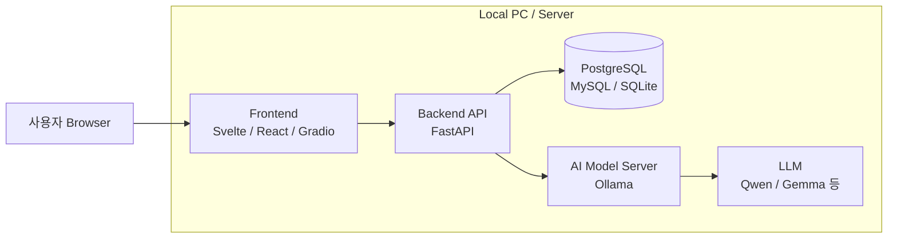
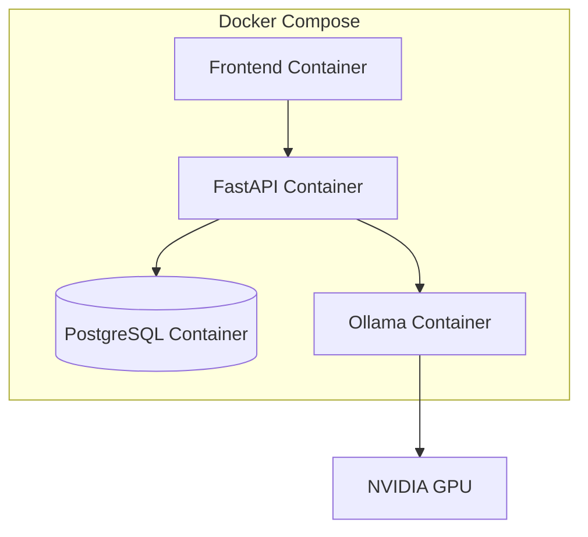
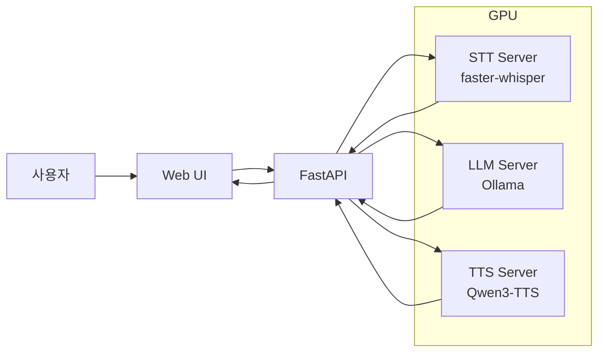

# Local System 배포 환경 구성

> **웹 애플리케이션뿐 아니라 AI 모델까지 포함해서 완전히 로컬 환경에서 배포**할 수 있습니다.
> 특히 Windows 11 기반 교육·프로젝트 환경이라면 처음부터 Kubernetes 같은 복잡한 환경보다 **Docker Compose + FastAPI + Ollama** 구조가 가장 다루기 쉽습니다.
> Docker Desktop에는 Docker Compose가 포함되어 있어 Windows에서도 여러 서비스를 한 번에 실행할 수 있습니다. ([Docker Documentation][1])

### 권장 로컬 배포 아키텍처



여기서 중요한 것은 **웹 프로그램과 AI 모델을 별도의 서비스로 배포하는 것**입니다.

| 계층         | 권장 기술                   |      Port 예 |
| ---------- | ----------------------- | ----------: |
| Frontend   | Svelte / React / Gradio | 3000 / 7860 |
| Backend    | FastAPI                 |        8000 |
| Database   | PostgreSQL / MySQL      | 5432 / 3306 |
| LLM Server | Ollama                  |       11434 |
| Container  | Docker Compose          |           - |

FastAPI 공식 문서도 실제 배포에서 Linux 컨테이너 이미지를 만들어 Docker로 실행하는 방식을 일반적인 접근법으로 설명합니다. ([FastAPI][2])

---

## 1. 가장 간단한 로컬 AI 모델 배포: Ollama

교육용 프로젝트라면 우선 **Ollama를 모델 서버로 사용하는 방법**을 권합니다.

Windows에서 Ollama는 네이티브 애플리케이션으로 동작하며 설치 후 기본적으로 API가 `http://localhost:11434`에서 제공됩니다. NVIDIA와 AMD GPU도 지원합니다. ([Ollama][3])

예를 들어 모델을 실행하면:

```powershell
ollama run gemma4
```

Ollama 서버는 API 서버 역할을 하므로 FastAPI에서 다음처럼 접근할 수 있습니다. 공식 `/api/chat` 엔드포인트가 제공됩니다. ([Ollama][4])

```python
import requests

def ask_llm(prompt):
    response = requests.post(
        "http://localhost:11434/api/chat",
        json={
            "model": "gemma4",
            "messages": [
                {
                    "role": "user",
                    "content": prompt
                }
            ],
            "stream": False
        }
    )

    return response.json()["message"]["content"]


print(ask_llm("RAG가 무엇인지 설명해줘"))
```

즉,

```text
FastAPI
   │
   │ HTTP
   ▼
Ollama
   │
   ▼
Local LLM
```

이라는 구조가 됩니다.

---

## 2. FastAPI까지 연결

예를 들어:

```python
# main.py

from fastapi import FastAPI
import requests

app = FastAPI()


@app.get("/")
def root():
    return {"message": "AI Server Running"}


@app.post("/chat")
def chat(prompt: str):

    response = requests.post(
        "http://localhost:11434/api/chat",
        json={
            "model": "gemma4",
            "messages": [
                {
                    "role": "user",
                    "content": prompt
                }
            ],
            "stream": False
        }
    )

    result = response.json()

    return {
        "answer": result["message"]["content"]
    }
```

실행:

```bash
uvicorn main:app --host 0.0.0.0 --port 8000
```

이제

```text
Browser
   ↓
Frontend
   ↓
http://localhost:8000/chat
   ↓
FastAPI
   ↓
http://localhost:11434/api/chat
   ↓
Ollama
   ↓
Local AI Model
```

구조가 됩니다.

---

# 3. Docker로 웹 애플리케이션 배포

FastAPI는 다음과 같이 Dockerfile을 만들 수 있습니다.

```dockerfile
FROM python:3.12-slim

WORKDIR /app

COPY requirements.txt .

RUN pip install --no-cache-dir -r requirements.txt

COPY . .

CMD ["uvicorn", "main:app",
     "--host", "0.0.0.0",
     "--port", "8000"]
```

`requirements.txt`

```text
fastapi
uvicorn
requests
```

빌드:

```bash
docker build -t ai-backend .
```

실행:

```bash
docker run -p 8000:8000 ai-backend
```

FastAPI 공식 문서에서도 이런 식으로 Python 기반 Linux 컨테이너 이미지를 만드는 배포 방식을 설명합니다. ([FastAPI][2])

---

# 4. AI 모델도 Docker로 같이 배포

여기서 한 단계 발전시키면 Ollama 자체도 Docker 컨테이너로 만들 수 있습니다.



Ollama는 공식적으로 Docker 배포와 NVIDIA/AMD GPU 사용을 지원합니다. Windows에서 Docker GPU를 이용하는 경우 WSL2 환경을 사용할 수 있습니다. ([Ollama][5])

예를 들어 `docker-compose.yml`을 다음처럼 구성할 수 있습니다.

```yaml
services:

  backend:
    build: ./backend
    ports:
      - "8000:8000"
    environment:
      OLLAMA_URL: http://ollama:11434
    depends_on:
      - ollama

  ollama:
    image: ollama/ollama
    ports:
      - "11434:11434"
    volumes:
      - ollama_data:/root/.ollama

volumes:
  ollama_data:
```

실행은 단순합니다.

```bash
docker compose up -d
```

Docker Compose는 여러 컨테이너 서비스를 하나의 YAML 파일로 정의하고 함께 시작·중지할 수 있게 합니다. ([Docker Documentation][6])

그러면 학생 입장에서는 사실상

```text
git clone 프로젝트

cd 프로젝트

docker compose up -d
```

정도로 전체 시스템을 배포할 수 있게 됩니다.

---

# 5. GPU가 있다면 AI 모델 배포 환경을 3단계로 구분하는 것이 좋습니다

AI 모델 서버는 목적에 따라 다음처럼 구분하는 것이 좋습니다.

| 수준       | 모델 서버             | 용도              | 난이도  |
| -------- | ----------------- | --------------- | ---- |
| ① 실습     | **Ollama**        | 학생 프로젝트 / 개인 PC | ★    |
| ② 실무     | **vLLM**          | LLM 서버 / GPU 서버 | ★★★  |
| ③ 엔터프라이즈 | **NVIDIA Triton** | 다중 모델 / 고성능 추론  | ★★★★ |

### ① Ollama

가장 간단합니다.

```text
Windows 11
    │
    ├─ FastAPI
    │
    └─ Ollama
         │
         └─ Qwen / Gemma 등
```

또 하나의 장점은 Ollama가 OpenAI 호환 API도 제공한다는 것입니다. 따라서 기존 OpenAI 기반 애플리케이션을 로컬 모델 쪽으로 바꾸는 작업도 비교적 수월합니다. ([Ollama][7])

---

## ② vLLM

실무적인 LLM 서빙 교육으로 넘어갈 때는 **vLLM**이 좋습니다.

vLLM은 OpenAI 호환 HTTP 서버를 제공하므로 OpenAI SDK를 사용하는 프로그램의 backend를 로컬 모델로 교체하기 쉽습니다. ([vLLM][8])

예:

```bash
vllm serve Qwen/Qwen3-8B
```

그러면 개념적으로:

```text
FastAPI
   ↓
OpenAI Compatible API
   ↓
vLLM
   ↓
Qwen
   ↓
CUDA
   ↓
NVIDIA GPU
```

가 됩니다.

다만 **vLLM은 Windows 네이티브보다는 Linux GPU 서버 환경이 적합**합니다. 현재 공식 quickstart의 기본 전제도 Linux와 Python 3.10~3.13입니다. ([vLLM][9])

그래서 Windows PC에서는

```text
Windows 11
     │
     └─ WSL2
          │
          └─ Ubuntu
               │
               ├─ CUDA
               ├─ Docker
               └─ vLLM
```

구조를 사용하거나 별도의 Ubuntu GPU 서버를 두는 것이 좋습니다.

---

## ③ NVIDIA Triton Inference Server

조금 더 전문적인 AI 인프라 교육에서는 Triton까지 갈 수 있습니다.

Triton은 단순 LLM 서버라기보다는 여러 AI 모델을 서비스하기 위한 **범용 inference server**입니다. HTTP/REST와 gRPC 요청을 받아 모델별 스케줄러로 전달하고, 모델 repository를 통해 여러 모델을 관리할 수 있습니다. ([NVIDIA Docs][10])

예를 들어:

```text
                ┌─ YOLO
                │
FastAPI ─ Triton├─ Whisper
                │
                ├─ BERT
                │
                └─ 기타 PyTorch/ONNX 모델
```

같은 AI 플랫폼을 구성할 수 있습니다.

---

# 6. 음성 AI 프로젝트라면 더 좋은 구조

현재처럼 STT·LLM·TTS까지 다룬다면 모델 하나만 배포하는 것보다 아래 구조가 훨씬 교육적입니다.



그리고 컨테이너도

```text
docker-compose.yml

frontend
backend
postgres
ollama
whisper
tts
```

형태로 분리합니다.

이렇게 하면 학생들이 단순히 AI API를 호출하는 데서 끝나는 것이 아니라,

```text
Model
 ↓
Inference Server
 ↓
REST API
 ↓
Backend
 ↓
Frontend
 ↓
Docker
 ↓
Deployment
```

라는 **AI 서비스의 전체 배포 구조**를 이해하게 됩니다.

---

# 7. 제가 권하는 교육/프로젝트용 최종 환경

비전공자 중심의 프로젝트라면 처음부터 Triton이나 Kubernetes까지 넣는 것보다는 아래 구성이 가장 적절합니다.

```text
Windows 11
│
├── VSCode
│
├── Git / GitHub
│
├── Docker Desktop
│
├── Docker Compose
│
├── Frontend
│     └── Svelte
│
├── Backend
│     └── FastAPI
│
├── Database
│     └── PostgreSQL
│
└── AI Model Server
      └── Ollama
            └── Qwen / Gemma
```

**1단계 개발 → 2단계 Docker화 → 3단계 AI 모델 로컬 배포 → 4단계 Compose 통합** 순서로 가는 것이 좋습니다.

특히 이 구성은 이후

```text
Local PC
   ↓
Docker Compose
   ↓
Linux Server
   ↓
Cloud VM
   ↓
Kubernetes
```

로 확장할 수 있기 때문에, **CI/CD와 Loop Engineering 교육으로 연결하기도 매우 좋습니다.**

제가 현재 교육 환경을 기준으로 선택한다면 **`Windows 11 + Docker Desktop + FastAPI + Svelte + PostgreSQL + Ollama`를 기본 배포 환경**으로 만들고, 마지막 확장 실습에서만 **Ubuntu + NVIDIA GPU + vLLM**을 보여주는 방식으로 구성하겠습니다. 이렇게 하면 비전공 학생에게도 부담이 지나치게 커지지 않으면서 **개발 → 컨테이너 → AI 모델 서빙 → 배포 → CI/CD**까지 하나의 프로젝트로 연결할 수 있습니다. ([Ollama][3])

[1]: https://docs.docker.com/compose/install/?utm_source=chatgpt.com "Overview of installing Docker Compose"
[2]: https://fastapi.tiangolo.com/deployment/docker/?utm_source=chatgpt.com "FastAPI in Containers - Docker"
[3]: https://docs.ollama.com/windows?utm_source=chatgpt.com "Windows"
[4]: https://docs.ollama.com/api/chat?utm_source=chatgpt.com "Generate a chat message"
[5]: https://docs.ollama.com/docker?utm_source=chatgpt.com "Docker"
[6]: https://docs.docker.com/compose/?utm_source=chatgpt.com "Docker Compose"
[7]: https://docs.ollama.com/api/openai-compatibility?utm_source=chatgpt.com "OpenAI compatibility"
[8]: https://docs.vllm.ai/en/stable/serving/online_serving/?utm_source=chatgpt.com "Online Serving"
[9]: https://docs.vllm.ai/en/latest/getting_started/quickstart/?utm_source=chatgpt.com "Quickstart"
[10]: https://docs.nvidia.com/deeplearning/triton-inference-server/user-guide/docs/introduction/index.html?utm_source=chatgpt.com "NVIDIA Triton Inference Server"
