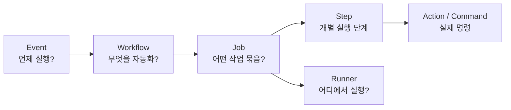
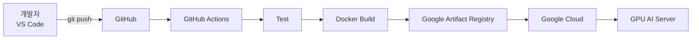
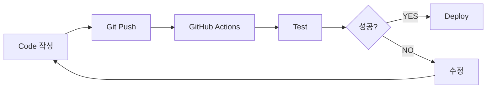

GitHub의 **Actions**는 저장소에서 발생하는 이벤트를 기준으로 **빌드, 테스트, 배포, 코드 검사 등의 작업을 자동 실행하는 CI/CD 플랫폼**입니다. GitHub 공식 문서도 Actions를 CI/CD 파이프라인을 자동화하는 기능으로 정의하고 있으며, Linux·Windows·macOS GitHub-hosted runner 또는 자체 서버의 self-hosted runner를 사용할 수 있습니다. ([GitHub Docs][1])

앞에서 이야기한 **Docker + FastAPI + AI 모델 + Google Cloud 배포**와 연결하면 GitHub Actions의 필요성이 훨씬 명확해집니다.

---

# 1. GitHub Actions를 아주 쉽게 이해하면

개발자가 직접 다음 작업을 한다고 생각해보겠습니다.

```text
코드 수정
 ↓
git push
 ↓
서버 접속
 ↓
소스 다운로드
 ↓
라이브러리 설치
 ↓
테스트
 ↓
Docker 이미지 생성
 ↓
Docker Registry 업로드
 ↓
클라우드 서버 재배포
```

매번 이렇게 하면 상당히 번거롭습니다.

GitHub Actions를 사용하면:

```text
개발자
 │
 │ git push
 ▼
GitHub
 │
 ▼
GitHub Actions
 │
 ├─ 코드 검사
 ├─ 테스트
 ├─ Docker Build
 ├─ Docker Registry Push
 └─ Cloud Deploy
```

처럼 **push 이후 과정을 자동화**할 수 있습니다.

즉,

> **GitHub에 코드를 올리면 나머지는 컴퓨터가 알아서 처리하도록 만드는 기능**

이라고 비전공자에게 설명하면 이해하기 쉽습니다.

---

# 2. GitHub Actions에서 가장 중요한 개념

GitHub Actions는 다음 구조만 이해하면 상당 부분 이해할 수 있습니다.



GitHub 공식 구조도 기본적으로 **Event → Workflow → Job → Step**, 그리고 실제 실행 환경인 **Runner**로 구성됩니다. ([GitHub Docs][2])

각각을 살펴보겠습니다.

---

## 3. Event — 언제 실행할 것인가?

예를 들어:

```text
push
pull_request
release
schedule
workflow_dispatch
```

등이 있습니다.

### push

```yaml
on:
  push:
```

누군가 GitHub에 코드를 push하면 실행됩니다.

---

### 특정 branch에 push

```yaml
on:
  push:
    branches:
      - main
```

`main` 브랜치에 push할 때만 실행합니다.

---

### Pull Request

```yaml
on:
  pull_request:
```

PR을 만들거나 수정하면 실행할 수 있습니다.

예:

```text
학생 코드 작성
      ↓
Pull Request
      ↓
GitHub Actions
      ↓
자동 테스트
      ↓
통과
      ↓
Merge
```

이것이 대표적인 **CI**입니다.

---

# 4. Workflow — 자동화할 전체 작업

Workflow는 YAML 파일로 작성합니다.

파일 위치는 반드시:

```text
프로젝트
│
└── .github
     └── workflows
          ├── test.yml
          ├── build.yml
          └── deploy.yml
```

입니다. GitHub는 `.github/workflows` 안의 YAML 파일을 workflow로 인식합니다. ([GitHub Docs][2])

하나의 프로젝트에 여러 workflow를 둘 수도 있습니다.

예:

```text
test.yml
    → 테스트

docker.yml
    → Docker 이미지 생성

deploy.yml
    → 서버 배포
```

---

# 5. Job — 실행할 작업 묶음

예를 들어:

```yaml
jobs:

  test:
    ...

  build:
    ...

  deploy:
    ...
```

라면:

```text
Workflow

 ├─ Job 1 : Test
 │
 ├─ Job 2 : Build
 │
 └─ Job 3 : Deploy
```

가 됩니다.

Job은 순차 또는 병렬 구조를 만들 수 있습니다. 각 Job은 Runner에서 실행됩니다. ([GitHub Docs][1])

---

# 6. Step — 실제 작업 단계

Job 내부에서:

```yaml
steps:

  - name: 코드 다운로드

  - name: Python 설치

  - name: 라이브러리 설치

  - name: Test

  - name: Docker Build
```

처럼 작업을 나눕니다.

구조를 한 번에 보면:

```text
Workflow

   Job

     Step 1
     Step 2
     Step 3
     Step 4
```

입니다.

---

# 7. Runner — 실제로 명령을 실행하는 컴퓨터

이 개념이 매우 중요합니다.

GitHub Actions가 마법처럼 코드를 실행하는 것이 아니라 실제로는 **Runner라는 컴퓨터를 빌려 명령을 실행합니다.**

예:

```yaml
runs-on: ubuntu-latest
```

그러면:

```text
GitHub
 ↓
Ubuntu 가상 머신 준비
 ↓
소스 다운로드
 ↓
Python 실행
 ↓
Test 실행
 ↓
가상 머신 종료
```

과정이 이루어집니다.

GitHub는 Linux, Windows, macOS runner를 제공하고 사용자가 직접 self-hosted runner도 구성할 수 있습니다. ([GitHub Docs][1])

---

# 8. 가장 간단한 GitHub Actions 실습

Python 프로젝트가 있다고 하겠습니다.

```text
project
│
├── main.py
├── test_main.py
└── requirements.txt
```

다음 파일을 만듭니다.

```text
.github/workflows/test.yml
```

내용:

```yaml
name: Python Test

on:
  push:

jobs:

  test:

    runs-on: ubuntu-latest

    steps:

      - name: Checkout
        uses: actions/checkout@v4

      - name: Python 설치
        uses: actions/setup-python@v5
        with:
          python-version: "3.12"

      - name: 라이브러리 설치
        run: |
          pip install -r requirements.txt

      - name: Test 실행
        run: |
          pytest
```

이제 학생이:

```bash
git add .
git commit -m "기능 추가"
git push
```

하면 자동으로:

```text
GitHub

push 감지
 ↓
Ubuntu Runner 생성
 ↓
Repository 다운로드
 ↓
Python 3.12 설치
 ↓
pip install
 ↓
pytest
 ↓
성공 / 실패 표시
```

가 됩니다.

GitHub Quickstart 역시 push 등의 이벤트를 기준으로 workflow가 자동 실행되는 방식을 기본 학습 구조로 설명하고 있습니다. ([GitHub Docs][3])

---

# 9. `uses`와 `run`의 차이도 중요합니다

처음 배우는 학생들이 여기에서 많이 혼동합니다.

### `run`

직접 명령을 실행합니다.

```yaml
- name: Install
  run: pip install -r requirements.txt
```

즉:

```text
Shell command
```

입니다.

---

### `uses`

누군가 만들어놓은 Action을 가져다 사용합니다.

```yaml
- uses: actions/checkout@v4
```

예를 들어 checkout Action은 repository 코드를 runner에 가져오는 역할을 합니다.

GitHub에서는 이런 **재사용 가능한 Action**을 직접 만들 수도 있고 Marketplace의 Action을 사용할 수도 있습니다. ([GitHub Docs][1])

따라서:

```text
run
 ↓
내가 명령 직접 작성

uses
 ↓
만들어져 있는 기능 사용
```

이라고 이해하면 됩니다.

---

# 10. GitHub Actions가 가장 유용한 부분: CI

**CI = Continuous Integration, 지속적 통합**

예를 들어 학생 4명이 공동 개발한다고 해보겠습니다.

```text
학생 A ─┐
학생 B ─┤
학생 C ─┼→ GitHub → Test
학생 D ─┘
```

누군가 코드를 변경할 때마다 자동으로:

```text
코드 문법 검사
        ↓
단위 테스트
        ↓
라이브러리 테스트
        ↓
Build Test
```

를 수행합니다.

문제가 있다면:

```text
❌ GitHub Actions Failed
```

정상이면:

```text
✅ GitHub Actions Passed
```

가 됩니다.

그래서 **팀 프로젝트에서 특히 유용합니다.**

---

# 11. 두 번째로 유용한 기능: CD

**CD = Continuous Delivery / Deployment**

코드가 정상일 경우 자동으로 서버까지 배포할 수 있습니다.

예:

```text
Developer
    ↓
git push
    ↓
GitHub
    ↓
GitHub Actions
    ↓
Test
    ↓
Docker Build
    ↓
Artifact Registry
    ↓
Google Cloud
    ↓
Application Deploy
```

GitHub Actions는 배포 workflow도 지원하며, GitHub environments를 이용해 production/staging 환경을 분리하거나 배포 전 승인을 요구할 수도 있습니다. ([GitHub Docs][4])

---

# 12. 앞에서 이야기한 Google Cloud AI 프로젝트에 적용하면

예를 들어:

```text
AI Assistant

Frontend
 └─ Svelte

Backend
 └─ FastAPI

AI
 ├─ Qwen
 └─ Whisper

Deployment
 └─ Google Cloud
```

라고 하겠습니다.

개발 과정은:



이것이 아주 전형적인 **CI/CD pipeline**입니다.

---

# 13. Docker와 GitHub Actions 조합

실무에서는 이 조합을 많이 학습할 가치가 있습니다.

예를 들어:

```yaml
- name: Docker Build
  run: |
    docker build -t ai-server .
```

그리고 Registry에:

```text
ai-server:v1
ai-server:v2
ai-server:v3
```

등으로 이미지를 올립니다.

구조는:

```text
Source Code
     ↓
GitHub Actions
     ↓
Docker Build
     ↓
Container Image
     ↓
Registry
     ↓
Server
```

입니다.

---

# 14. Google Cloud 배포에서는 Secret 관리도 중요

예를 들어 이런 정보를 workflow 파일에 직접 작성하면 안 됩니다.

```yaml
OPENAI_API_KEY: sk-....
```

대신 GitHub의:

```text
Repository

Settings
 ↓
Secrets and variables
 ↓
Actions
```

에 저장합니다.

그리고 workflow에서는:

```yaml
env:
  OPENAI_API_KEY: ${{ secrets.OPENAI_API_KEY }}
```

처럼 사용합니다.

GitHub Secrets는 repository, organization, environment 수준에서 민감한 값을 저장해 workflow에서 명시적으로 사용할 수 있도록 제공됩니다. ([GitHub Docs][5])

Cloud 배포 인증은 가능하면 장기 서비스 계정 키를 Secrets에 넣는 것보다 **OIDC 기반 단기 자격증명**을 사용하는 방식이 더 좋습니다. GitHub 역시 지원되는 클라우드 공급자에서는 OIDC를 이용하면 장기간 유지되는 cloud credential을 저장하지 않을 수 있다고 안내합니다. ([GitHub Docs][6])

---

# 15. 또 하나 유용한 기능: Artifact

예를 들어 Python 프로그램을 실행해서:

```text
model.pkl
result.csv
app.zip
test-report.html
```

가 생성됐다고 해보겠습니다.

이를 GitHub Actions 실행 결과로 저장할 수 있습니다.

이를 **Artifact**라고 합니다.

```text
Build

 ├─ app.zip
 ├─ test-result.xml
 └─ report.html
```

실행이 끝난 이후에도 내려받거나 다른 Job에서 사용할 수 있습니다.

반면 **Cache**는:

```text
pip package
npm package
build cache
```

처럼 반복적으로 다운로드하거나 생성하는 데이터를 재사용해서 workflow 속도를 높이는 용도입니다. GitHub는 Artifact와 Cache의 목적을 명확히 구분하고 있습니다. ([GitHub Docs][7])

---

# 16. 학생들에게 가장 먼저 가르칠 기능

GitHub Actions 전체 기능을 처음부터 모두 가르칠 필요는 없습니다.

저라면 다음 **6가지만 먼저 교육**합니다.

| 중요도   | 기능              | 교육 내용               |
| ----- | --------------- | ------------------- |
| ★★★★★ | Workflow        | YAML 자동화 파일         |
| ★★★★★ | Event           | push / pull_request |
| ★★★★★ | Job / Step      | 작업 구성               |
| ★★★★★ | Runner          | 실행 컴퓨터              |
| ★★★★☆ | Test Automation | pytest 등            |
| ★★★★☆ | Docker Build    | 배포 이미지 생성           |

그 다음 단계에서:

```text
Secrets
Artifact
Cache
Environment
Cloud Deployment
OIDC
```

를 가르치는 것이 좋습니다.

---

# 17. 가장 좋은 첫 실습

비전공 학생에게는 다음 실습이 좋습니다.

### 실습 1

```text
Python 프로그램 작성
       ↓
GitHub Push
       ↓
GitHub Actions
       ↓
Python 실행
```

### 실습 2

```text
Python
 ↓
pytest
 ↓
GitHub Actions 자동 Test
```

### 실습 3

```text
FastAPI
 ↓
GitHub Actions
 ↓
Docker Build
```

### 실습 4

```text
FastAPI
 ↓
GitHub
 ↓
Actions
 ↓
Docker
 ↓
Google Cloud
```

이렇게 점진적으로 발전시키는 것입니다.

---

# 18. 특히 중요한 CI 개념

학생들에게 아래 상황을 보여주면 CI를 바로 이해합니다.

잘못된 코드:

```python
def add(a, b):
    return a - b
```

테스트:

```python
def test_add():
    assert add(2, 3) == 5
```

학생이 push합니다.

```bash
git push
```

그러면 GitHub Actions가:

```text
pytest

Expected : 5
Actual   : -1

❌ FAILED
```

를 발생시킵니다.

개발자가 수정:

```python
def add(a, b):
    return a + b
```

다시:

```bash
git push
```

하면:

```text
pytest

✅ PASSED
```

가 됩니다.

이 경험 하나만으로도 학생들이 **“왜 CI가 필요한지”** 상당히 쉽게 이해합니다.

---

# 19. Loop Engineering과도 매우 밀접합니다

GitHub Actions를 앞에서 이야기했던 Loop Engineering 관점에서 보면 더 중요합니다.



즉:

> **작성 → 실행 → 검사 → 피드백 → 수정 → 다시 실행**

이라는 반복 루프를 자동화하는 핵심 도구가 됩니다.

AI가 코드를 생성하는 환경에서는 오히려 더 중요합니다.

```text
AI가 코드 생성
      ↓
GitHub Actions
      ↓
자동 테스트
      ↓
자동 검증
      ↓
실패
      ↓
AI/개발자 수정
      ↓
다시 테스트
```

**코드를 누가 작성했느냐보다 자동으로 검증할 수 있는 환경을 만드는 것이 중요해지는 것**입니다.

---

## 교육 관점에서 가장 중요하게 가르칠 흐름

저라면 GitHub Actions를 별도 기능으로 설명하기보다는 다음 하나의 흐름으로 학생들에게 가르치겠습니다.

```text
① Git
   코드 변경

       ↓

② GitHub
   코드 공유

       ↓

③ Pull Request
   변경 검토

       ↓

④ GitHub Actions
   자동 테스트

       ↓

⑤ Docker
   실행환경 패키징

       ↓

⑥ Artifact Registry
   이미지 저장

       ↓

⑦ Google Cloud
   자동 배포

       ↓

⑧ Monitoring
   결과 확인
```

이렇게 하면 **Git → GitHub → CI → Docker → CD → Cloud**가 하나로 연결됩니다.

특히 현재 다루고 있는 **Google Cloud GPU AI 배포**까지 연결한다면 최종적으로는 다음 구조가 좋은 학습 목표입니다.

```text
VS Code
   │
   │ git push
   ▼
GitHub
   │
   ▼
GitHub Actions
   │
   ├── pytest
   ├── Docker Build
   └── Docker Push
          │
          ▼
Google Artifact Registry
          │
          ▼
Google Cloud
          │
          ├── Cloud Run
          │
          └── GPU VM
                │
                ▼
          FastAPI + AI Model
```

이 정도를 학생들이 직접 한 번 구축해 보면 **CI/CD가 무엇인지 이론 설명보다 훨씬 명확하게 이해할 수 있습니다.**

다음 단계의 실습으로는 **`FastAPI 간단 프로그램 → GitHub → GitHub Actions → pytest 자동 테스트 → Docker 이미지 생성 → Google Cloud 자동배포`**를 하나의 완성된 예제로 만드는 것이 가장 적합합니다.

[1]: https://docs.github.com/en/actions/get-started/understand-github-actions?ref=grant-winney&utm_source=chatgpt.com "Understanding GitHub Actions - GitHub Docs"
[2]: https://docs.github.com/en/actions/concepts/workflows-and-actions/workflows?learn=getting_started&learnProduct=actions&utm_source=chatgpt.com "Workflows - GitHub Docs"
[3]: https://docs.github.com/en/actions/get-started/quickstart?apiVersion=2022-11-28&utm_source=chatgpt.com "Quickstart for GitHub Actions - GitHub Docs"
[4]: https://docs.github.com/en/actions/concepts/workflows-and-actions/deployment-environments?utm_source=chatgpt.com "Deployment environments - GitHub Docs"
[5]: https://docs.github.com/en/actions/concepts/security/secrets?utm_source=chatgpt.com "Secrets - GitHub Docs"
[6]: https://docs.github.com/en/actions/get-started/continuous-deployment?utm_source=chatgpt.com "Continuous deployment - GitHub Docs"
[7]: https://docs.github.com/en/actions/concepts/workflows-and-actions/dependency-caching?utm_source=chatgpt.com "Dependency caching - GitHub Docs"
