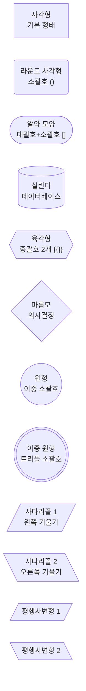
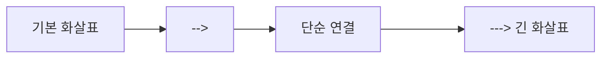
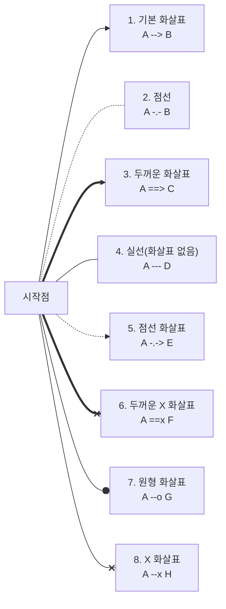
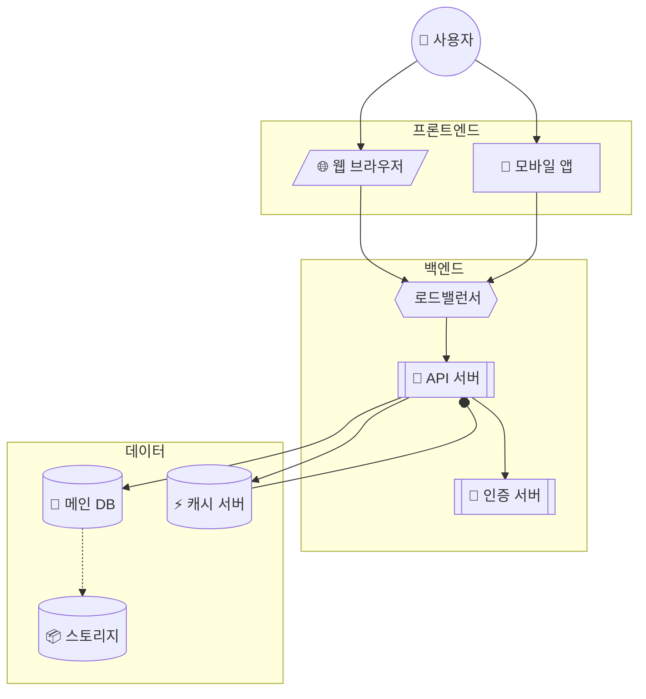
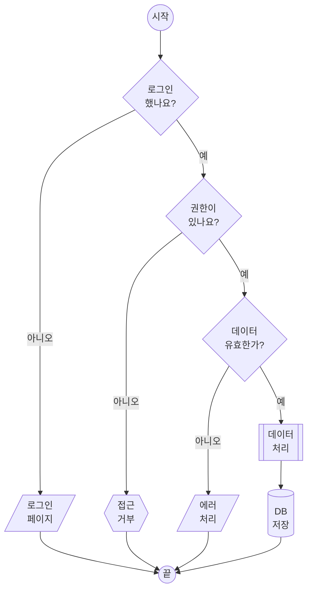
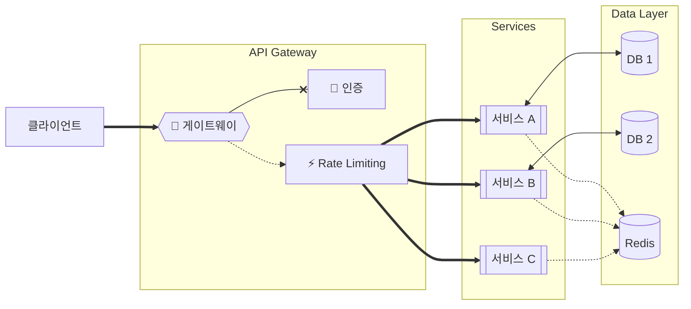
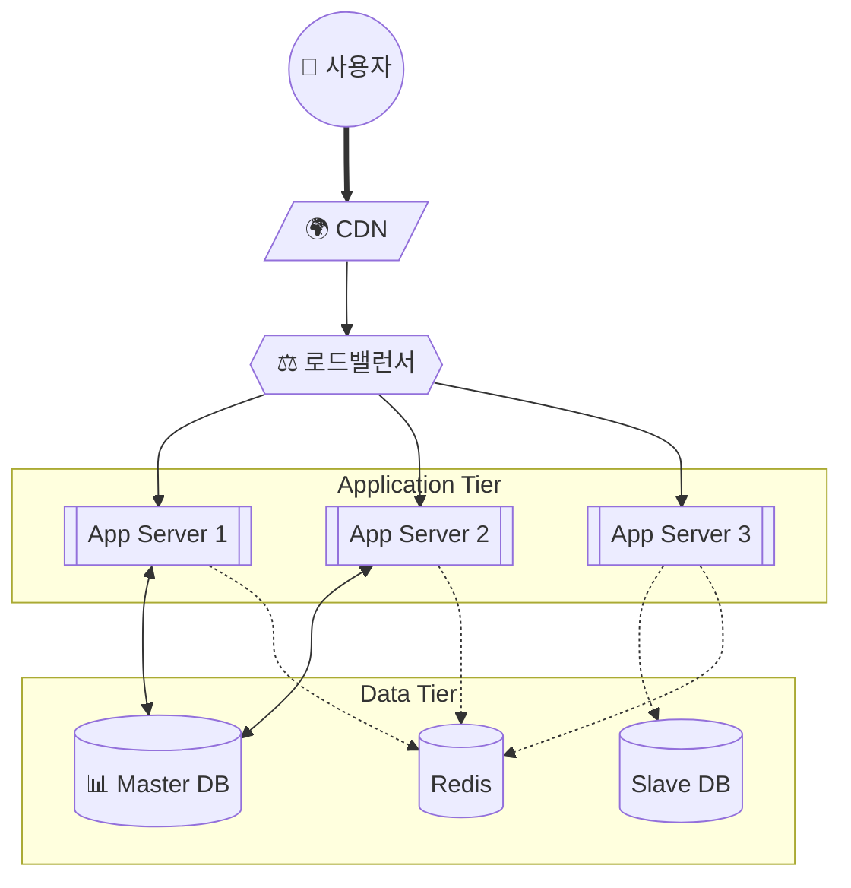
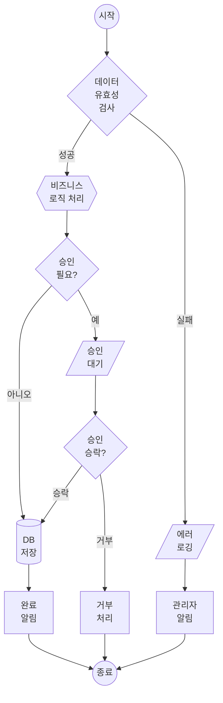

# Mermaid 도형과 화살표 완전 가이드

## 1. 노드(Node) 도형 종류

### 기본 도형들



### 서브루틴 및 특수 도형

```mermaid
flowchart LR
    A[["서브루틴<br>이중 대괄호 [[]]"]]
    B>"플래그 1<br>왼쪽 화살표 >"]
    C<"플래그 2<br>오른쪽 화살표 <"]
    D[/"트래피조이드<br>기울기 /"\]
    E[\ "트래피조이드<br>기울기 \"/]
```

---

## 2. 화살표(Edge) 종류

### 기본 화살표



### 다양한 화살표 스타일



### 양방향 화살표

```mermaid
flowchart LR
    A["A"] <--> B["양방향<br><-->"]
    B <---> C["양방향(길게)<br><--->"]
    C <.-.-> D["양방향 점선<br><.-.->"]
    D <===> E["양방향 두꺼움<br><===>"]
```

---

## 3. 완전 종합 예제

### 예제 1: 시스템 아키텍처 (다양한 도형 활용)



### 예제 2: 의사결정 흐름도 (마름모 활용)



### 예제 3: 데이터 흐름도 (다양한 화살표)



---

## 4. 도형과 화살표 참조표

### 노드 도형 문법

| 도형 | 문법 | 예시 |
|------|------|------|
| 사각형 | `A["text"]` | `A["사각형"]` |
| 라운드 사각형 | `A("text")` | `B("라운드")` |
| 알약 모양 | `A["text"]` | `C["알약"]` |
| 마름모 | `A{"text"}` | `D{"의사결정"}` |
| 육각형 | `A{{"text"}}` | `E{{"육각형"}}` |
| 원형 | `A(("text"))` | `F(("원"))` |
| 이중 원 | `A((("text")))` | `G((("이중원")))` |
| 실린더 | `A[("text")]` | `H[("DB")]` |
| 서브루틴 | `A[["text"]]` | `I[["서브루틴"]]` |
| 사다리꼴 | `A[/"text"\]` | `J[/"사다리꼴"/]` |
| 플래그 | `A>"text"]` | `K>"플래그"]` |

### 화살표 문법

| 화살표 | 문법 | 설명 |
|--------|------|------|
| → | `-->` | 기본 화살표 |
| - | `---` | 실선 (화살표 없음) |
| ··· | `-.-` | 점선 (화살표 없음) |
| ⇢ | `-.->` | 점선 화살표 |
| ⇒ | `==>` | 두꺼운 화살표 |
| ⟷ | `<-->` | 양방향 화살표 |
| -o | `--o` | 원형 끝 |
| -x | `--x` | X 표시 끝 |

---

## 5. 실전 템플릿

### 템플릿 1: 클라우드 아키텍처



### 템플릿 2: 비즈니스 프로세스



이 가이드를 참고하여 Mermaid로 다양한 다이어그램을 만들어보세요! 🎨
