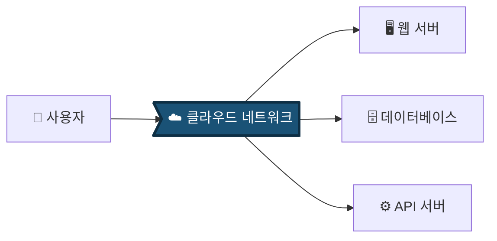
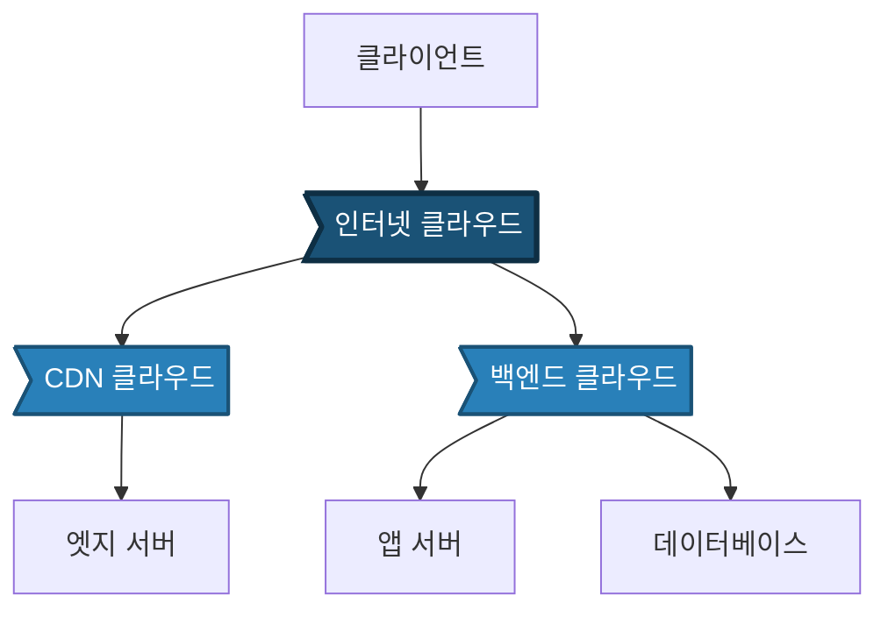
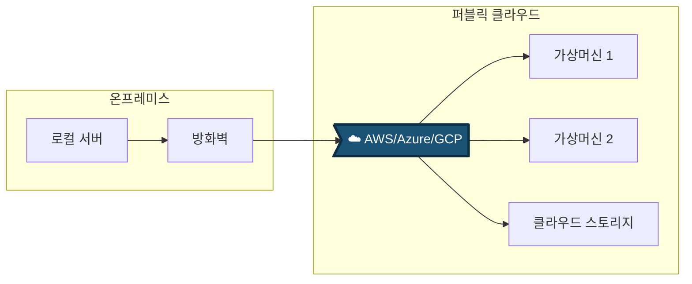
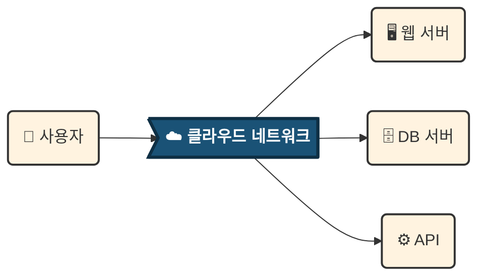
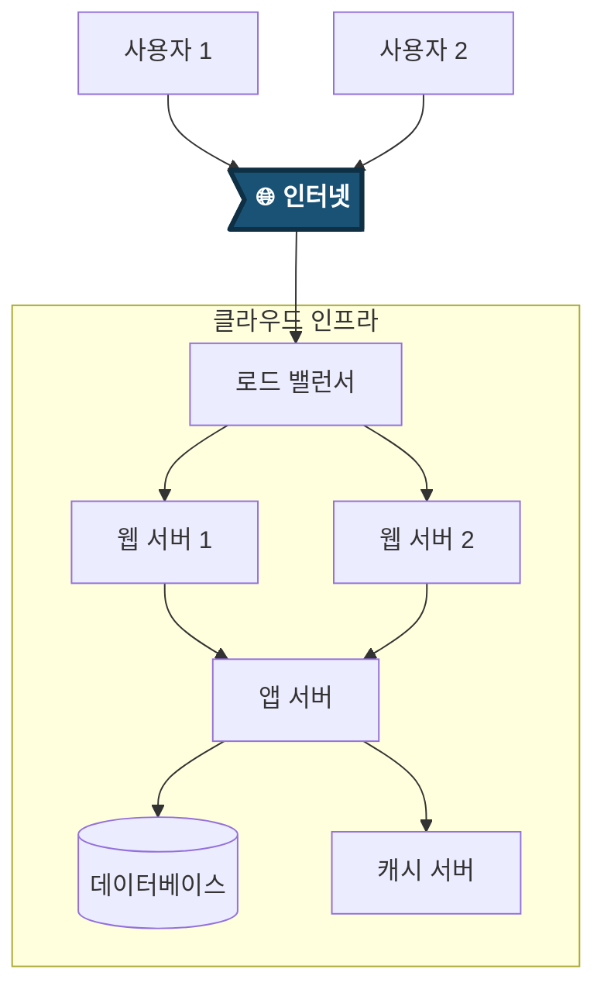

# Mermaid에서 구름(Cloud) 모양으로 네트워크 표현하기

네, Mermaid에서 구름 모양을 사용하여 네트워크를 표현할 수 있습니다! 제공해주신 이미지와 유사한 구름 형태의 네트워크 다이어그램을 만드는 방법을 안내해 드립니다.

## 1. 기본 구름 모양 문법

Mermaid에서 구름 모양은 `>` 기호를 사용하여 표현합니다:

## 2. 네트워크 다이어그램 예시 (구름 모양 활용)

### 예시 1: 클라우드 기반 네트워크 구조

### 예시 2: 분산 클라우드 네트워크

### 예시 3: 하이브리드 클라우드 네트워크

## 3. 구름 모양 + 스케치 스타일 적용

이전에 설명드린 스케치 느낌과 구름 모양을 결합한 예시입니다:

## 4. Mermaid에서 지원하는 주요 노드 모양

| 모양 | 문법 | 용도 |
|------|------|------|
| **구름** | `A>"텍스트"]` | 클라우드/네트워크 |
| 라운드 사각형 | `A("텍스트")` | 일반 프로세스 |
| 원형 | `A(("텍스트"))` | 시작/종료 |
| 마름모 | `A{"텍스트"}` | 의사결정 |
| 육각형 | `A{{"텍스트"}}` | 준비/설정 |
| 실린더 | `A[("텍스트")]` | 데이터베이스 |
| 플래그 | `A>"텍스트"]` | 이벤트/신호 |

## 5. 실무 네트워크 다이어그램 예시

이렇게 Mermaid에서 구름 모양을 사용하면 제공해주신 이미지와 유사한 클라우드 네트워크 다이어그램을 쉽게 만들 수 있습니다! 추가로 원하시는 스타일이나 구성이 있으면 말씀해 주세요.
