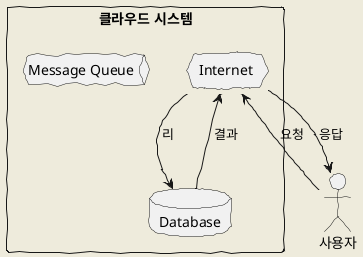
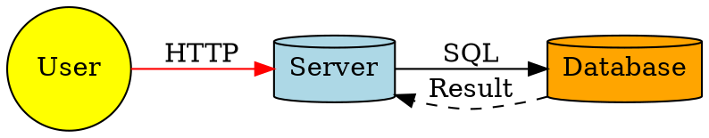
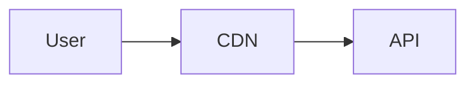
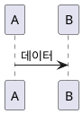

# Mermaid 대안: 더 다양한 시각화 도구들

Mermaid보다 더 풍부하고 전문적인 다이어그램을 만들 수 있는 도구들을 정리해 드립니다.

---

## 📝 **Markdown에서 직접 사용 가능한 도구들**

### 1. **PlantUML** ⭐ 추천
- **특징**: Mermaid보다 훨씬 다양한 도형과 UML 다이어그램 지원
- **장점**: 
  - 30+ 가지 다이어그램 유형 (시퀀스, 유스케이스, 클래스, 컴포트 등)
  - 매우 풍부한 도형 라이브러리
  - AWS/GCP/Azure 아이콘 내장
- **단점**: Mermaid보다 문법이 복잡함
- **지원 플랫폼**: GitHub (플러그인), GitLab, VS Code, Notion (플러그인)



---

### 2. **Graphviz (DOT 언어)**
- **특징**: 자동 레이아웃이 뛰어난 그래프 시각화
- **장점**:
  - 복잡한 네트워크/트리 구조에 최적
  - 노드/엣지 스타일 무한定制 가능
  - 수학적으로 최적화된 레이아웃
- **단점**: 문법이 다소 어려움, 대화형 다이어그램에는 부적합
- **지원**: VS Code 확장, 별도 렌더러 필요



---

### 3. **D2 (Declarative Diagramming)**
- **특징**: Mermaid의 현대적 대안, 매우 직관적인 문법
- **장점**:
  - Mermaid보다 간결하고 읽기 쉬운 문법
  - 100+ 가지 도형과 아이콘
  - 테마 시스템 내장
  - SQL, Terraform 등 특수 다이어그램 지원
- **단점**: 비교적 새로운 도구, 플랫폼 지원 제한적
- **지원**: VS Code, GitHub Actions, 별도 렌더러

```d2
{
  layout: elk
  
  user: {
    shape: person
    style.fill: "#FFE5B4"
  }
  
  cloud: {
    shape: cloud
    style.fill: "#E0F7FA"
    
    server: {
      shape: cylinder
    }
    
    db: {
      shape: cylinder
      style.fill: "#FFF9C4"
    }
  }
  
  user -> cloud.server: "API Request"
  cloud.server -> cloud.db: "Query"
}
```

---

### 4. **Kroki** (통합 플랫폼)
- **특징**: 여러 다이어그램 언어를 통합한 서비스
- **지원 형식**: PlantUML, Graphviz, BlockDiag, Mermaid 등 20+ 종류
- **장점**: 하나의 API로 모든 다이어그램 생성 가능
- **단점**: 자체 문법이 아닌 다른 도구들의 래퍼
- **사용법**: Markdown에서 이미지 링크로 삽입

```markdown

```

---

## 🖼️ **이미지로 삽입해야 하는 전문 도구들**

### 1. **Draw.io / Diagrams.net** ⭐⭐ 강력 추천
- **특징**: 웹 기반 무료 다이어그램 도구
- **장점**:
  - 1000+ 가지 도형과 템플릿
  - AWS, Azure, GCP, Kubernetes 공식 아이콘
  - 실시간 협업 가능
  - GitHub, Confluence, Notion 연동
  - XML/JSON/PNG/SVG export
- **단점**: Markdown 직접 작성 불가 (수동 제작 필요)
- **웹사이트**: https://app.diagrams.net/

---

### 2. **Excalidraw**
- **특징**: 손그림 스타일의 화이트보드 도구
- **장점**:
  - 매우 자연스러운 스케치 느낌
  - 라이브러리 공유 가능
  - End-to-end 암호화
  - Markdown 지원 (excalidraw.com)
- **단점**: 프로그래밍적 생성 어려움
- **Notion 연동**: 공식 지원

---

### 3. **Lucidchart**
- **특징**: 엔터프라이즈급 다이어그램 도구
- **장점**:
  - 가장 전문적인 기능
  - 1000+ 템플릿
  - 실시간 협업
  - Jira, Confluence, Google Workspace 연동
- **단점**: 유료 (무료 버전 제한적)
- **웹사이트**: https://www.lucidchart.com/

---

### 4. **Miro**
- **특징**: 무한 캔버스 협업 도구
- **장점**:
  - 플로우차트, 마인드맵, wireframe 등 다양
  - 실시간 팀 협업 최적
  - 300+ 템플릿
- **단점**: 유료, Markdown 직접 작성 불가
- **웹사이트**: https://miro.com/

---

### 5. **yEd Graph Editor**
- **특징**: 데스크톱 기반 무료 그래프 에디터
- **장점**:
  - 자동 레이아웃 알고리즘 강력
  - 대용량 그래프 처리 우수
  - 무료
- **단점**: GUI만 지원 (코드 기반 아님)
- **다운로드**: https://www.yworks.com/products/yed

---

### 6. **Inkscape / Adobe Illustrator**
- **특징**: 터 그래픽 편집기
- **장점**:
  - 완전한 디자인 자유도
  - 프로페셔널 품질
  - SVG/PDF/PNG export
- **단점**: 학습 곡선 높음, 수동 작업 필요
- **용도**: 출판용 퀄리티 다이어그램

---

##  **용도별 추천 도구**

| 용도 | 추천 도구 | 이유 |
|------|----------|------|
| **GitHub README** | Mermaid, PlantUML | 네이티브 지원 |
| **기술 문서** | PlantUML, D2 | 풍부한 UML 지원 |
| **네트워크 다이어그램** | Graphviz, Draw.io | 자동 레이아웃 우수 |
| **비즈니스 프레젠테이션** | Lucidchart, Miro | 전문적인 디자인 |
| **손그림 느낌** | Excalidraw, Mermaid (sketch 테마) | 친근한 느낌 |
| **대규모 시스템 아키텍처** | Draw.io, Lucidchart | 클라우드 아이콘 풍부 |
| **코드 기반 자동 생성** | D2, PlantUML, Graphviz | Git 버전 관리 가능 |

---

##  **비교표: Markdown 지원 도구**

| 도구 | 난이도 | 도형 다양성 | 자동레이아웃 | GitHub지원 | 학습곡선 |
|------|--------|------------|-------------|-----------|---------|
| **Mermaid** | 쉬움 | ⭐⭐ | ⭐⭐ | ✅ | 낮음 |
| **PlantUML** | 보통 | ⭐⭐⭐⭐ | ⭐⭐⭐ | ⚠️ | 보통 |
| **Graphviz** | 어려움 | ⭐⭐⭐⭐ | ⭐⭐⭐⭐⭐ | ❌ | 높음 |
| **D2** | 쉬움 | ⭐⭐⭐⭐ | ⭐⭐⭐⭐ | ❌ | 낮음 |

---

## 💡 **실전 팁: 혼합 사용 전략**

```markdown
# 시스템 아키텍처

## 1. 고수준 아키처 (Mermaid)


## 2. 상세 컴포넌트 (Draw.io 이미지)


## 3. 데이터 흐름 (PlantUML)

```

---

## 🔗 **추가 리소스**

- **PlantUML 갤러리**: https://plantuml.com/starting
- **D2 Playground**: https://play.d2lang.com/
- **Graphviz Gallery**: https://graphviz.org/gallery/
- **Draw.io 템플릿**: https://www.diagrams.net/blog/all

---

**결론**: 
- **Markdown에서 직접 작성** → **PlantUML** (가장 강력) 또는 **D2** (가장 간편)
- **최고의 품질** → **Draw.io**로 제작 후 이미지 삽입
- **네트워크/복잡한 그래프** → **Graphviz**

용도와 플랫폼에 맞춰 도구를 선택하시면 됩니다!
