Mermaid 다이어그램의 배경색을 회색 계열로 일괄 변경하는 방법을 알려드리겠습니다. Mermaid는 CSS 스타일링을 지원하므로 여러 가지 방식으로 적용할 수 있습니다.

---

## 1. `%%{init}%%` 구문으로 전역 테마 설정 (권장)

Mermaid 8.6.0 이상에서 지원하는 `%%{init}%%` 구문을 사용하면 전역적으로 테마와 색상을 설정할 수 있습니다.

### 기본 회색 테마 예시

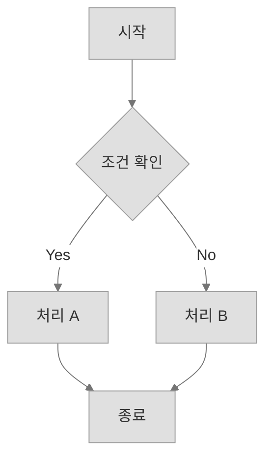

---

## 2. 각 다이어그램 유형별 회색 테마 적용

### Flowchart (흐름도)

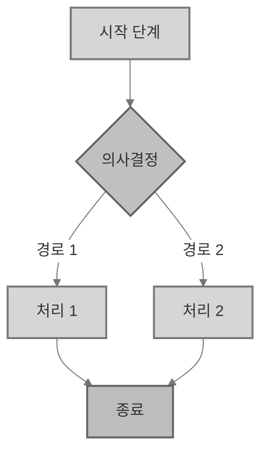

---

### Mindmap (마인드맵)

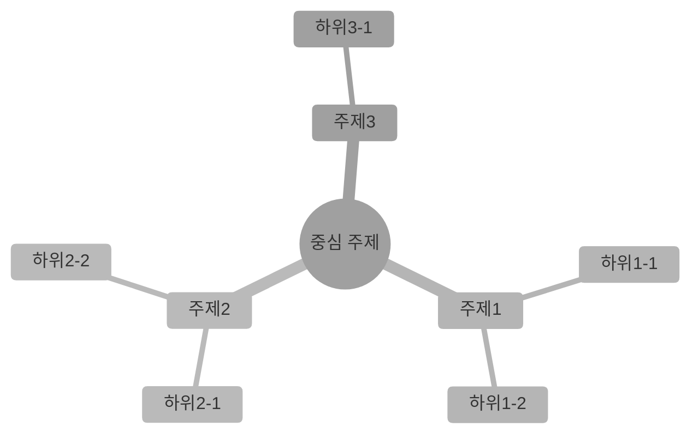

> ⚠️ Mindmap은 `style` 구문이 제한적이므로 `themeVariables`로 전역 설정하는 것이 가장 효과적입니다.

---

### Gantt Chart (간트 차트)

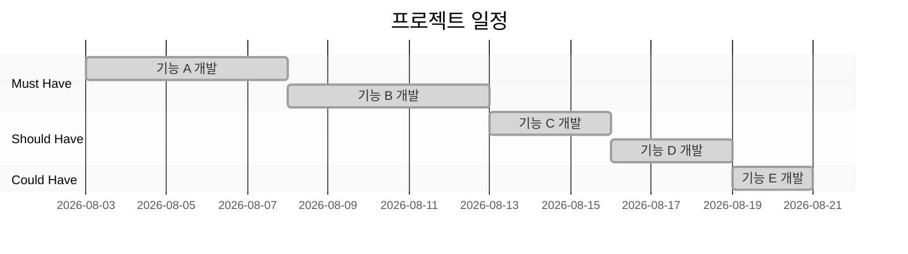

---

### Pie Chart (파이 차트)

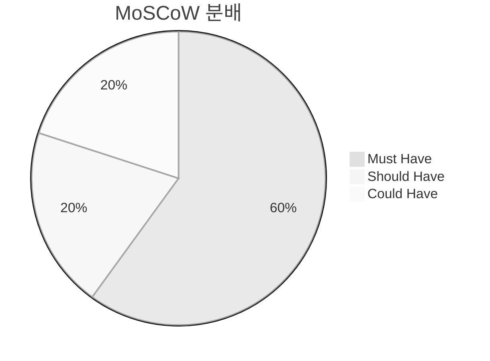

> ⚠️ Pie Chart의 각 조각 색상은 `themeVariables`로 직접 지정이 어려워 별도 `style`이 필요할 수 있습니다. 아래 **커스텀 색상 매핑**을 참고하세요.

---

## 3. 개별 노드에 직접 회색 스타일 적용

전역 설정과 별개로, 특정 노드에만 색상을 지정하고 싶을 때는 `style` 구문을 사용합니다.

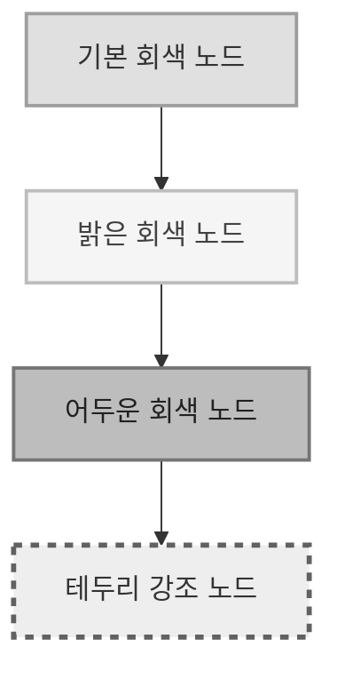

---

## 4. 클래스(class)를 활용한 일괄 스타일링

반복적으로 사용하는 스타일은 `classDef`로 정의하고 `class`로 적용하면 효율적입니다.

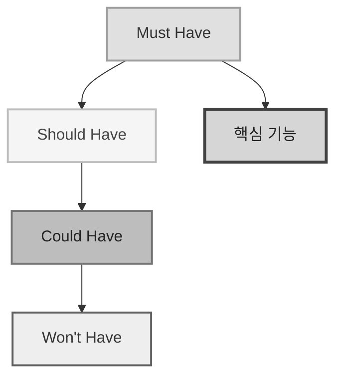

---

## 5. 회색 계열 색상 팔레트 참고

자주 사용하는 회색 계열 색상 코드입니다:

| 색상명 | HEX 코드 | 용도 |
|--------|----------|------|
| 아주 밝은 회색 | `#fafafa` | 배경, tertiaryColor |
| 밝은 회색 | `#f5f5f5` | 보조 배경, secondaryColor |
| 연한 회색 | `#eeeeee` | 섹션 배경, clusterBkg |
| 기본 회색 | `#e0e0e0` | 주요 노드, primaryColor |
| 중간 회색 | `#d6d6d6` | 강조 노드, taskBkgColor |
| 중간-어두운 회색 | `#bdbdbd` | 어두운 노드, activeTaskBkgColor |
| 어두운 회색 | `#9e9e9e` | 테두리, primaryBorderColor |
| 더 어두운 회색 | `#757575` | 선, lineColor |
| 진한 회색 | `#616161` | 강조 테두리 |
| 매우 진한 회색 | `#424242` | 제목, 강조 텍스트 |
| 거의 검정 | `#333333` | 본문 텍스트 |
| 검정 | `#212121` | 강조 텍스트 |

---

## 6. 실전 예시: MoSCoW 강의자료용 회색 테마

아래는 앞서 작성한 MoSCoW 강의자료를 회색 테마로 변환한 완성 예시입니다:

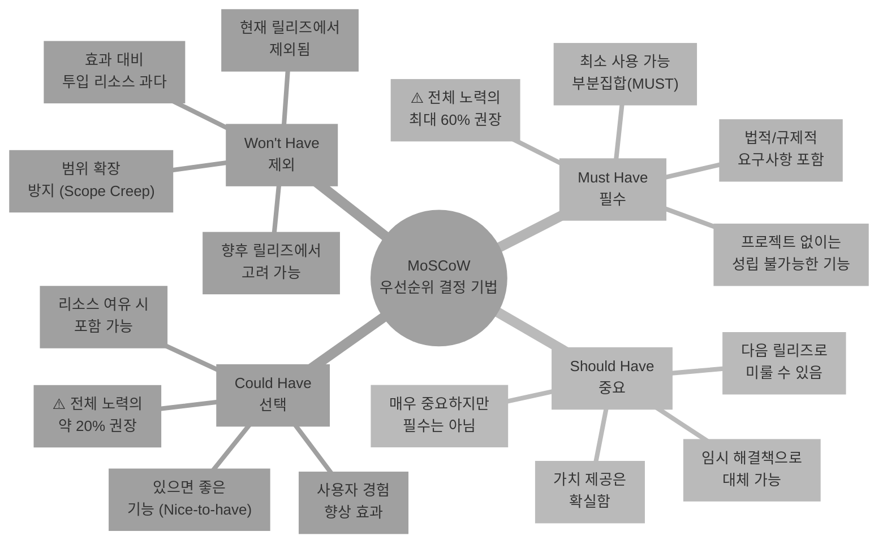

---

## 7. 적용 방법 요약

| 방법 | 사용 상황 | 코드 위치 |
|------|----------|----------|
| `%%{init}%%` | 전역 테마 설정 | 다이어그램 최상단 |
| `style` | 개별 노드 스타일링 | 노드 정의 후 |
| `classDef` + `class` | 반복 스타일 일괄 적용 | 다이어그램 상단에 정의 |
| `themeVariables` | 세부 색상 변수 조정 | `%%{init}%%` 내부 |

---

전경 텍스트를 검정색(#212121) 또는 흰색(#ffffff)으로 대비를 명확히 하여 두 테마를 다시 만들어 드리겠습니다.

---

# 🍊 오렌지 테마 (대비 개선)

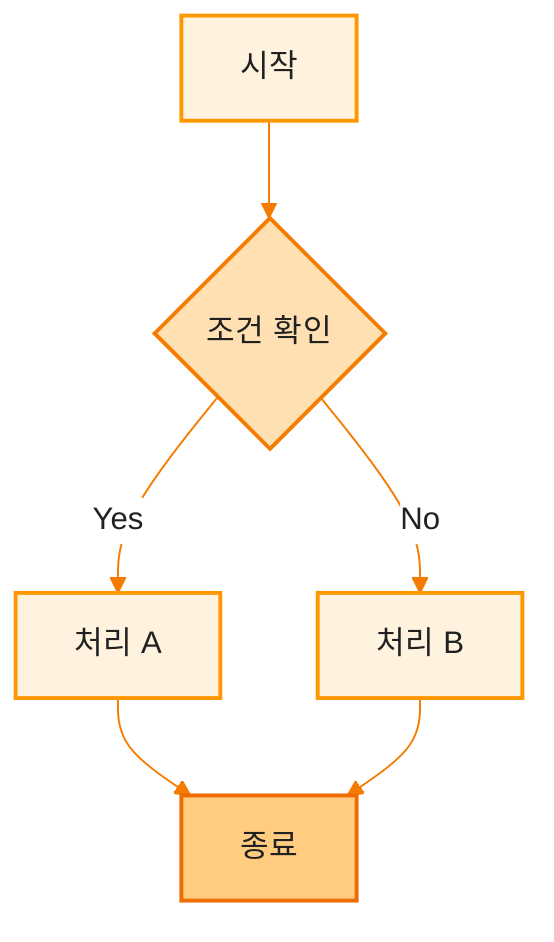

---

### 오렌지 테마 - Mindmap 예시

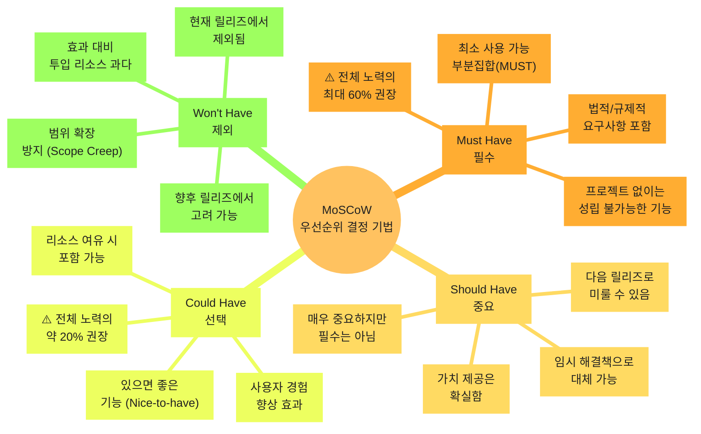

---

### 오렌지 테마 - Gantt Chart 예시

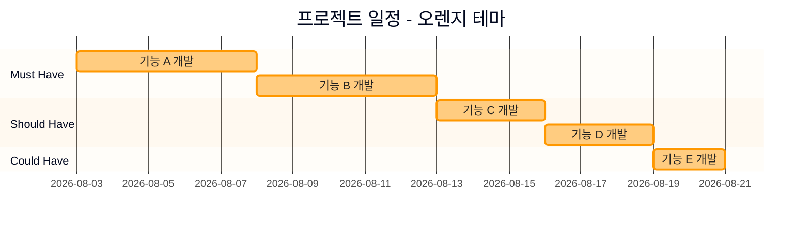

---

### 오렌지 테마 - Pie Chart 예시

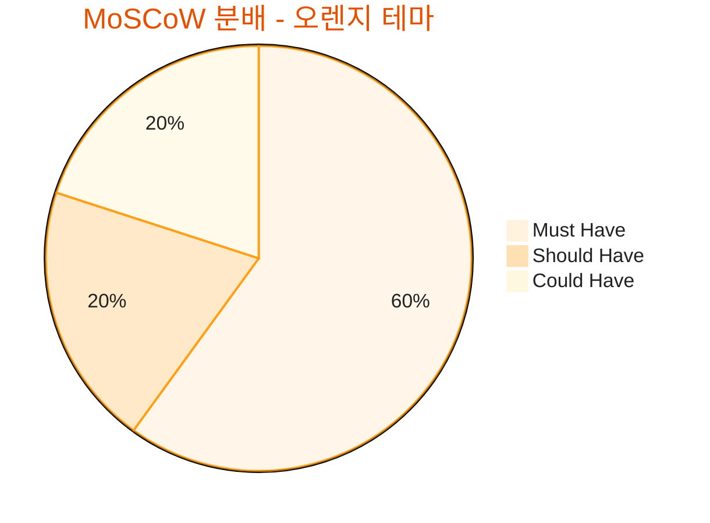

---

### 오렌지 테마 - ClassDef 활용 예시

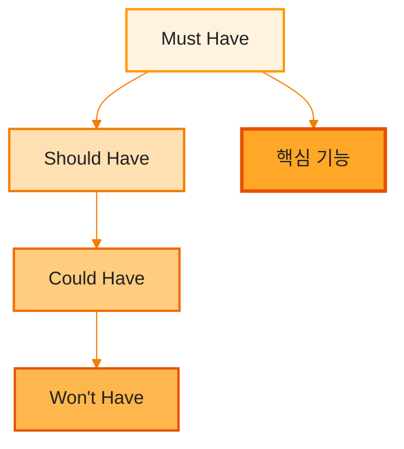

---

# 🌸 핑크 테마 (대비 개선)

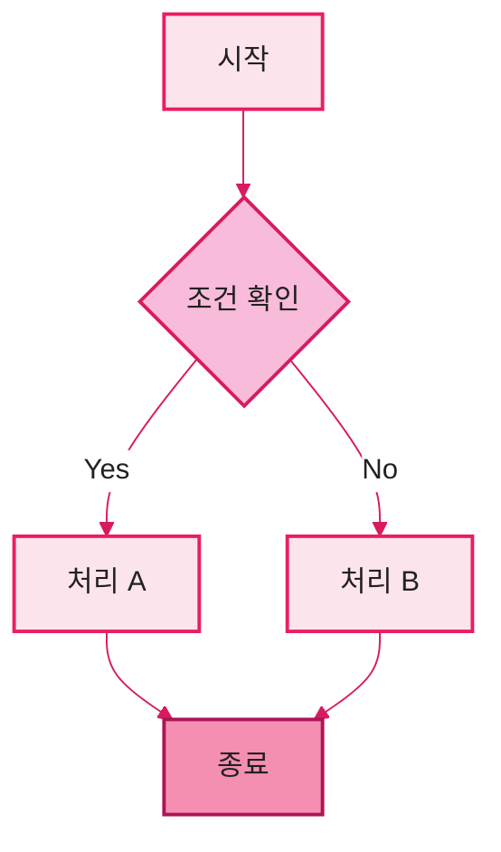

---

### 핑크 테마 - Mindmap 예시

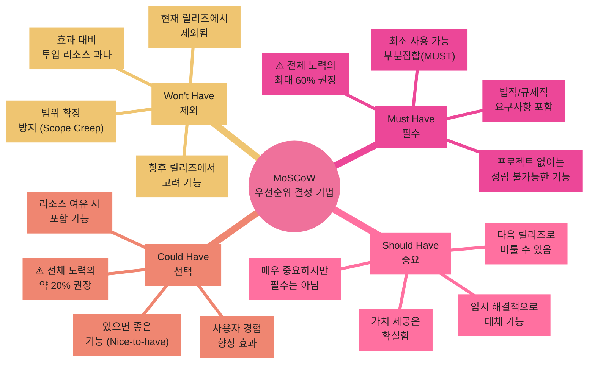

---

### 핑크 테마 - Gantt Chart 예시

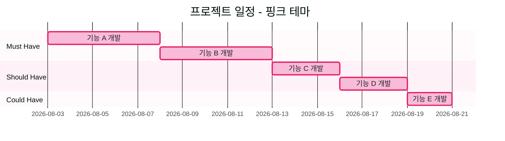

---

### 핑크 테마 - Pie Chart 예시

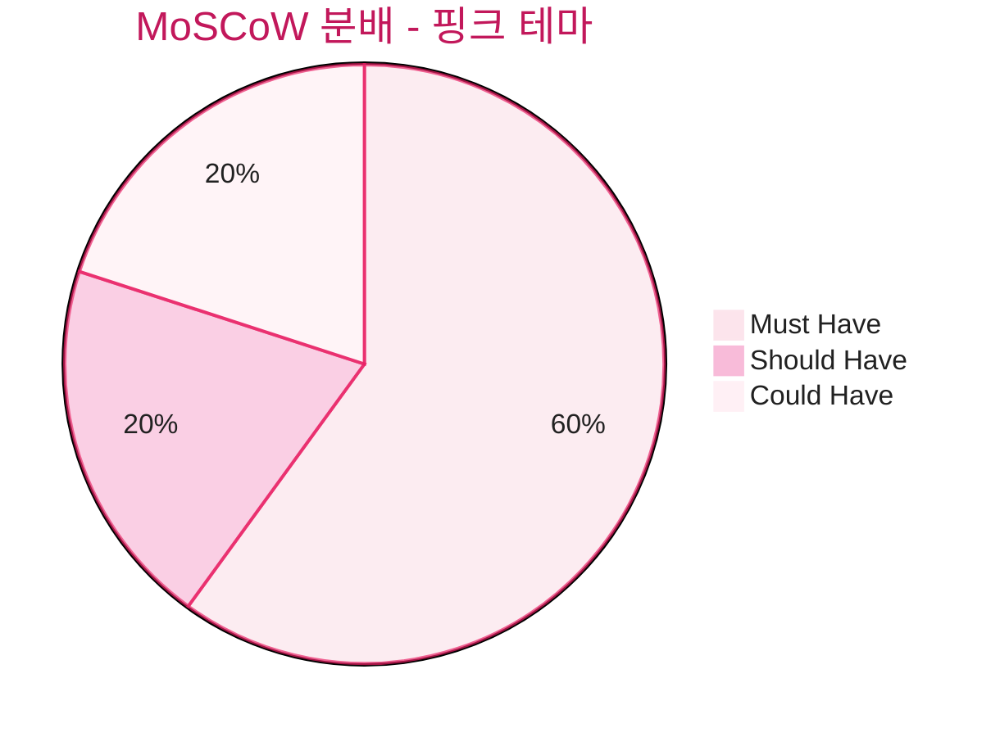

---

### 핑크 테마 - ClassDef 활용 예시

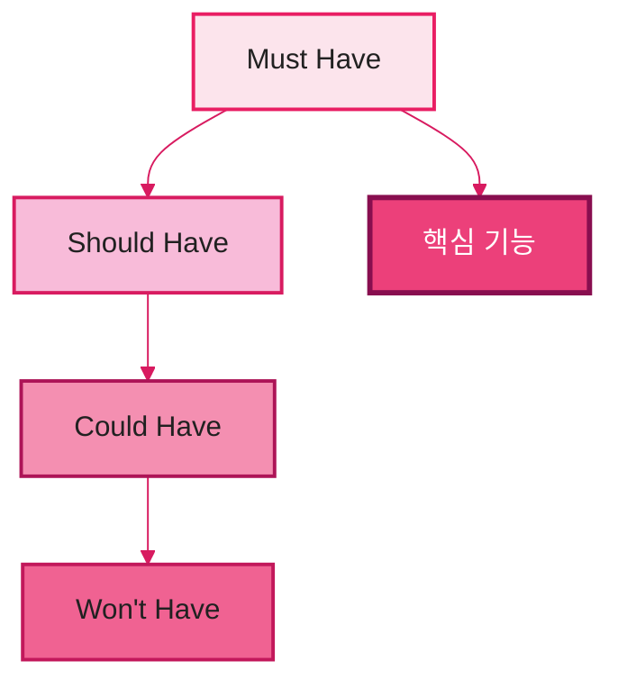

---

## 🎨 수정된 색상 팔레트 비교

### 오렌지 테마 색상 팔레트 (대비 개선)

| 용도 | 배경색 | 테두리색 | 텍스트색 |
|------|--------|----------|----------|
| 배경 | `#fff8e1` | - | - |
| 주요 노드 | `#fff3e0` | `#ff9800` | **검정 `#212121`** |
| 보조 노드 | `#ffe0b2` | `#f57c00` | **검정 `#212121`** |
| 강조 노드 | `#ffcc80` | `#ef6c00` | **검정 `#212121`** |
| 어두운 노드 | `#ffb74d` | `#e65100` | **검정 `#212121`** |
| 하이라이트 | `#ffa726` | `#e65100` | **검정 `#212121`** |
| 선 | - | `#f57c00` | - |
| 제목 | - | - | `#e65100` |

### 핑크 테마 색상 팔레트 (대비 개선)

| 용도 | 배경색 | 테두리색 | 텍스트색 |
|------|--------|----------|----------|
| 배경 | `#fff0f5` | - | - |
| 주요 노드 | `#fce4ec` | `#e91e63` | **검정 `#212121`** |
| 보조 노드 | `#f8bbd9` | `#d81b60` | **검정 `#212121`** |
| 강조 노드 | `#f48fb1` | `#ad1457` | **검정 `#212121`** |
| 어두운 노드 | `#f06292` | `#c2185b` | **검정 `#212121`** |
| 하이라이트 | `#ec407a` | `#880e4f` | **흰색 `#ffffff`** |
| 선 | - | `#d81b60` | - |
| 제목 | - | - | `#c2185b` |

---

## 💡 핵심 변경 사항

| 항목 | 이전 | 변경 후 |
|------|------|---------|
| `primaryTextColor` | `#e65100` (오렌지) / `#c2185b` (핑크) | `#212121` (검정) |
| `nodeTextColor` | `#bf360c` (오렌지) / `#880e4f` (핑크) | `#212121` (검정) |
| `taskTextColor` | `#e65100` (오렌지) / `#c2185b` (핑크) | `#212121` (검정) |
| `taskTextLightColor` | `#f57c00` (오렌지) / `#d81b60` (핑크) | `#424242` (진한 회색) |
| 하이라이트 노드 텍스트 | - | `#ffffff` (흰색) - 배경이 어두울 때 |

이제 모든 전경 텍스트는 **검정색(#212121)** 또는 **흰색(#ffffff)**으로 설정되어 배경색과 명확한 대비를 제공합니다. 특히 핑크 테마의 `highlight` 클래스는 배경색(`#ec407a`)이 어두우므로 텍스트를 흰색으로 설정하여 가독성을 확보했습니다.

## 💡 팁

1. **GitHub/GitLab Markdown**에서 사용 시: `%%{init}%%` 구문이 지원되지 않을 수 있으므로, `style`이나 `classDef`를 사용하세요.
2. **Mermaid Live Editor**에서 미리보기: [https://mermaid.live](https://mermaid.live)에서 실시간으로 색상을 테스트해보세요.
3. **일관성 유지**: 모든 다이어그램에 동일한 `themeVariables`를 복사-붙여넣기하여 일관된 디자인을 유지하세요.

이 방법들을 조합하여 원하는 회색 테마를 적용하시면 됩니다!
